# How Marshall is wired

    Type: CURRENT REFERENCE
    Validated against: 10 August 2026

> What the system DOES, organised symptom-first at the end. Deep archaeology accumulates here — where it overlaps the code, believe the code.


**No line numbers, deliberately.** This document used to carry 750 of them and
88% had drifted — a reader following `agent_atc.py:251` landed somewhere random
and stopped trusting the rest of the page. Symbols survive edits and line
numbers do not, so every reference here is a file and a symbol name. Search for
the symbol.

This document is a wiring diagram, not a tutorial: it says which module owns which decision, what talks to what, in what order, and — when the radio does something you did not expect — which of the two brains is likely to have produced it. Read the frame below first (the map, the two-brain line, and the vocabulary table), then jump to whichever of the nine sections covers the part you are suspicious of. **After a confusing sortie, start at "Troubleshooting: symptom to suspect" at the end** — it is organised by what you heard, and it names the log line and the file to open for each symptom.

## The map

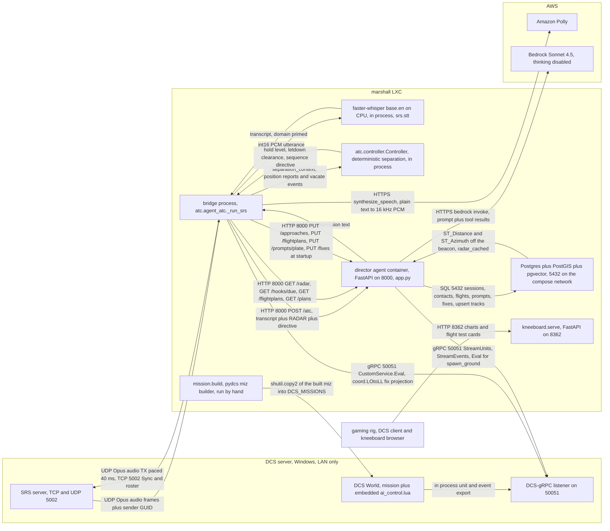

The loop, in the order it happens: the pilot keys the mic, SRS hands the bridge Opus-coded audio (the voice codec, not the model) plus the sender's GUID and SRS client name, and Whisper — running inside the bridge process, not on the sim box — turns it into a transcript. The bridge then does everything that must not be a guess: it resolves *who that was* from the GUID and the radar picture it just fetched from `GET /radar`, it advances the deterministic `Controller` and gets back a directive and a stack string, and it computes ASR guidance from the scope. All of that is pasted into one message and POSTed to the director's `/atc`, where a single Bedrock Sonnet agent — one per session, one session per channel — turns it into radio English. The reply comes back as text, the bridge strips it to radio-plain, sends it to Polly, and transmits it on the frequency the call arrived on. Separately and continuously, the director mirrors the sim's unit stream into the PostGIS `tracks` table so `/radar` is one local spatial query rather than a gRPC fan-out in the hot path — which is why a stale sim connection shows up as *no contacts*, never as confidently wrong positions.

Every box is a process except `STT` and `CTL`, which live inside the bridge process (`_run_srs` holds `stt.load_model` and one `controller.Controller`) — that is why the separation engine has no network hop and cannot be reached or overridden by the agent. `agent_atc.py` hard-codes `BASE_URL = "http://localhost:8000"`, and `director/docker-compose.yml` publishes only that one port, so Postgres is compose-internal. `push_fixes` is the bridge's only gRPC call and is best-effort: no sim, no fix table, approach unaffected. Left out: the external Nginx Proxy Manager, the dormant Haiku fast tier selected by the `tier` field on `/atc`, `POST /flights/bind` and `GET /flights/airspace`, `radio/pilot.py`, and `tools/asr_autopilot.py` which is the only thing that drives `ai_control.lua` via gRPC `SetUserFlag`. Note `feed/dcs.py` also holds `load_mission`, `call_in_traffic`, `get_player_units` and `get_current_mission`, deliberately *not* registered on the approach-controller agent in `app.py`; `director/app.py` also serves `/events/departed`, which nothing in `src/marshall/` calls today.

## The two brains

**The agent** (Bedrock Sonnet, in the director, prompt = `director/prompts/soul.md` + `plate` + `rules.md`) owns language, judgment, and anything grounded in the radar picture it was handed: reading the scope over the pilot's words, correcting a position report, giving range in lieu of DME, deciding a question deserves an answer, calling `identify` to bind a callsign to a track, calling `set_hook` when it promises a callback, calling the clearance tools. It has no timer, no memory of where anything is between calls, and no authority to invent an altitude — `rules.md` pins assignable levels to the plate.

**The deterministic core** (`src/marshall/atc/controller.py`) owns *separation*, and nothing else: who is on the board, what level each holds, who is in the letdown, who steps down when the bottom aircraft vacates, who is banished after two misses. It is blind — no radar, no telemetry, its whole world is what pilots reported plus a clock (`controller.py`) — and it is stateful, in the bridge process's RAM, so a bridge restart empties it. Around it sit three stateless helpers: `asr.py` (where he is on the approach, what heading regains course), `geometry.py` (the maths), `phases.py` (the legal phase transitions).

The seam is exactly one function: `separation_context` at `agent_atc.py`. It classifies the transcript, advances the `Controller`, and returns `(directive, stack)`. Those two strings are then injected into the agent's message under literal labels — `CONTROLLER (deterministic next step of the approach — voice its altitudes, headings and sequence exactly, add your radar read, never skip a leg):` and `SEPARATION (holding stack, one in the letdown):` at `agent_atc.py`. So the engine *decides* and the agent *speaks*. The same pattern is used for the flight roster (`FLIGHT (already decided from the roster and radar — SAY THIS...)`, `agent_atc.py`) and for ASR guidance, on the same reasoning: who is in which flight and how far apart two aeroplanes are is the same class of fact as separation, and not the model's to invent.

**The one-sentence test.** Every altitude, heading, sequence number and "hold at" you hear should appear verbatim in a `CONTROLLER:` or `SEPARATION:` line printed in the bridge log immediately before the transmission (`agent_atc.py`) — if it does, the engine produced it and the agent only phrased it; if there is no such line and the number came out of the radio anyway, the agent invented it, and that is a prompt bug in `rules.md`, not an engine bug. The converse also matters: a directive that was printed but not spoken means the agent paraphrased away a leg, which is the failure the dry run (`tools/atc_dryrun.py`) exists to catch.

Two known consequences of the asymmetry, both real scars. The engine cannot see, so a false position report advances it before the agent can refuse it — the bridge reconciles this by checking a claimed station passage against the range of the track bound to that callsign, and by suppressing a vector when the directive says hold (`reconcile`, `agent_atc.py`). And the agent cannot retract: once the engine has acted, nothing on the radar side can undo it.

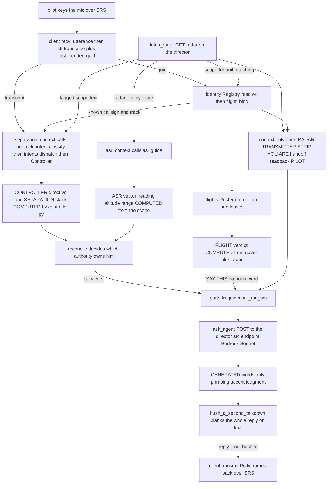

One transmission, two brains. Everything reaching `parts` in `src/marshall/atc/agent_atc.py` is either COMPUTED (`CONTROLLER`, `SEPARATION` from `separation_context` driving `atc/controller.py` via `atc/bedrock_intent.py` and `atc/intents.py`; `ASR` from `asr_context` calling `atc/asr.py` `guide`; `FLIGHT` from `atc/flights.py` `Roster`) or CONTEXT the agent may reason over (`RADAR`, `TRANSMITTER`, `STRIP`, `YOU ARE`, the handoff phrase, `PILOT`). Two edges to know: `separation_context` only runs when `engaged` — `MARSHALL_SEP_ALWAYS`, two radar contacts, or two aircraft already on the board — so a lone ship gets no `CONTROLLER`/`SEPARATION` line at all, and `hush_a_second_talkdown` does not trim the reply, it returns empty, which makes the bridge log "(no call)" and transmit nothing. Left out: the engineering channel, ship-to-ship suppression, the `who` challenge and the `simple_response` short-circuit, all of which `continue` before assembly ever runs.

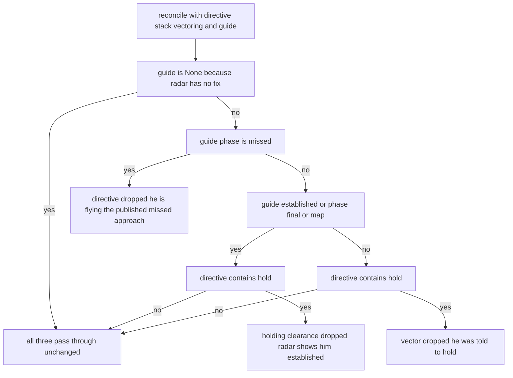

`reconcile` at `src/marshall/atc/agent_atc.py` is the arbiter that stops the agent voicing two contradictory instructions in one breath. The stack is never suppressed — it is about the OTHER aircraft, so it survives every branch — and the drop reason is returned as the fourth value and printed by `_run_srs` as a `..` line, so a suppression is visible in the bridge log rather than silent. Read that log line carefully on the missed branch: it says "holding/vector suppressed", but the code only blanks the directive and the ASR vector still goes to the agent. The geometry decides because it is the only one of the three inputs that can see where the aeroplane actually is.

## Vocabulary

**First, the PARTS — and two words this document still says that you should not.** Each part is named for what it does and sits at a layer in `LAYERS.md`; the canonical table is [`STRUCTURE.md` → What to call the parts](STRUCTURE.md#what-to-call-the-parts).

| say this | layer | what it does | runs in |
|---|---|---|---|
| `marshall-radio` | 0 transport | the SRS voice client: one ear on every frequency, ten mouths | the voice process |
| `marshall-atc` | 4–5 control + procedure | separation, the board, approaches, clearances, handoffs, the ground | the voice process |
| `marshall-feed` | 1 world | the sim mirrored into Postgres | the agent container |
| the **language brain** | 6 language | the prompts, the conversation window, the tools a seat is handed | the agent container |
| the **stores** | 1–3 | Postgres + PostGIS + pgvector, and the migrations | the agent container |
| `marshall-kneeboard` | 7 surfaces | the page server | its own container |

**"the bridge" and "the director" are DIRECTORY names, and are deprecated as vocabulary.** They say where a file happened to sit after a subtree merge on 25 July, and a folder name carries no layer — so a reader cannot tell whether a thing belongs where it is. This page has ~290 of them in prose written before that was decided; **read "the bridge" as `marshall-radio` + `marshall-atc` in one host process, and "the director" as the language brain plus the stores plus `marshall-feed`'s threads in one container.** The folders themselves have not moved and will not until #147 item 5; the words are not waiting for them.

**Then fourteen name-like things.** A bug in any one of them sounds, from the cockpit, exactly like a bug in any other — this table is the antidote.

| Term | What it actually is | Where it comes from | Said out loud? |
|---|---|---|---|
| **sim unit name** | `362nd_sockeye`, `Pony 1-2`, `Testbed 1-1`. The sim's own handle for one aeroplane. PRIMARY KEY of `tracks` (`src/marshall/feed/tracks.py`) and the value in `Identity.track`. | DCS. For AI flights pydcs is made to write `<group>-<n>` (`mission/build.py`); for a manned slot it is the slot's unit name. | never |
| **DCS player name** | `362nd_sockeye`. Arrives on the gRPC unit stream as `u.player_name`; stored as `tracks.player` (`tracks.py`). | the human's DCS profile | never |
| **SRS client name** | `Sockeye`. Arrives free on every voice packet beside the GUID. Normally identical to the DCS name because SRS takes it from the DCS export. | the SRS client | never |
| **radar label** | `tracks.label` = `player_name or callsign or name` (`tracks.py`). What prints at the head of a scope line. | derived, in the director | never |
| **DCS callsign** | `Enfield11`. The mission editor's AI callsign field. Deliberately left disagreeing with what the pilot calls himself — correlating the two from a position report is the machinery under test (`build.py`). | the .miz | never |
| **spoken callsign** | `"Pony one one"` — `callsign.Callsign.spoken` (`callsign.py`). What goes to Polly. Interpolating the canonical form instead makes Polly read the hyphen as "to", which the pilot hears as `Falcon 1-2-1` (see the comment at `agent_atc.py`). | `atc/callsign.py` | **yes** — this is the addressing form |
| **canonical callsign** | `Pony 1-1` — `callsign.Callsign.canonical`. The key everything internal is keyed on. | `atc/callsign.py` | never (see above) |
| **handle** | `sockeye`. `identity.handle` drops every chunk of a name containing a digit (`identity.py`), so `Hoover 1-1-1` → `Hoover`. One person, survives a slot change and a callsign change. | derived from the unit / SRS name | never |
| **flight name** | `Apex`. One group, created by a lead saying so, gone when the group is. A *member number* (`Apex 1-2`) is not a third kind of name — hearing one is evidence the transmission is intra-flight and not addressed to us (`flights.py`). | `atc/flights.py` roster | **yes** |
| **track** | A row in the PostGIS `tracks` table, and the strongest rung of the identity ladder. `Identity.track` holds the sim unit name when the chain reached one. | `tracks._stream_category` mirroring `mission.StreamUnits` | never |
| **board** | What the *deterministic engine* believes is flying — `Controller.board` (`controller.py`), written to the flight recorder as `kind="board"` on every transmission (`agent_atc.py`). Not the same as the scope, and the difference is the whole ghost problem. | bridge RAM | no |
| **strip** | A filed flight plan row (`flight_plans`, and its per-aeroplane copy `assigned_plans`). Rung 2 of the identity ladder — a claim matched against something typed before the sortie rather than believed on its own. | director Postgres | no |
| **plate** | The mission-specific prompt block generated by `atc/briefing.py:plate` from `route.py` and PUT to `/prompts/plate` at bridge startup (`agent_atc.py`). Also, confusingly, the kneeboard chart of the same facts. If the controller says a number the chart does not show, suspect a stale plate in Postgres before suspecting drift. | generated from `core/route.py` | its contents are |
| **directive** | The deterministic engine's next-step string for this call, from `separation_context` (`agent_atc.py`), injected as `CONTROLLER (...)`. Empty for off-script calls, where the agent reasons freely. | `atc/controller.py` | its contents are, via the agent |
| **Opus** | The VOICE CODEC on the SRS wire (RFC 6716), 40 ms frames. Nothing to do with the Anthropic model of the same name — this document names Bedrock Sonnet and a dormant Haiku tier, so the word is genuinely ambiguous here. Encoded in `radio/tts.py`, decoded in `radio/client.py`. | SRS | no |
| **session** | `batumi-approach:<freq>` by default (`agent_atc.py`), overridable as argv5. One per channel per mission instance — a shared context for the frequency, never a per-pilot chat. Keys the Postgres transcript, the hook queue, the identity bindings on `/radar`, and the director's per-session busy lock (`director/app.py`). | the bridge, at startup | no |

## Where to look first

| If this is wrong | Read |
|---|---|
| A number on the radio disagrees with the kneeboard, or the controller cites a fix that is not on the plate | `src/marshall/core/route.py`, then `atc/briefing.py:plate` — and check that the startup line `pushed plate for <controller> to the director` (`agent_atc.py`) actually appeared |
| The wrong aeroplane was addressed, a callsign was invented, or a ghost took a level | `atc/identity.py` — `Registry.resolve` (`identity.py`) and the `(identity: ...)` line it prints (`agent_atc.py`); then the `kind="board"` records in `build/logs/flight-<session>.jsonl` |
| Two aircraft were put on the same level, or a stack sequence looked wrong | `atc/controller.py` — the board and the queue. Check whether the engine was even engaged: it needs `n_contacts >= 2`, an existing stack, or `MARSHALL_SEP_ALWAYS=1` (`agent_atc.py`) |
| The controller answered fluently but skipped a leg, paraphrased an altitude, or said something no directive contained | `director/prompts/rules.md` and the injected block at `agent_atc.py`; reproduce with `tools/atc_dryrun.py`, which uses the same message assembly with typed input |
| Silence — the call was heard and nothing came back | bridge stdout for a `..` suppression line or the readback/`answering` gate (`agent_atc.py`), then `docker compose logs` in `director/` for `session ... is still answering the previous call` (`director/app.py`), which drops rather than queues |

> Written 29 July 2026 by a fan-out of agents reading the source, then checked: every
> `file:line` here was verified to resolve (785 citations across 86 files), and every
> diagram was redrawn against the code by a second agent whose job was to delete
> arrows that are not real. It describes the tree at commit `d8d4d91`.

---

## The two deployables, and running them

One repo, two processes that must both be up before a pilot keys a mic. They are not peers: the **agent container** ("the director") is a long-lived service that survives sorties and holds the language brain, the stores and `marshall-feed`; the **voice process** ("the bridge") is a foreground Python process you start and stop around each flight, and it is `marshall-radio` and `marshall-atc` running together. Nearly every "the radio went strange" report resolves to *which of these two produced the words*, so start by knowing what each one is.

### The voice process — `marshall.atc.agent_atc`

A single Python process, and `marshall-radio` (layer 0) and `marshall-atc` (layers 4–5) both live in it; splitting them into two commands waits on `_run_srs` becoming importable (#55). It owns the radio, the Whisper model, the deterministic `controller.Controller` (the separation board lives **in this process's memory**, not in Postgres), and every timer. It has no HTTP server of its own; it is a client of the language brain.

`__main__` is thirteen lines (`agent_atc.py`) and the argument order is positional, no flags:

```
python -m marshall.atc.agent_atc --srs <host> <freq_mhz> [voice] [session]
 argv2 argv3 argv4 argv5
```

- **`host`** — the SRS server (`_run_srs` passes it straight to `SRSClient`, `agent_atc.py`). Note this is *not* read from `config.SRS_HOST`; the argument wins, always.
- **`freq_mhz`** — the *primary* channel only. `_run_srs` then adds every station frequency from the profile (`agent_atc.py`), so the bridge monitors 4 channels tonight, not one. See the startup line below.
- **`voice`** — the Polly voice for the *fallback* controller. Per-station voices come from the profile (`agent_atc.py`); this argument only covers a channel no station claims.
- **`session`** — defaults to `f"batumi-approach:{freq_mhz:.3f}"` (`agent_atc.py`). This one string keys three things at once: the director's Postgres conversation, the `_atc_agents` cache entry, and the hook queue. **Changing it starts a brand-new controller with no memory of the sortie.**

The documented raw invocation (module docstring, `agent_atc.py`):

```sh
uv run --extra voice python -m marshall.atc.agent_atc --srs $SRS_HOST 132.0 Matthew
```

But **use the launcher instead**, `tools/bridge.py` — see the pkill trap below. Its defaults (`tools/bridge.py`) are the live configuration: freq `124.0`, voice `Matthew`, session `hooks`.

```sh
uv run python tools/bridge.py status
uv run python tools/bridge.py start
uv run python tools/bridge.py restart
uv run python tools/bridge.py stop
```

`start` is not fire-and-forget: it tails the log for up to 60 s and only returns 0 once it sees the word `monitoring` (`tools/bridge.py`). It also distinguishes "refused: another bridge holds the frequency" from "exited early". Log goes to `/tmp/marshall-bridge-live.log` (override with `MARSHALL_BRIDGE_LOG`).

**`BASE_URL` is hard-coded to `http://localhost:8000`** (`agent_atc.py`) with no env override. The bridge must run on the same host as the director, full stop.

### The director — `marshall-director` compose stack

Two containers. `db` is Postgres+PostGIS+pgvector; `agent` is FastAPI/uvicorn running `director/app.py`.

```sh
cd /opt/marshall/director && docker compose up -d
docker compose logs -f agent
```

**The project name is pinned to `marshall-director` in the compose file itself** (`director/docker-compose.yml:6`). This is load-bearing, and the comment above it says why: the stack was born in `/opt/marshall-director`, its volume is `marshall-director_pgdata`, and after the move under `marshall/director/` compose would otherwise derive the project name from the *folder* (`director`), mount a fresh empty `director_pgdata`, and come up looking perfectly healthy **with no contacts, no sessions, no approaches**. If you ever find the controller has amnesia about every identity binding it ever made, check `docker volume ls` for a stray `director_pgdata`.

Startup is `entrypoint.sh` → wait for Postgres → `strands_pg.migrate` → uvicorn. Migrations run on *every* container start; `no pending migrations` is the normal line.

Note `make_app(build_agent, prompt_store=prompts)` (`app.py`) is called **without `deploy=True`**, so the `POST /api/deploy` endpoint described in `deploy.sh` and `director/systemd/` is **not registered** on this stack. That whole git-pull-and-rebuild path is inherited from the upstream stamp and is currently dormant — deploy by hand with `docker compose up -d --build`.

### Config: which file feeds which process

Two `.env` files, read by completely different mechanisms, and they do not see each other.

| File | Read by | How |
|---|---|---|
| `/opt/marshall/.env` | the **bridge** (and every `tools/` script) | `config.py` — `_load_dotenv(REPO_ROOT / ".env")`, a hand-rolled parser, `os.environ.setdefault` so **an exported value always beats the file** |
| `/opt/marshall/director/.env` | the **director container** | `env_file:` in `docker-compose.yml:31-32`, injected by docker |

`config.py` resolves the repo root from `__file__` (`config.py`), so the bridge finds `.env` regardless of cwd. The live root `.env` holds only `SRS_HOST` and `SRS_EAM_PASSWORD`.

**`SRS_EAM_PASSWORD` is the silent-failure one.** `deploy/.env.example` spells it out: External AWACS clients are not relayed without it, so a wrong password looks exactly like a dead radio — you register fine, you transmit fine, and nobody ever hears you.

Bridge-side env vars, all optional:

| Var | Default | Effect |
|---|---|---|
| `MARSHALL_FAST_TIER` | off | Routes routine phraseology to Haiku. Off deliberately — Haiku 4.5 doesn't hold the approach sequence (`agent_atc.py`) |
| `MARSHALL_SEP_ALWAYS` | off | Engage the separation engine with fewer than 2 radar contacts. The voice-only rehearsal needs this (`agent_atc.py`) |
| `MARSHALL_MISSION` | `default` | Partitions the `flights` table (`agent_atc.py`) |
| `MARSHALL_CALLSIGNS` | empty | Extra callsigns fed to the Whisper prompt and the flight-name set (`agent_atc.py`) |
| `DCS_GRPC_ADDR` | `127.0.0.1:50051` | **See below** |
| `MARSHALL_BUILD` | `<repo>/build` | Where `bridge.lock`, `logs/flight-*.jsonl` and `engineering.attended` live |

**`DCS_GRPC_ADDR` is the trap.** It is set *only* in `director/.env`, because the director container is its main consumer (`src/marshall/feed/dcs.py`). But the bridge reads it too, at `agent_atc.py`, in `push_fixes` — and defaults it to `127.0.0.1:50051`, which is this LXC, where there is no sim. So a hand-started bridge fails the fix push on **every** start, and the controller ends up with only the field to compute bearings against. `tools/bridge.py` exists to fix exactly this: it greps `DCS_GRPC_ADDR=` out of `director/.env` and injects it. Any *other* hand-run script (`tools/spawn.py`, `tools/draw.py`, `tools/say.py`, `tools/survey_terrain.py`, `src/marshall/radio/pilot.py`) needs it exported by hand.

Director-side, `director/.env` currently pins `STRANDS_PG_MODEL_ID=us.anthropic.claude-sonnet-5` — which **overrides** the `claude-sonnet-4-5` default written into `app.py`. If you are wondering which model actually answered, read the container's own startup line, not the source.

### A healthy startup, line by line

Bridge (`/tmp/marshall-bridge-live.log`), a real one:

```
 loaded flight plan '362nd-batumi-asr' -> approach 'batumi-asr'
 pushed 21 named fixes (projected by the sim)
 pushed plate for Batumi Approach to the director
agent ATC live as Batumi Approach (voice Matthew, session hooks)
 monitoring 139.000, 124.000, 118.000, 131.000
```

| Line | What it proves | If it's missing / different |
|---|---|---|
| `loaded flight plan ... -> approach` (`agent_atc.py`) | The director answered `PUT /approaches`, `PUT /flightplans`, `GET /flightplan/active`. **The DB, not `route.py`, is now the profile in use** | `!! flight-plan bootstrap failed, using route.py:` — director down or unreachable. The bridge carries on with the `route.py` seed, so it does not crash; it just may disagree with what's in the DB |
| `pushed N named fixes (projected by the sim)` | gRPC reached the sim and `coord.LOtoLL` ran. `vector` can now give a real bearing to a steerpoint | `!! fix push failed, controller has the field only:`. Almost always `DCS_GRPC_ADDR`. Not fatal — the approach needs none of it — but "distance to waypoint three" will come back as no-fix |
| `pushed plate for <controller> to the director` | `PUT /prompts/plate` succeeded; the agent's system prompt now carries tonight's numbers | `!! could not push plate:` — the agent is running on a **stale plate** from a previous sortie. This is the one that produces confidently-wrong altitudes |
| `agent ATC live as ... (voice ..., session ...)` | SRS registration returned, `Controller` constructed, threads about to start. Echoes the session id — check it matches what you meant | — |
| `monitoring 139.000, 124.000, ...` | The channel list. **This is what `tools/bridge.py start` waits for**, and it is the line to check when a pilot says "I called and nobody answered" — if his radio card frequency is not in this list, the call was inaudible from both ends |

Notice the frequency you passed on the command line (124.0) appears in the middle of the list, not first — the station list from the profile wins, and `freq_mhz` is only *inserted* if the profile doesn't already cover it.

Three daemon threads start right after: `engineering_radio`, `scheduler` (hooks + stale-board release, 2 s tick, `HOOK_POLL_SEC`), `asr_monitor` (the mile-call metronome, 4 s tick, `ASR_POLL_SEC = 4.0`). Then the main loop blocks on `client.recv_utterance`.

A line you should **never** see, and which will not stop anything working:

```
 !! SRS roster tracking stopped (...); radios will read as GUID stubs and
 identity falls back to weaker evidence
```

(`radio/client.py`). The TCP drain thread is the only thing that maps a voice packet's GUID to "Sockeye". When it dies the system keeps talking, just on worse evidence — which is why it prints loudly.

Director, a real healthy start:

```
[entrypoint] waiting for Postgres...
[entrypoint] applying migrations from /app/migrations...
no pending migrations
[entrypoint] starting: uvicorn app:app --host 0.0.0.0 --port 8000
... INFO strands_pg._pool | strands_pg connection pool opened
... INFO tools.tracks | track streamer started
... INFO tools.events | event stream started
... DEBUG strands.models.bedrock | config=<{'model_id': 'us.anthropic.claude-haiku-4-5...'}> | initializing
... INFO botocore.credentials | Found credentials in shared credentials file: ~/.aws/credentials
... DEBUG strands.models.bedrock | config=<{'model_id': 'us.anthropic.claude-sonnet-5'}> | initializing
INFO: Uvicorn running on http://0.0.0.0:8000
```

`track streamer started` (`app.py`) and `event stream started` (`app.py`) are the two gRPC consumers. They start regardless of whether the sim is up — an empty `tracks` table reads as *no contact*, never as confidently-wrong, so a dead streamer looks like clear skies. If radar is inexplicably empty, that is the pair to suspect, not the bridge.

Both `_FAST` and `_SMART` BedrockModels are constructed at import (`app.py`), which is why you see two `initializing` lines even with the fast tier off. `Found credentials in shared credentials file: ~/.aws/credentials` proves the `${HOME}/.aws` bind mount (`docker-compose.yml:41`) and `AWS_PROFILE` are working — no credentials means every `/atc` call 500s.

Then the bridge's bootstrap shows up as four requests, in this order, which is your independent confirmation the two deployables found each other:

```
"PUT /approaches/batumi-asr HTTP/1.1" 200 OK
"PUT /flightplans/362nd-batumi-asr HTTP/1.1" 200 OK
"GET /flightplan/active HTTP/1.1" 200 OK
"PUT /prompts/plate HTTP/1.1" 200 OK
```

and steady state is a `GET /radar` + `GET /hooks/due` heartbeat every couple of seconds forever.

### The HTTP surface, and who calls what

Everything on, no auth (`auth_verifier` is not configured). Endpoints from `director/app.py` unless noted.

| Endpoint | Caller | Notes |
|---|---|---|
| `POST /atc` | bridge, `ask_agent` (`agent_atc.py`) | The hot path. Per-session `threading.Lock`, **non-blocking** — a second call while the agent is thinking is **dropped**, returns `{"busy": true, "response": ""}` (`app.py`). Silence on the radio with no error anywhere is this |
| `GET /radar?session_id=` | bridge, `fetch_radar`; polled by both the scheduler and `asr_monitor` | Returns `{"picture": "..."}`, annotated with that session's identity bindings. Best-effort — a failure returns `""`, i.e. *no radar*, silently |
| `GET /hooks/due?session_id=` | bridge scheduler, every 2 s | One-shot; a returned hook is already deleted |
| `PUT /prompts/{name}` | bridge at startup, for `plate`; you, by hand, for `soul`/`rules` | See the caching scar below |
| `GET /prompts`, `GET /prompts/{name}` | you | Read what the agent is actually running on |
| `POST /chat`, `POST /chat/stream` | **nothing in the bridge** — legacy/manual | The bridge uses `/atc`. `/chat` uses `make_app`'s own agent cache, a *different* cache from `/atc`'s |
| `PUT /approaches/{key}` (one per published procedure) | `marshall-atc` `load_and_push_plates` | Publishes the map's whole OFFER at start. It seeded ONE from `route.py` and read it back; there is no process-wide arrival to seed since #162 |
| `PUT /fixes` | bridge `push_fixes` | Lat/lon projected by the sim itself |
| `GET /fixes` | you, for checking the push landed | |
| `POST /flights/bind`, `/flights/{id}/agree`, `/flights/{id}/handoff` | bridge `flight_bind` / `flight_agree` / `flight_handoff` | **All three swallow their exceptions** — "the state store must never make him mute". Failures appear only as `!! flight bind failed:` in the bridge log |
| `GET /flights/airspace?callsign=` | bridge `leaving_my_airspace` | Reports the handoff disagreement; does not decide |
| `GET /plans` | bridge `plan_labels`, `tools/plan_sweep.py`, and the kneeboard PLANS page (`kneeboard/plans.py`) | |
| `GET /flightplans` | bridge `filed_plans` | |
| `GET /flights`, `DELETE /flights` | `tools/handoff_check.py`, and you between sorties | `DELETE` is how you forget last sortie's aircraft |
| `GET /health` | nothing automated | Registered by `make_app` (`api.py`) |
| `GET /events/departed` | **nobody** | Written for the bridge (`app.py`) but no caller exists in `src/` or `tools/`. The bridge currently drops stale aircraft off the board with `release_stale`'s 8-minute radar timeout instead (`agent_atc.py`, `STALE_BOARD_SEC`). Dangling |

**The prompt-cache scar, worth knowing before you edit a prompt.** `PUT /prompts/{name}` calls `invalidate_agents`, which clears `make_app`'s cache — the one behind `/chat` (`api.py`). It does **not** touch `app.py`'s module-level `_atc_agents` dict (`app.py`), which is the cache `/atc` uses. **That scar is closed** (29 July, audit finding 6.1): `/atc` now compares the assembled system prompt against the cached agent's and rebuilds when they differ (`app.py`), so a live `soul`/`rules`/`plate` edit takes on the next transmission of an already-active session. The failure it fixed was a bridge restart without a director restart leaving the controller on the *previous mission's plate* — right field, wrong altitudes, and no symptom except a pilot being given numbers his chart does not show.

### Stopping the bridge — the pkill trap

Documented at length in `tools/bridge.py`. **Do not** run:

```sh
pkill -f marshall.atc.agent_atc # DON'T
```

That pattern matches the shell running the pkill, because the string is in its own command line. The shell dies mid-command, the `&& restart` after it never runs, and the pilot sits on a dead frequency. It happened twice in one night and he noticed before the author did.

`tools/bridge.py running` matches on the process list, explicitly excluding its own pid, its own process group, and anything containing `tools/bridge.py`. `stop` sends SIGTERM, waits 15 s, then SIGKILL.

The second half of the trap: `uv run python -m ...` is a launcher with a Python child. Killing the launcher leaves the child logged into SRS. Two bridges on one frequency is described as the most expensive failure this system has — both hear the pilot, both answer, **and each hears the other's reply as a pilot call**. They had separate holding stacks and separate conversations, both fluent, one believing the aircraft was inbound and the other outbound. Reported from the cockpit as "duplicate controllers".

Two defences exist:

- **`claim_the_frequency`** (`agent_atc.py`) runs before `_run_srs` in `__main__` and takes an advisory `flock` on `build/bridge.lock`. Deliberately a flock, not a PID file — the kernel drops it however the process dies, so a crash can never leave a stale lock that blocks the next start. A refused start prints:

 ```
 !! another bridge already holds the frequency (pid 12345).
 Two controllers on one channel is the bug this prevents.
 Stop it first: kill 12345
 ```

 This is also why `restart` must stop before it starts, and why `tools/bridge.py start` treats `already holds the frequency` as a distinct failure.

- **`OUR_STATIONS`** (`agent_atc.py` — `{"Marshall", "Engineering", "Eartest"}`) makes the receive loop ignore anything transmitted by one of our own SRS names, so even if two do end up on the air they cannot talk to each other forever (, logs `(ignoring X -- that is one of ours, not a pilot)`).

Note the SRS client registers as `SRS_NAME = "Marshall"`, not as "Batumi Approach" — the roster shows the *service*, because one client is Center, Approach and Tower at once. Who is speaking is the voice and the callsign in the transmission. The transmit pool registers as `Marshall-1` … `Marshall-10` and the ATIS as `ATIS <field>`; those names are not meaningful either, for the same reason.

**ATIS is separate from all of it.** One client per broadcasting aerodrome (127.100 Batumi, 127.400 Kobuleti), started with the bridge, outside the pool — 22 seconds of audio every 30 is near enough continuous, so five fields would hold half the pool permanently and starve the controllers. It renders once per information letter and loops the cached frames, rotates hourly or on a material weather change, writes the runway in use to the `atis` table, and stands down entirely when nobody is connected.

### Reading the bridge log during a sortie

The console log is the primary troubleshooting artefact. Prefixes tell you which brain spoke:

```
PILOT [Andre]: Batumi Approach, Andre, joining ABEX. [RADAR: 362nd_Sockeye-1 ...]
 (identity: ...) only when it was NOT radar (:3152)
 CONTROLLER: <directive> deterministic engine's instruction (:3472)
 SEPARATION: <stack> the holding stack as handed to the model (:3474)
 ATC[pilot/sonnet] (4.3s): <words> the agent (:2641) — kind/tier and latency
 ATC[simple] (0.0s): <words> canned, never touched a model (:3212)
 ATC[vec] / ATC[asr] <words> the asr_monitor metronome, deterministic (:2910, :2935)
 ATC[down] <words> landing goodbye (:2851)
HOOK fired (+60s) on 139.000: <why> scheduler (:2688)
 ENG[tx] / ENGINEERING [...] engineering radio, Amy's voice, not a controller
```

`ATC[...]` with a `/tier` suffix came from Bedrock. `ATC[vec]`, `ATC[asr]`, `ATC[down]`, `ATC[simple]` did **not** — no LLM was involved, so no amount of prompt editing will change them. That distinction is the fastest triage in the system.

A machine-readable copy of the same thing lands in `build/logs/flight-<session_id>.jsonl`, one JSON object per transmission (`record`, `agent_atc.py`), specifically so a bad vector can be re-run against a real flight without flying it again.

Finally: the log at `/tmp/marshall-bridge-live.log` right now ends in a traceback (`AttributeError: module 'marshall.atc.flights' has no attribute 'parse_adopting'`) at line numbers that no longer exist in `agent_atc.py`. It is from an older revision and no bridge is running — worth clearing before the next start so a stale crash isn't mistaken for a current one.

### Footnote: the third thing

`deploy/docker-compose.yml` runs a `marshall-kneeboard` container (host →) serving the charts and the flight-planning app. It mounts `../src` and `../docs` read-only so charts render from live source, and needs `host.docker.internal:host-gateway` plus `MARSHALL_DIRECTOR_URL=http://host.docker.internal:8000` — because inside that container `localhost` is the container, and without it the PLANS page renders "nobody answered". It is not part of the ATC loop; nothing on the radio depends on it.

---

## The life of one transmission

### transmission

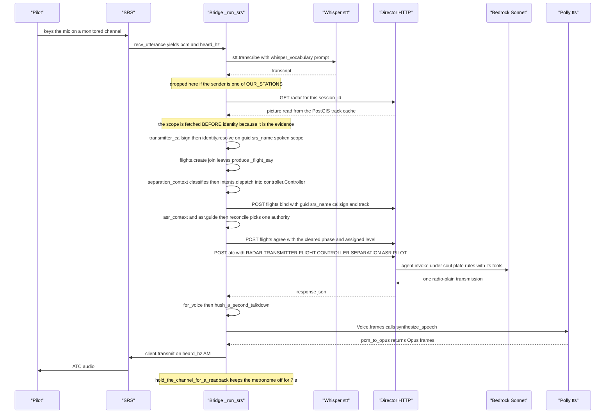

The receive loop is the `while True` at the bottom of `src/marshall/atc/agent_atc.py` (`_run_srs`), with transcription in `radio/stt.py`, Opus encoding in `radio/tts.py`, the radio in `radio/client.py`, and `/radar` plus `/atc` served by `director/app.py`. The order that surprises: `fetch_radar` runs *before* anything looks at the words — and only when `profile.atc.radar` is set — because the GUID-to-client-name-to-unit-to-track chain has no microphone in it (`atc/identity.py`); the picture comes from the warm PostGIS track cache, falling back to a live gRPC scan only when that cache is cold (`feed/dcs.py`). `separation_context` does call a model, `bedrock_intent.classify`, but only to *name* the intent: `intents.dispatch` then advances `atc/controller.py`, and the queue and stack reach the agent as CONTROLLER and SEPARATION blocks it may phrase and never invent. `/atc` takes a per-session lock non-blocking, so a call arriving mid-answer is dropped rather than queued, which on the radio sounds like silence, not a late reply.

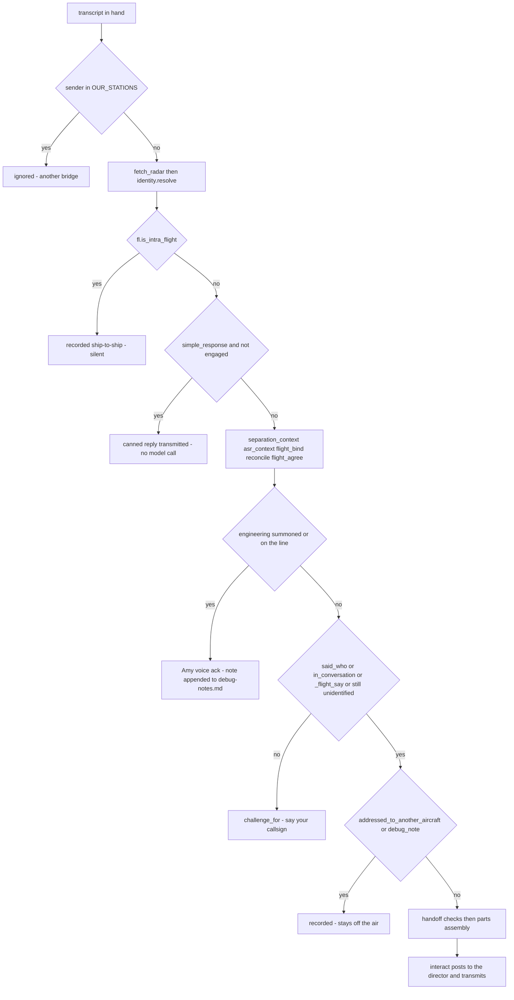

Every gate above is a real `continue` in the same loop in `src/marshall/atc/agent_atc.py`, and each one is a different explanation for a transmission the pilot heard nothing back from — worth checking in this order before blaming the model. `atc/flights.py` supplies `is_intra_flight`, and the FLIGHT verdict it produces deliberately suppresses the callsign challenge so a join or a refusal is never swallowed; note the challenge also needs a `known` callsign, so a radio nobody has identified yet falls straight through to the model. The engineering branch sits *after* the separation engine runs, so the board still advances even on a transmission the controller never answers.

### The drop gates

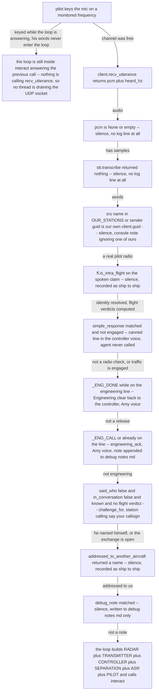

Every box is a `continue` in the receive loop of `src/marshall/atc/agent_atc.py` (lines 2992 to 3429), in the order they execute. The surprising edges: G5 answers him without ever calling the agent, so a radio check sounds instant and a mid-sequence one does not, because `engaged` flips once two contacts or two aircraft exist; G7 swallows *everything* from that radio until a release or a controller name in the first six words (`_ADDRESSING` versus `_eng_at` in the opening), which is why a pilot on engineering can believe ATC has gone deaf; and G8 fires only when `known` is truthy, so a radio with no identity at all falls straight through to the agent rather than being challenged. The busy branch is not a lock at all — `answering[0]` only gates the metronome via `channel_is_free`; the pilot's loss is simply that the single loop thread is inside `interact` and `radio/client.py` has no background UDP drain, only `_drain_tcp`, `_ping_loop` and `_warmup`.

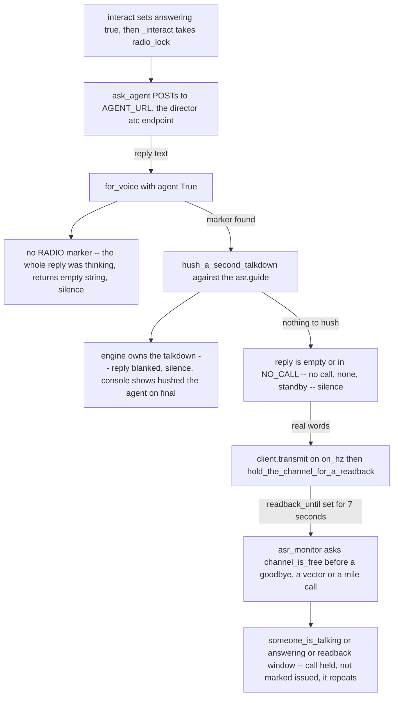

The second family of silences: the transmission passed every gate, reached Bedrock, and still nothing goes over the air. All of this is `for_voice`, `hush_a_second_talkdown`, `NO_CALL` and `channel_is_free` in `src/marshall/atc/agent_atc.py`, with `someone_is_talking` in `src/marshall/radio/client.py`. An HTTP failure inside `ask_agent` lands here too — the fallback reply is "Standby.", which `for_voice` blanks for want of a marker and `NO_CALL` would have dropped anyway, so an unreachable director sounds exactly like a controller who chose not to speak. Note also that a held metronome call is deliberately *not* recorded as issued, so it comes back on the next sweep — a delayed mile call is this path, not a dropped one.

The receive loop is the `while True:` at `src/marshall/atc/agent_atc.py`. Everything below happens inside one iteration of it, on one thread, in the order written. Three other daemon threads (`engineering_radio`, `scheduler`, `asr_monitor`, started at `agent_atc.py`) transmit on their own schedules and are *not* part of this path — if the thing you heard was a mile call, a vector, a hook callback, or an engineering line, it did not come from here.

Two logs record the trip:

| Where | What |
|---|---|
| bridge stdout | the human-readable trace, prefixes `PILOT`, `ATC[...]`, `CONTROLLER:`, `SEPARATION:`, `ASR:`, `..` for a suppression, `!!` for an error |
| `build/logs/flight-<session_id>.jsonl` | one JSON object per event, written by `record` (`agent_atc.py`). `BUILD_DIR` defaults to `<repo>/build` (`config.py`) |

If a transmission produced nothing on the air, the fastest triage is: find the `PILOT [...]` line for it. If there is no `PILOT` line at all, it died in steps 1–4. If there is one, read forward for the first `..` or `(...)` line — that is the short-circuit that ate it.

---

### The numbered sequence

**1. Audio capture and end-of-utterance.** `client.recv_utterance(max_wait=3600)` (`radio/client.py`, called at `agent_atc.py`) blocks on the UDP socket, decodes each SRS voice packet's 40 ms Opus frame to int16 PCM, and returns when **1.2 s of silence** has passed since the last packet (`silence=1.2`, `radio/client.py`). It also pulls two things off the packets: the transmit frequency out of the first freq block (`client.py`) and `last_sender_guid` from the trailing 22 bytes (`client.py`). It stamps `self.last_rx` on every packet, which is what `someone_is_talking` (`client.py`) reads so the other three threads stay off the air.

Consequence worth knowing: a pilot who pauses more than 1.2 s mid-thought gets **two** transmissions, each transcribed and processed independently, and the second one usually has no callsign in it.

Logs: nothing. This step is silent by construction.

**2. Whisper.** `stt.transcribe(model, pcm, prompt=whisper_vocabulary(profile))` (`agent_atc.py`, `radio/stt.py`). faster-whisper `base.en`, CPU, int8. The prompt is rebuilt on **every** transmission by `whisper_vocabulary` (`agent_atc.py`) from the squadron callsigns in `route.py`, `MARSHALL_CALLSIGNS`, every name any radio has ever claimed (`_transmitters`), the station names, the route fixes and the filed plan labels. An empty transcript `continue`s at `agent_atc.py` with no log line — this is drop #2 in the table below and it is invisible.

**3. Who keyed the mic (free).** `srs = client.name_for(client.last_sender_guid)` (`agent_atc.py`) — the SRS roster name, harvested off the TCP control channel (`client.py`).

**4. Guard: our own stations.** `agent_atc.py`. If the SRS name is in `OUR_STATIONS` (`{"Marshall", "Engineering", "Eartest"}`, `agent_atc.py`) or the GUID is our own, drop. This exists because a second bridge left running on the same frequency will hear this one, answer it, and the two will talk to each other forever.

**5. Radar, before identity.** `scope = fetch_radar(session_id) if radar_on else ""` (`agent_atc.py`) → `GET /radar?session_id=...` on the director (`director/app.py`), which renders the PostGIS `tracks` table as prose annotated with this session's radar-identified callsigns. `radar_on` comes from `profile.atc.radar` (`agent_atc.py`). This is best-effort: any failure returns `""` (`agent_atc.py`) and the whole rest of the loop then behaves like a no-radar mission. **A director that is down looks exactly like a procedural approach**, and nothing says so out loud.

**6. Identity.** Three calls, in this order:

- `claim = transmitter_callsign(guid, transcript)` (`agent_atc.py`, defined at) — what the *words* claim, voted across the sortie by count-then-recency, filtered through `_plausible_callsign` which demands a ≥3-letter alphabetic name that is either on the roster or in the first/last three words of the transmission. This is a **claim**, not an answer.
- `_ident = _identity.resolve(guid, srs, spoken=claim, scope=scope, plans=filed_plans, roster=ctl.identified)` (`agent_atc.py`, `identity.py`). The ladder, in order: **radar** via `unit_for_radio` (SRS name → sim unit, exact match, then handle match, then substring, refusing on ambiguity — `identity.py`); **by elimination** if exactly one manned unit on the scope is unclaimed (`identity.py`); **a filed plan** the claim matches; **the roster** of aircraft already admitted; otherwise a prior radar/plan resolution survives; otherwise nothing.
- `_who = identity.handle(_ident.track)` (`agent_atc.py`) — the human out of the unit name, `362nd_sockeye` → `sockeye` (`identity.py`).

Logs: ` (identity: <why>)` at `agent_atc.py`, printed **only when the authority is not radar**. Seeing `(identity: claimed 'Pony 1-1', already on the board)` for a pilot who should be on the scope means the radar chain broke upstream. `record(kind="pilot", ...)` at carries `srs_name`, `claimed`, `authority`, `track`, `who`, `why` so a sortie can be scored afterwards.

**7. Guard: intra-flight talk.** `agent_atc.py`. If the claim is a member designator of a flight that actually exists (`flights.is_intra_flight`, `flights.py`), it is the flight talking to itself and never lands in ATC. Logs ` .. <claim> is intra-flight, not for the controller`, records `kind="ship-to-ship"`, drops.

**8. Flight roster.** `agent_atc.py`, and only if `_who` is set (i.e. identity reached a track). Four parsers run over the transcript: `fl.parse_create`, `fl.parse_joining`, `fl.parse_leaving`, and the "he named a flight that does not exist" branch. Each writes a verdict into `_flight_say`. **The verdict is decided here, deterministically, from the roster and radar geometry (`miles_between`) — the agent's only job is to say it**; the comment at records the sortie where these were computed, recorded, and never voiced. `known` is then replaced with the flight name if he is in one (, `_flights.speaking_as`).

**9. Book-keeping before any decision.** `_heard_on[known] = heard_hz` — which channel he checked in on, later gating `may_be_vectored`. `_last_active_hz` for hook callbacks. `count_contacts(scope)` (, defined) counts *aircraft*, expanding "4 ships" on a formation line. Then the trace line:

```
PILOT [Pony 1-1]: batumi approach pony one one over the beacon four thousand [RADAR: 362nd_sockeye [Pony 1-1] (P-51D-30-NA, manned): 8.1 nm ...]
```

(`agent_atc.py`.) Two `record` calls follow: `kind="pilot"` with the radar fix, and `kind="board"` with `ctl.board` — the engine's state at that instant, deliberately adjacent to the words that produced it.

**10. Does the deterministic engine engage?** `engaged = SEP_ALWAYS or n_contacts >= 2 or len(ctl.aircraft) >= 2` (`agent_atc.py`). One ship, one contact, empty board → the engine is **off** and the reply is pure Sonnet on plate + radar. `MARSHALL_SEP_ALWAYS=1` forces it on for voice-only rehearsals.

**11. Canned reply.** `simple_response(transcript)` (, defined) — radio check, or a closing call ("down and stopped", "clear of the active"). Only when **not engaged**. Transmits immediately, records `kind="atc/simple"`, logs ` ATC[simple] (0.0s): ...`, and `continue`s at. No agent call, no engine.

**12. The deterministic controller.** `separation_context(ctl, transcript, scope, known, _ident.track)` (, defined), only if `engaged`. Inside, in order:

1. `bedrock_intent.classify(transcript)` — **a Sonnet call**, on the deterministic path (`bedrock_intent.py`: Sonnet, not Haiku, because the classifier decides which leg of the approach a call belongs to). This is why an engaged exchange is ~2 s slower than a single-ship one.
2. Implausible classified callsign → replaced with `known`.
3. Classified callsign that disagrees with the radio's binding → **overruled by the radio**, logging ` .. heard 'X', but this radio is Y`. Classified callsign with no radio binding and no radar tag → **discarded entirely**, logging ` .. 'X' is neither a radio we have identified nor a track on the scope`. This is the rule that keeps ghost aeroplanes out of the holding stack.
4. Claimed beacon passage contradicted by radar (>`OVERHEAD_NM` = 4.0 nm) → returns a `POSITION REJECTED` directive and the report **never reaches the engine**. Logs ` !! rejected: claims the beacon, radar shows 8.1 nm`. Only on a beacon approach; on a vectored one the guard is off, because the classifier files every position report as `REPORT_BEACON`.
5. `ctl.note_radar_contact`, `ctl.note_equipment`, `ctl.seen_on_final`.
6. `intents.dispatch(ctl, intent)` (, `intents.py`) — the actual state transition. The engine's `Tx` objects are joined into `directive`; `_stack_summary` becomes `stack`, shown only with ≥2 aircraft not all resolved.

Logs: ` CONTROLLER: <directive>` and ` SEPARATION: <stack>`, plus `record(kind="controller")`. Any exception here is swallowed with ` !! controller classify failed:` — the transmission continues to the agent with no directive.

**13. Radar guidance.** `asr_context(profile, scope, known, _ident.track)` (, defined). Costs no model call, so it runs even for a single ship. Returns `""` if the profile is not `vectored`, if there is no fix, or if `is_on_the_ground` says he is down. Otherwise one `ASR: ...` line for the phase — vectoring, final, missed, or MAP. Logged as ` ASR: ...` and recorded `kind="asr"`.

**14. The flight strip.** `flight_bind(...)` POSTs to `/flights/bind` on the director, joining GUID + SRS name + callsign + track into one row. **The track only goes in if radar actually produced a fix**. `flight_agree(...)` then writes what was agreed — phase, assigned altitude, procedure, runway — read off the engine, never parsed back out of English.

**15. Reconcile — one authority per aeroplane.** `reconcile(directive, stack, vectoring, _g)` (, defined), where `_g = asr.guide(...)` is the current geometry. Flying the missed → directive and stack suppressed. Established/final/MAP → any holding directive suppressed. Otherwise, if he has been told to hold → the vector is suppressed. Logs ` .. holding clearance suppressed: radar shows him established on the approach` etc.. Without this the agent was handed two confident contradictory instructions and said both.

**16. Engineering.** `agent_atc.py`, and note it is **after** the engine has already been advanced. `_opening` is the first six words; whoever is named first in it wins. Release is tested before summons so "thanks engineering" cannot re-open the line. If summoned or already on the line: the transcript is appended to `build/debug-notes.md`, logged as ` ENGINEERING [hh:mm:ss] who: text`, acknowledged in the Amy voice, and the loop `continue`s — **the controller never sees it**.

**17. Guard: out of the blue, no callsign.** `agent_atc.py`. Fires when `not _said_who and not _open and known and not _flight_say`:
- `said_who` matches a numbered callsign *or* the closed set of flight names plus his own handle,
- `in_conversation` is 90 s since this GUID last transmitted,
- `known` must be truthy — **an entirely unidentified radio is not challenged**, it goes to the agent with "TRANSMITTER: a radio you have not identified yet.",
- and a flight verdict pre-empts the challenge, because throwing away a join that has already taken effect leaves the roster and the pilot disagreeing.

Logs ` ATC[who] Station calling ..., say your callsign. (out of the blue, no callsign)`, records `kind="atc/challenge"`, transmits, drops.

**18. Guard: ship-to-ship.** `addressed_to_another_aircraft(transcript, known, station_names)` (, defined). Reads the first 44 characters: a station name → ours; a callsign that is not the speaker's own → theirs. Refuses to decide if `known` is empty. Logs ` (ship-to-ship: X calling Y — not ours)`, records, drops.

**19. Guard: debug note.** `debug_note(transcript)` (, defined). "debug", "debug log", "debug note" anywhere in the transmission. Writes to `build/debug-notes.md`, logs ` DEBUG NOTE [hh:mm:ss] ...`, and stays entirely off the air.

**20. Who is answering, and to whom he hands off.** `me = station_on(on_mhz)` — which controller owns the channel this arrived on, matched against every frequency a facility holds (`Station.hears`), and scoped to his FIELD, because a role is only unique within an aerodrome. The table is the THEATRE's (`core/theatre.py`) and was the arrival profile's until #162, which is how a Batumi ILS came to answer for Kobuleti Ground.

The handoff itself is `next_controller`, one function and a cascade of three kinds of evidence in priority order:

1. `handoff_on_the_event` — the sim's own land/takeoff state. A fact, and it outranks any geometry.
2. `handoff.due` — the ladder: who hands to whom, at what range, in which direction, and which PHASE he is in. A phase with no geometry (clearance, taxi, holding short, landed) is owned outright by the controller the phase table names, so moving into it IS the handoff and no row is needed.
3. `leaving_my_airspace` — the PostGIS volumes, for "he has left my block altogether", which a ladder rule cannot express.

**This was three separate mechanisms until 1 August** and that is worth knowing, because the shape recurs. `route.handoff_from` answered the same question for this path while `handoff.RULES` answered it for the proactive monitor — not duplicates but complementary halves, each missing what the other had, so which rules applied depended on whether the pilot keyed the mic. `tools/handoff_check.py` called only the third and reported "all cases behaved" while Center could not hand anybody over at all. A pilot found it at 44 nm and declared an emergency. `handoff_from` is deleted; the bridge, the monitor and the check all call `next_controller` now. [#51]

The talkdown veto that used to sit here as an `if` moved into the table with it — see `_inbound_within`. It was written here because `handoff_from` could not tell an arrival from a go-around; the rules have `on_ground` and `inbound`, which is what it wanted.

**21. Message assembly.** `parts = []` at, joined with newlines and POSTed as one string. In order:

| Order | Part | Line | Condition |
|---|---|---|---|
| 1 | `RADAR: <picture>` | 3477 | scope non-empty |
| 2 | `TRANSMITTER: the radio calling itself X` / `a radio you have not identified yet` | 3478 | always |
| 3 | `STRIP: ...` | 3483 | the flights row had anything (`flight_strip`) |
| 4 | `FLIGHT (already decided ... SAY THIS)` | 3498 | `_flight_say` — deliberately above the approach directive |
| 5 | `CONTROLLER (deterministic next step ... voice its altitudes exactly)` | 3502 | directive survived reconcile |
| 6 | `SEPARATION (holding stack, one in the letdown)` | 3506 | ≥2 aircraft, not all resolved |
| 7 | `ASR (radar guidance ... voice these numbers exactly)` | 3508 | vectoring survived reconcile |
| 8 | `VISUAL APPROACHES ARE AVAILABLE` | 3513 | role is approach or tower |
| 9 | `YOU ARE: <station> on <freq>` + `YOU ALSO WORK` + `DEPARTURE FREQUENCY` | 3523-3581 | a station owns this channel |
| 10 | `OVERLORD ROLE` brief | 3582 | role is overlord |
| 11 | handoff phrase, or `TOWER RELAY` | 3584-3601 | `nxt`, or inside the final on a talkdown |
| 12 | `THIS TRANSMISSION IS FROM X — identified by his radio, not by the words` | 3608 | known |
| 13 | `READ-BACK EXPECTED` | 3617 | `readback_due`, 150 s window armed when the last reply contained a squawk and a routing (`is_a_clearance`) |
| 14 | `READ-BACK CORRECT` | 3632 | `reads_back_what_we_said` — his numbers match what we issued |
| 15 | `PILOT: <transcript>` | 3638 | always, and always last |

**22. The POST.** `interact(...)` → `_interact`. **It does NOT hold the radio while it thinks.** `ask_agent` POSTs `{session_id, message, tier}` to `http://localhost:8000/atc` with a **30 s timeout**; `tier` comes from `route_tier` and is always `"sonnet"` unless `MARSHALL_FAST_TIER=1`.

That used to run inside `radio_lock`, which serialised the wrong thing entirely — measured over 372 real transmissions the model call runs at a median 3.3 s, p90 6.4 s and a worst case of 13.5 s, so the air was held for 7 to 13 seconds of which only the last few were speech. With one pilot that reads as latency; with two at two aerodromes it is a controller who has gone deaf. Two controllers compose simultaneously now and contend only when they speak.

One thing the coarse lock was protecting by accident: `handoff_due` is set by the receive loop immediately before this, and reading it after a long unlocked model call could pick up a *later* turn's authorisation. It is captured at entry.

On the director: `atc_endpoint` (`director/app.py`) takes a **non-blocking** per-session lock. If the agent is still answering the previous transmission it returns `{"response": "", "busy": true}` and logs `session ... is still answering the previous call; dropping this one rather than queueing it` — **in the director's log, not the bridge's.** From the bridge that is indistinguishable from a model that chose to say nothing. The agent is Sonnet with thinking **disabled** (`app.py`), one Postgres session per channel, and tools `identify`, `vector`, `set_hook`, clearance, memory, `spawn_ground` (`app.py`). Its context is a `RadioContext` (`src/marshall/atc/agent/context.py`, `app.py`) — see **What he is handed, and what he remembers** below, because the distinction decides what he can still know about a conversation five calls ago.

**23. The reply, cleaned.** `for_voice(reply, agent=True)` (, defined). The rule that matters: the model's reply must contain a `RADIO:` marker, and everything before the last one is thinking. **A reply from the agent with no marker at all is treated as thinking and becomes silence**. Then markdown is stripped, newlines collapsed, and `Falcon 1-1` is rewritten to `Falcon one one` so Polly cannot say "Falcon one *to* one".

**24. Hush.** `hush_a_second_talkdown(reply, guide)` (, defined). If the geometry says final or MAP and the reply contains talkdown words, the whole reply is dropped, logging ` .. hushed the agent on final: the engine is flying the talkdown`. This exists because the agent's parallel mile calls did not merely duplicate — they held the metronome off the air and took the descent instructions with them.

**25. Nothing to say.** Empty reply, or one of `NO_CALL` (, `{"(no call)", "no call", "(none)", "standby."}`) → logs ` ATC[pilot/sonnet] (2.8s): (no call)` and returns.

**26. TTS and transmit.** `voice_for(on_hz)` picks the Polly voice belonging to the station that owns that channel. `Voice.frames(text)` (`radio/tts.py`) → `pronounce` respellings → **the cache** → Polly PCM 16 kHz → 40 ms Opus frames. Rendering happens *before* the lock, because Polly is a network call too.

`_pool.transmit(frames, channels_of(on_hz), AM)` (`radio/pool.py`) borrows one of ten clients and paces frames at 40 ms real time. **The reply goes out on the frequency the call arrived on** — and on every other frequency that facility owns, so a warbird on 124.000 and a jet on 124.425 hear one call once.

**One ear, ten mouths, and they must not hear each other.** The listening client registers every controller frequency and never transmits, so it can never be blocked. The pool is ten separate clients — and SRS does not echo a client to *itself*, so with one client we could never hear ourselves and with a pool we can. Every word we say comes back looking exactly like a pilot, which would make a controller stand off for his own voice for 1.5 s after each transmission. The ear takes the pool's GUIDs into `ignore_guids`.

**Serialisation is per FREQUENCY, not global.** Two controllers at two aerodromes talk at once; two transmissions on one channel wait, as they must — that is what a blocked transmission is. Locks are taken in sorted order because a facility owning several frequencies makes overlapping channel sets routine.

Measured: 100 clients open in 0.4 s (4 ms each); 10 transmitting at once took 9.8 s wall for 9.4 s of audio against 98 s serialised. A **warm** client skips the 0.4 s settle — a fresh one cannot, and clips a frame roughly one run in four, which is the first syllable of a callsign, intermittently. That is the whole reason a pool beats creating a client per transmission.

Logs: ` ATC[pilot/sonnet] (2.8s): Pony one one, roger, ...`, `record(kind="atc/pilot")` with `to=addressed_to(reply)` — who he *said*, not who we resolved, so the two disagreeing is visible.

**27. After.** `hold_the_channel_for_a_readback` sets a 7 s window in which the unprompted threads stay silent. Back in the loop, `note_issued` has already recorded our numbers for the next `reads_back_what_we_said`, and if the reply was a clearance, `_awaiting_readback[known]` is armed.

---

### Every way a transmission dies, in order

The single most confusing pilot experience is a dropped call, so this is the whole list, in the order the loop tests them.

| # | Line | Condition | What the log says |
|---|---|---|---|
| 1 | 2994 | no PCM decoded | **nothing** |
| 2 | 2998 | Whisper returned empty | **nothing** |
| 3 | 3008 | sender is `Marshall` / `Engineering` / `Eartest`, or ourselves | `(ignoring X -- that is one of ours, not a pilot)` |
| 4 | 3042 | claim is a member of a known flight | `.. X is intra-flight, not for the controller` |
| 5 | 3216 | radio check / closing call, engine not engaged | `ATC[simple] (0.0s): ...` — answered, but never reaches the agent |
| 6 | 3337 | on the engineering line and said a farewell | `ENGINEERING released X` |
| 7 | 3370 | summoned engineering, or already on the line | `ENGINEERING [hh:mm:ss] who: text` + `ENG[tx]` |
| 8 | 3402 | known pilot, no callsign said, no open conversation, no flight verdict | `ATC[who] ... (out of the blue, no callsign)` |
| 9 | 3413 | opens with another aircraft's callsign | `(ship-to-ship: X calling Y — not ours)` |
| 10 | 3429 | contains "debug" | `DEBUG NOTE [hh:mm:ss] ...` |
| 11 | `director/app.py` | agent still answering the previous call | `ATC[pilot/sonnet] (0.1s): (no call)` on the bridge; the real reason is in the **director** log |
| 12 | `agent_atc.py` | agent reply had no `RADIO:` marker | `ATC[pilot/sonnet] (3.1s): (no call)` |
| 13 | 2636 | reply was a talkdown call while the engine owns the final | `.. hushed the agent on final: the engine is flying the talkdown` |
| 14 | 2639 | reply was `(no call)` / `standby.` | `ATC[pilot/sonnet] (2.2s): (no call)` |

Drops 11, 12 and 14 print **the same line**. To tell them apart, check the elapsed seconds (a busy-drop is instant) and the director's log.

---

### Things that surprise people, and current weak points

- **Drops 8, 9 and 10 happen *after* the deterministic engine has already acted.** `separation_context` runs at; the challenge, ship-to-ship and debug guards are at. So with traffic on the frequency, a transmission that gets answered with "station calling, say your callsign" — or one that is silently filed as a debug note — has already advanced the holding stack, and `flight_bind`/`flight_agree` have already written to Postgres. If the stack moved and nobody was told, look here.
- **"Engineering, radio check" is answered by the controller, not by engineering.** `simple_response` matches `radio check` and `continue`s at, well before the engineering block at. Only true when the engine is not engaged.
- **`RADAR:` is fetched before identity is resolved, on purpose**. The chain GUID → SRS name → sim unit → track has no microphone in it; the callsign is a label hung on the result. When you see the controller address someone by the wrong name but vector him correctly, that is a label problem (step 6's `_label`, `identity.py`), not an identity problem, and they are deliberately different failure classes.
- **A silent director degrades to a procedural controller with no announcement.** `fetch_radar` swallows every error, so `scope=""`, `asr_context` returns `""`, `radar_fix` returns `None`, and the agent gets no RADAR line. The symptom is a controller who stops reading the scope; the cause is a container.
- **The intent classifier is a live Sonnet call inside the "deterministic" path** (`bedrock_intent.py`). It only runs when the engine is engaged, but when it does it adds latency to a path advertised as deterministic, and its failures are swallowed with `!! controller classify failed:` and no directive.
- **`is_on_the_ground` prefers the sim's event, and falls back to a geometry guess**. The fallback (alt < 200 ft and speed < 60 kt) is what runs after a director restart, because the event stream begins knowing nothing. A parked aeroplane reported as flying the missed approach is this fallback missing.
- **Formations collapse to one radar line, and the parser has to un-collapse it** (`identity.py`, `flatten_formation`). Every regex that reads a position looks for the first `N nm` on a line; on a formation line the first one is a wingman's offset. If a flight suddenly reads as three hundred yards off the runway, that is where to look.
- **`recv_utterance` has no VAD, only a 1.2 s silence timer.** Long thinking pauses fork one call into two, and the second half arrives with no callsign — which is exactly the input that trips drop #8.

---

## Identity: six kinds of name, and the ladder

### Identity

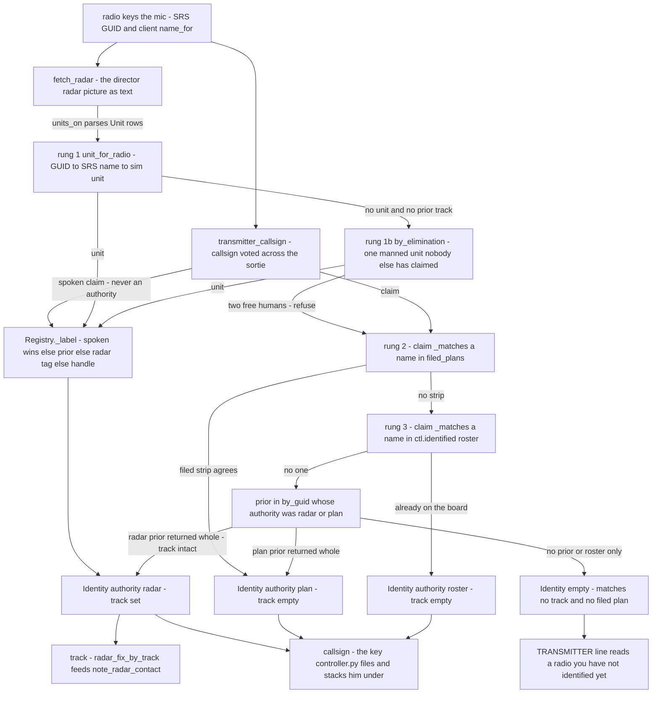

`Registry.resolve` in `src/marshall/atc/identity.py`, called once per transmission from the live loop in `src/marshall/atc/agent_atc.py` around line 3028 with `spoken=transmitter_callsign(...)`, `scope=fetch_radar(...)`, `plans=filed_plans` and `roster=ctl.identified`. The asymmetry is the whole design: only rung 1 produces a `track`, and the track is what `separation_context` uses via `radar_fix_by_track` to set `radar_identified` — a plan- or roster-authority pilot still reaches `atc/controller.py` under his callsign, but his radar-identified flag then rests on his spoken callsign matching a scope tag, which is the weaker path. Rung 4 is not a fourth authority: it re-returns the `Identity` already granted, radar or plan, so a clipped call cannot blank a pilot, while a roster-only prior is allowed to lapse. An unidentified radio gets no `challenge_for` — that deterministic "station calling" fires only for an already-known radio that named nobody; the empty case is handed to the agent as the TRANSMITTER line, and `separation_context` refuses to file him at all.

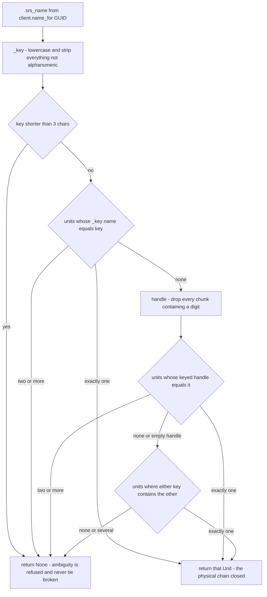

`unit_for_radio`, `handle` and `_key` in `src/marshall/atc/identity.py`; the `Unit` rows come from `units_on`, which also emits the wingmen named inside an `IN FORMATION with` line so a forming-up flight does not go invisible. Exact-first is load-bearing rather than an optimisation — with DCS running the SRS client name and the radar name are the same string, and trying substrings first made Hoover and Hoover2 each match both units, so the ambiguity rule refused and neither pilot was identified. The handle rung exists because `Andre` and `362nd Andre` contain neither one another; dropping any chunk with a digit in it also survives `Hoover 1-1-1`. `by_elimination` on `Registry` deliberately filters on `u.manned` — an unoccupied AI unit can never be the thing talking.

### names

```mermaid
flowchart LR
 GUID["SRS ClientGuid, never spoken"]
 SRSNAME["SRS client name eg Sockeye"]
 PLAYER["DCS player name via StreamUnits"]
 UNIT["sim unit name eg 362nd_sockeye"]
 DCSCS["DCS mission callsign eg Enfield11"]
 TRACKS["tracks table, primary key is the unit name"]
 LABEL["tracks.label column"]
 UNIQ["naming map from tracks._unique_labels"]
 TAG["contacts row written by identify.bind"]
 SCOPE["radar picture from tracks._render"]
 UNITSON["identity.units_on yields Unit"]
 MATCH["identity.unit_for_radio via identity._key"]
 ELIM["Registry.by_elimination"]
 IDENT["Identity.track equals the sim unit name"]
 HANDLE["identity.handle eg sockeye"]
 FLIGHT["flights.Roster.speaking_as"]
 KNOWN["known, the name ATC puts on the air"]
 PLAYER -->|"SRS takes its client name from the DCS export, outside this repo"| SRSNAME
 GUID -->|"client.name_for from the SRS roster"| SRSNAME
 UNIT -->|"tracks._upsert"| TRACKS
 PLAYER -->|"tracks._upsert writes the player column"| TRACKS
 DCSCS -->|"u.callsign"| TRACKS
 TRACKS -->|"_upsert picks player else callsign else unit name"| LABEL
 LABEL -->|"colliding labels fall back to the unit name"| UNIQ
 UNIQ -->|"one line per contact or formation"| SCOPE
 TAG -->|"identify.bindings_for annotates the line"| SCOPE
 SCOPE -->|"identity.units_on, formation ships included"| UNITSON
 SRSNAME -->|"squashed key, exact then handle then substring"| MATCH
 UNITSON --> MATCH
 MATCH -->|"no unit matched and no prior track"| ELIM
 MATCH -->|"authority radar"| IDENT
 ELIM -->|"authority radar"| IDENT
 IDENT -->|"identity.handle drops every chunk with a digit"| HANDLE
 HANDLE -->|"Roster.of finds his flight"| FLIGHT
 FLIGHT -->|"overrides Identity.callsign in the bridge"| KNOWN
```

The silent chain, with no microphone anywhere in it — `src/marshall/radio/client.py` (`name_for`), `feed/tracks.py` (`_upsert`, `_unique_labels`, `_render`), `src/marshall/atc/identify.py` (`bind`, `bindings_for`, served by `director/app.py` on `/radar`), `src/marshall/atc/identity.py` (`units_on`, `unit_for_radio`, `_key`, `handle`, `Registry.by_elimination`) and `src/marshall/atc/flights.py` (`Roster.speaking_as`, applied at `agent_atc.py` line 3147). Two edges are worth knowing when a radio call goes wrong: the bracketed tag on the scope line is *corroboration written back by a previous correlation*, so believing it as primary is circular; and `_unique_labels` silently swaps a friendly DCS callsign for the raw unit name the moment two mission groups share one, which is why the scope sometimes prints `362nd_sockeye` where it printed `Enfield11` last sortie. Note that `identity.flatten_formation` is **not** on this path — `units_on` reads the formation prose itself, and `flatten_formation` exists only for the bridge's position regexes (`radar_fix`, the type and fix scanners).

```mermaid
flowchart LR
 VOICE["what the pilot says, SPOKEN ALOUD"]
 WHISPER["srs.stt transcript text"]
 EXTRACT["callsign.extract_all, _digits then _is_our_word"]
 CANON["Callsign.canonical eg Pony 1-2"]
 PLAUS["agent_atc._plausible_callsign, roster or opening position"]
 VOTE["agent_atc.transmitter_callsign votes per GUID"]
 CLAIM["claim, a claim and never an authority"]
 INTRA["flights.is_intra_flight so the call is dropped"]
 PLANS["agent_atc.filed_plans, authority plan"]
 ROSTERN["controller.identified, authority roster"]
 RESOLVE["identity.Registry.resolve ladder"]
 LBL["Registry._label where the spoken claim wins"]
 KNOWN2["Identity.callsign, the label only"]
 FLW["flights.parse_create and parse_joining, SPOKEN ALOUD"]
 NEAR["flights.near_name against the flights that exist"]
 ROSTERF["flights.Roster.join then speaking_as"]
 SAY["Callsign.spoken read one digit at a time, SPOKEN ALOUD by Polly"]
 VOICE -->|"whisper"| WHISPER
 WHISPER --> EXTRACT
 EXTRACT --> CANON
 CANON --> PLAUS
 PLAUS -->|"second surviving name is the speaker"| VOTE
 VOTE --> CLAIM
 CLAIM -->|"member number means not addressed to ATC"| INTRA
 CLAIM -->|"spoken argument"| RESOLVE
 PLANS -->|"claim matched against a filed strip"| RESOLVE
 ROSTERN -->|"claim matched against a radar identified aircraft"| RESOLVE
 RESOLVE -->|"only once a track is already known"| LBL
 LBL --> KNOWN2
 WHISPER -->|"only when the ladder already gave him a track"| FLW
 FLW -->|"one word in the grammatical slot"| NEAR
 NEAR --> ROSTERF
 ROSTERF -->|"the flight name replaces Identity.callsign"| KNOWN2
 KNOWN2 -->|"controller._addr and the canned replies"| SAY
```

The spoken side, which produces only *labels* and never a track — `src/marshall/atc/callsign.py` (`_digits`, `extract_all`, `_is_our_word`, `parse`, `spoken`), `agent_atc.transmitter_callsign` and `_plausible_callsign` and `filed_plans`, `controller.identified` and `Controller._addr`, `identity.Registry.resolve` and `_label`, and `src/marshall/atc/flights.py` (`parse_create`, `parse_joining`, `near_name`, `is_intra_flight`, `Roster.join`). Only four values here are ever said by a human: the pilot's callsign claim, his handle, a flight name, and the controller's `Callsign.spoken`. Two edges cost the most debugging time: the denylist inside `_is_our_word` is what stops "Maintained two thousand" becoming an aeroplane called Maintained 2, and `_label` lets the voted claim rename a pilot freely — safe only because the track underneath it came from the first diagram. Note that `callsign.speaker_in` implements the same second-name convention but is exercised only by `tests/test_callsign.py`; the live bridge inlines it in `transmitter_callsign`, filtering candidates through `_plausible_callsign` *before* picking the speaker.

The heading undercounts. There are eight name-like things in this system and a
bug in any one of them looks, from the cockpit, exactly like a bug in any other.
Get this table into your head first; the rest of the section is just the code
that joins the rows together.

### The eight names

| # | Name | Where it comes from | Who can change it | Ever spoken aloud? | Keyed on by |
|---|---|---|---|---|---|
| 1 | **sim unit name** — `362nd_sockeye`, `Pony 1-2`, `Testbed 1-1` | DCS. For AI, pydcs writes `<group>-<n>` — `mission/build.py`. For a manned slot it is the slot's unit name. | mission author (or the ME) | never | `tracks.name` (PRIMARY KEY, `src/marshall/feed/tracks.py`), `Identity.track`, `flight_state.track_name` |
| 2 | **DCS player name** — `362nd_sockeye` | the human's DCS profile; arrives on the gRPC unit stream as `u.player_name` | the pilot, in DCS settings | never | `tracks.player` (`tracks.py`), and it *becomes* the radar label for a manned contact (`tracks.py`) |
| 3 | **SRS client name** — `Sockeye` | the SRS client; with DCS running it is taken from the DCS export, so **it is normally the same string as #2** | the pilot, in SRS, if he runs standalone | never | `SRSClient.roster[guid]` (`radio/client.py`), `flight_state.srs_name`, `contacts.srs_name` |
| 4 | **SRS GUID** | generated per client, arrives free on every voice packet (`radio/client.py`) | nobody | never | `Registry.by_guid`, `_transmitters`, `_order`, `flight_state.srs_guid`, `engineering_line` |
| 5 | **radar label** — what the scope prints before the bracket | `label = u.player_name or u.callsign or u.name` (`tracks.py`), then de-collided by `_unique_labels` (`tracks.py`) | indirectly, by changing #2 | never | `contacts.track_label`, `identify.bindings_for` |
| 6 | **DCS callsign** — `Enfield11` | the airframe's DCS callsign field. Left alone on purpose for AI (`mission/build.py`) — radar labels are *supposed* to disagree with what a pilot says | mission author | never | only as a fallback label at `tracks.py` |
| 7 | **spoken callsign** — `Pony 1-1`, `Falcon 1-1` | Whisper, then `callsign.extract_all` → `transmitter_callsign` (`agent_atc.py`) | the pilot, every time he keys the mic | **yes, constantly** | `Controller.aircraft` dict keys (`controller.py`), `contacts.callsign`, `_heard_on`, `_seen_at`, `radar_fix` |
| 8 | **handle** — `sockeye`, `Andre` | `identity.handle` applied to the **track name** (`agent_atc.py`) | nobody directly | yes, when he is not in a flight | `flights.Roster` membership, `_flights.of/speaking_as` |

Plus a ninth that is not a name for an aeroplane at all: the **flight name**
(`Apex`), created by a lead saying it (`flights.py:_CREATE`), owned by nobody,
gone when the group is.

**The one sentence that matters:** #1–#6 are never spoken, so they cannot be
mis-transcribed. #7 is the only one a microphone touches, and it is the one the
separation engine still uses as its primary key. That residual asymmetry is
[ARCH-2]/#40 and it is where two days went.

### The chain with no microphone in it

```
SRS GUID -> SRS client name -> sim unit name -> track
 (4) (3) (1)
```

`identity.py` states why this is the strongest link, with the measurement
behind it: radar tagged unit `362nd_sockeye` with **five different callsigns in
one week** (Pony 1-1, Hammer 1-1, Falcon 1-1, two garbles) because a callsign is
a position and he flew a different one each night (#38). The SRS name never
moved.

### What the ladder actually reads

The bridge never sees the `tracks` table. It sees one string — the radar picture
— fetched from `GET /radar` (`agent_atc.py` → `director/app.py` →
`dcs.py:radar_picture` → `tracks._render`), lines joined by `" | "`. Two shapes:

```
362nd_sockeye [Pony 1-1] (P-47D-30, manned): 4.1 nm on the 281 radial, 4,659 ft, heading 026
362nd_sockeye [Pony 1-1] (P-51D, manned) IN FORMATION with 362nd_andre (P-51D, manned, 0.3 nm) — 2 ships, lead 13.5 nm on the 307 radial, 5,950 ft, heading 062
```

`units_on` (`identity.py`) parses both into `Unit(name, callsign, type,
manned, on_ground)`. Three things to know when a picture looks right but nobody
resolves:

- **The bracketed callsign is corroboration, never the key** (`identity.py`).
 It only appears once `contacts` has a binding. Treating it as primary is
 circular and threw away 43% of legitimate bindings when it was tried.
- **The colon is not always there.** A formation line has none, and assuming it
 did blinded the ladder to *both* aeroplanes in a formation — precisely when a
 pilot is about to ask to join a flight (`identity.py`). `_SCOPE_LINE`
 now accepts a colon *or* a lookahead to `IN FORMATION`.
- **`manned` is the elimination rung's whole input.** It comes from
 `u.player_name` being non-empty (`tracks.py`, rendered at `tracks.py`).
 If the picture never says `manned`, the guest path is dead and nothing else
 will tell you.

`flatten_formation` (`identity.py`) exists because every other regex in
`agent_atc.py` that reads a range takes the **first** `N nm` on the line — which
on a formation line is a wingman's offset. Left unflattened, a flight is placed
three hundred yards off the runway. Call sites: `agent_atc.py`.

### `Registry.resolve` — the four rungs

`identity.py`. Called once per transmission at `agent_atc.py` with
`(guid, srs_name, spoken=claim, scope, plans=filed_plans, roster=ctl.identified)`.

| Rung | Code | `authority` | What it means |
|---|---|---|---|
| 1 | `identity.py` `unit_for_radio(srs_name, units)` | `radar` | The physical chain closed. No microphone anywhere. |
| 1b | `identity.py` `by_elimination` | **also `radar`** | One manned contact unclaimed, one unknown radio. Not a guess — elimination. |
| 2 | `identity.py` claim vs `plans` | `plan` | He said a name that matches a **filed strip**. |
| 3 | `identity.py` claim vs `roster` | `roster` | He said a name already on the board — borrowed authority. |
| 4 | `identity.py` prior, if it was `radar` or `plan` | unchanged | Not a new authority; the one he already had. Survives a clipped call. |
| — | `identity.py` | `""` | "Say again." |

Note what is **absent**: a rung where a well-formed callsign matching nothing
becomes an aeroplane. `identity.py` — "That rung is the bug." 846
recorded transmissions bound one radio to 37 distinct names, of which ten were
aeroplanes.

Rung 2 reads `/flightplans`, **not** `/flights` (`agent_atc.py`). The
live board contains rows created *by* the binding this rung is meant to
corroborate; believing it is circular. A flight plan is typed by a human before
anybody keys a mic, which is why it is the right authority for a *first*
transmission. Rung 3's input is `ctl.identified` (`controller.py`), which
returns only `radar_identified` aircraft — so a ghost cannot vouch for itself on
the second hearing.

Rung 1 is **re-run every transmission**, never cached (`identity.py`).
That is the answer to #38's "how do I reset it without an engineer": there is
nothing durable to reset. `Registry.forget` (`identity.py`) exists for the
same reason — but note **it has no caller anywhere in the repo**; only
`tests/test_identity.py` exercises it. The reset story rests entirely on
re-derivation.

### `authority` in the recorder

`Identity.authority` is the point of the whole module (`identity.py`). It
is written to the flight recorder on every pilot line (`agent_atc.py`) and
printed to the bridge log **only when it is not radar**:

```
 (identity: claimed 'Pony 1-2', and 'Pony 1-2' is filed)
```

`agent_atc.py`. A regular pilot showing `plan` or `roster` on every
call is a finding, not a curiosity — it means the SRS-name-to-radar-label match
is failing and you should suspect (a) the SRS roster froze, or (b) radar is
printing the **slot** name instead of the **player** name.

**(a) is a real, silent failure mode.** `radio/client.py`: `create_connection`'s
timeout stays on the socket, `_drain_tcp` blocks on a quiet server, ten seconds
of quiet raises, the drain loop exits, and the GUID→name roster **freezes for the
whole session**. Every client that joins after that point is a six-character GUID
stub forever, `_key` gives fewer than 3 characters or garbage, and every pilot
silently falls to the weaker rungs. Symptom: `radio=` in `identity_watch` shows a
hex stub instead of a name. The fix is in (`self.tcp.settimeout(None)`), but a
frozen roster is still what to look for first.

**(b)** is guarded by a canary test,
`test_a_client_slot_name_is_not_what_a_pilot_matches_on`
(`tests/test_identity.py`): `unit_for_radio("Sockeye", [Unit("Testbed 1-1")])`
must be `None`.

**The blind spot to know about:** rung 1b reports `authority="radar"`, the same
as rung 1. Only `why` distinguishes them — `"the only person flying who is not
already accounted for is in '<unit>'"` vs `"radio 'Sockeye' is in '<unit>' on
radar"`. And `identity_watch.py` prints `why` **only when authority is not
radar**. So an elimination match is invisible in the watcher. To find them:

```sh
grep -o '"why":"[^"]*"' ~/.../logs/flight-live1.jsonl | grep 'only person'
```

### `unit_for_radio` — exact, then handle, then substring

`identity.py`. Three passes, in this order, and the order is a scar:

1. **Exact on `_key`**. `_key` strips everything non-alphanumeric and
 lowercases, so `362nd_sockeye` → `362ndsockeye`. With DCS running the
 SRS name and the radar label are the *same string*, so this is the normal case.
2. **Exact on the handle**. `Andre` vs `362nd Andre` — same person,
 neither contains the other once a squadron tag is in the way.
3. **Substring either direction**.

Substrings were tried first and **failed outright**: with `Hoover` and `Hoover2`
both flying, each radio matches both units, ambiguity refuses, and *neither*
pilot is identified — it takes out the man whose name is a prefix as well as the
one whose name contains it (`identity.py`, `tests/test_identity.py`).

**Ambiguity is refused, never tie-broken**, at every pass. The reasoning is at `identity.py`: *a wrong identity is worse
than none, because none produces "say again" and wrong produces a clearance for
the wrong aeroplane*. `flights.near_name` (`flights.py`) and the agent's own
radar-ID rule (`src/marshall/atc/identify.py`) follow the same rule.

Names shorter than 3 characters after `_key` return `None` — "too short to be
evidence of anything".

`by_elimination` (`identity.py`) refuses the moment it becomes a choice: it
takes `manned` units not already in `claimed_tracks`, and returns one only if
exactly one is free. AI is excluded — matching a radio to an unmanned contact
would hand a pilot's clearances to a machine that never asked for them.

### `handle` — the pre-existing identity

`identity.py`. **The rule is "drop any chunk with a digit in it"**, split on
space, dash or underscore:

```python
parts = [p for p in re.split(r"[ _-]+", name or "") if p and not re.search(r"\d", p)]
return " ".join(parts) or (name or "")
```

Not "take what follows the first separator" — that version turns `Hoover 1-1-1`
into `1-1-1`. Squadron tags and slot numbers both carry digits and a human's name
does not, so one test removes both. Falls back to the whole string, because a
pilot calling himself `Viper2` is still somebody.

Why it exists: formation procedure says each aeroplane reverts to the callsign it
already had when the flight splits. There was no such thing, so a split had
nothing to fall back to and a wingman's radio took the flight's name
(`identity.py`, `flights.py`, [ARCH-4]/#42).

`_who` is `handle(_ident.track)` — the handle of the **sim unit name**, not of the
SRS name (`agent_atc.py`). **Consequence worth holding on to: `_who` is empty
whenever the ladder did not reach a track.** A pilot identified by `plan` or
`roster` has a callsign and no track, so for him the entire flight machinery —
create, join, break out, `speaking_as` — is dead code. That asymmetry is also what
hid a live `AttributeError` for weeks (`agent_atc.py`): the crashing
call site needed `_who`, and both routes to a track were blocked, so repairing
identity is what exposed it and the bridge died on the very next call.

### `_label` — what he is CALLED, versus the track

`identity.py`. The asymmetry is deliberate: **the track is what gets
separated; the label is only ever used to address him. A wrong label is rude; a
wrong track is dangerous.**

```
spoken (already voted across the sortie) -> wins
 otherwise: prior.callsign -> u.callsign (the [bracket]) -> handle(u.name) -> u.name
```

- `spoken` is not one transmission's guess. It arrives pre-voted by
 `transmitter_callsign` (`agent_atc.py`), which counts how often a radio has
 used a name against how recently, with one override: **naming yourself more
 precisely wins immediately** — a radio bound to `Pony 1` that says `Pony one
 one` has become specific, not changed its mind.
- **A second guard here was a real outage** (`identity.py`). It refused
 any rename no filed strip agreed with. A pilot checked in as Pony 1-1, flew as
 Falcon 1-1 and said so a dozen times, and stayed Pony 1-1 forever. Radar had
 tagged his track `Falcon one one`, the engine went looking for `Pony 1-1`, found
 nobody, and told him he was not radar identified for the whole approach — while
 the agent cheerfully vectored Falcon 1-1. Two brains working two different
 aeroplanes. The evidence for the guard came from replaying the *raw* extractor
 with no vote in front of it; the live path has never worked that way.
- **The last-resort chain ends at `handle(u.name)`, not `u.name`**
 (`identity.py`). Reaching the unit name put a squadron tag on the air:
 the controller called a man `362nd_Andre-1`, which Polly read as *"3-6-2 and
 DeAndre-1"*.
- `_label` still takes a `plans` argument it never reads — leftover from the
 removed guard. Harmless, but do not assume filed strips influence the label.

After `_label`, one more rewrite happens outside identity.py: if he is in a
flight, `known = _flights.speaking_as(_who)` replaces the label with the **flight
name** (`agent_atc.py`).

### Where the label is still a key — the residual risk

`Controller.aircraft` is `dict[str, Aircraft]` keyed on the **callsign string**
(`controller.py`). So is `_heard_on`, `_seen_at` (via `_key_name`,
`agent_atc.py`), and `radar_fix`. The mitigation is that guidance is looked up
**by track first**:

```python
_fix = (radar_fix_by_track(scope, _ident.track, profile)
 or radar_fix(scope, known, profile)) # agent_atc.py```

and `flight_bind` writes `track_name=_ident.track`, never the callsign — binding
it to the callsign made the airspace view's join to `tracks` never match, every
aeroplane came back with no geography, and a pilot at eleven miles was offered to
Georgia Center eight times in one approach (`agent_atc.py`).

One sharp edge in `resolve` worth knowing: a prior **radar** identity does not
protect rung 2. If radar misses him for one sweep (`u is None`) *and* his spoken
claim matches a filed plan, the loop at `identity.py` overwrites `by_guid`
with a `plan` identity whose `track` is `""` — losing the track, and with it
`_who`, the flight machinery and `radar_fix_by_track`. The prior-identity
fallback at is only reached when rungs 2 and 3 both miss.

Also: `contacts` (the agent's own binding table, `src/marshall/atc/identify.py`) is
a **separate** identity store from `Registry`. It is what puts `[Pony 1-1]` in the
scope brackets, it is written by the agent's `identify` tool on a position report,
and it expires after `BINDING_TTL_SEC = 2h` (`identify.py`) — added after a tag
reading `Hammer 1-1` from a Jug sortie twelve hours earlier sat on an F-16 whose
pilot was calling himself Falcon 1-1. The registry and `contacts` can disagree,
and `_label` prefers `prior.callsign` over the bracket, so they will.

### Diagnosing a misidentification

```sh
uv run python tools/identity_watch.py # live, follows the newest recording
uv run python tools/identity_watch.py --replay # from the top, then follow
uv run python tools/whos_who.py # tracks vs board vs radio, refreshing
```

`identity_watch` prints one line per pilot transmission
(`tools/identity_watch.py`):

```
time radio claim -> resolved authority who scope
14:22:07 radio=Sockeye claim=Pony 1-1 -> Pony 1-1 [radar ] sockeye 2 manned
14:22:31 radio=a1b2c3 claim=Falcon 1-1 -> Falcon 1-1 [plan ] 1 manned <<
 why: claimed 'Falcon 1-1', and 'Falcon 1-1' is filed
```

Read the columns in this order:

1. **`radio=`** — a six-hex-character stub means the SRS roster is broken
 (`radio/client.py`), and *everything* below it is downstream of that.
2. **`authority`** — anything but `radar` gets a `<<` marker and its `why`
 printed. A regular pilot on `plan`/`roster` is a finding.
3. **`N manned`** — computed live by re-parsing the recorded scope through
 `units_on`. If it reads `0` while somebody is flying, `tracks.player` is empty
 (check the gRPC unit stream) and the guest/elimination path is dead.
4. **`heard 'X', concluded 'Y'`** — printed whenever the claim and the answer
 differ. That is the design working: it is the exact case that used to invent an
 aeroplane.

`whos_who` answers the other question — whether the *board* agrees with the sky.
Its three panels are TRACKS (from `/radar`, ground truth), BOARD (from the last
`kind="board"` recorder line, which is written adjacent to the transmission that
produced it, `agent_atc.py`), and RADIO. It prints explicitly:

```
 !! on the board, not on radar: Waypoint 3, Busy 4
```

That line is the ghost detector. `None` board vs `[]` board are distinguished on
purpose (`whos_who.py`) — "no snapshot yet" and "the engine is tracking
nobody" look identical and mean opposite things.

Every field you need is on the `kind="pilot"` recorder line — `srs_name`,
`claimed`, `callsign`, `authority`, `track`, `who`, `why`, `scope`
(`agent_atc.py`). Both of the earlier weak paths are replayable from an
old recording because `srs_name` and `authority` are now preserved; recordings
from before that change can only measure the weak rungs.

### Which brain produced it

- Wrong **name on the air**, right aeroplane vectored → `_label`/`transmitter_callsign`
 on the bridge. Check `claim` vs resolved in `identity_watch`.
- Right name, **wrong aeroplane vectored** → the track. Check `_ident.track` against
 the scope, and check `contacts` for a stale bracket.
- "**Station calling, say your callsign**" from a man who named himself → either
 `said_who` (`tests/test_identity.py`: a bare handle used to fail the
 challenge because `callsign.extract` demands a number), or the ladder returned
 `authority=""`.
- A **flight verdict never voiced** → the verdicts are computed deterministically
 and pushed to the agent as `FLIGHT (already decided ...)` (`agent_atc.py`).
 If the pilot heard nothing, look for `_flight_say` being empty because `_who`
 was empty because there was no track.
- **Two controllers arguing** → `OUR_STATIONS` (`agent_atc.py`) and the
 self-GUID check at. A second bridge on the same frequency is trivially
 easy to leave running.

---

## Flights: forming, joining, leaving

### flights

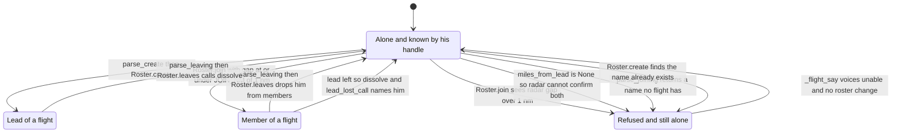

Membership state lives in the single `fl.Roster` at `src/marshall/atc/agent_atc.py`, and every transition is a method on `Roster` in `src/marshall/atc/flights.py` — `create`, `join`, `leaves`, `dissolve`. Two edges are worth remembering on the radio: a join is refused when radar cannot see both aircraft at all, not only when they are too far apart, and losing the LEAD dissolves the whole flight rather than promoting anyone, so surviving wingmen revert to individuals the controller separates again. Note that `leaves` is documented as surviving the loss of its lead but the code dissolves, and its "last member gone" branch is unreachable because the lead is always in `members`. Name recognition is fuzzy through `near_name` against the closed set of existing flights, so Whisper's "Abex" still joins Apex, but a name matching nothing is echoed back in the refusal only and never acted on.

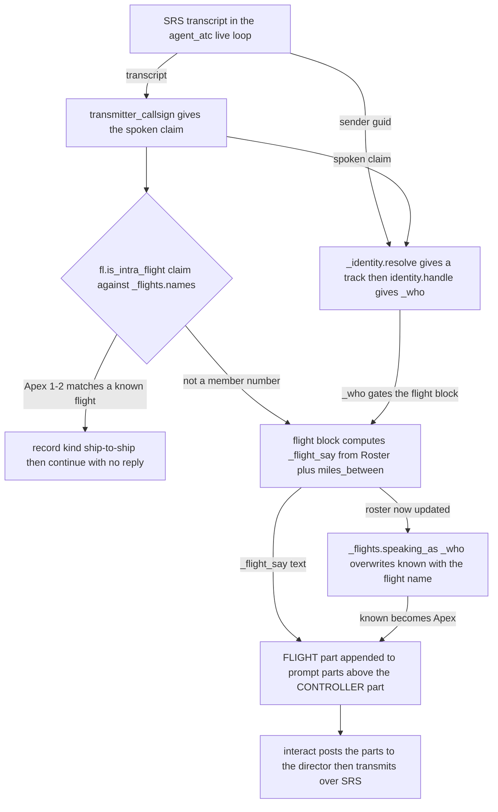

Attribution runs in one block of `src/marshall/atc/agent_atc.py` around lines 3037 to 3150, calling into `src/marshall/atc/flights.py`. Intra-flight talk is dropped on the spoken claim alone, before any reasoning happens — hearing "Apex 1-2" is treated as evidence the call was not addressed to the controller, so the hardest identification case becomes one nobody has to resolve. The verdict is deterministic like separation is: the prompt part says SAY THIS and do not reword the callsigns, the flight name or the distances, it sits above the CONTROLLER directive so a refused join is answered first, and a set `_flight_say` also suppresses the "say your callsign" challenge at line 3393. Left out: the identity ladder inside `_identity.resolve` and the radar geometry of `miles_between` and `_track_of`, which supply the gap the join test uses.

Two files. `src/marshall/atc/flights.py` (383 lines, no imports beyond `re`/`time`/`dataclasses`) holds the whole model and is pure state; `src/marshall/atc/agent_atc.py` is the only caller — one block inside the SRS receive loop that reads the transcript, mutates the roster, and produces a single string, `_flight_say`, which is later handed to the agent as a directive it must voice verbatim.

Nothing about flights touches the network, the director, or `controller.py`. If the radio said something odd about a flight, the answer is in those two places and nowhere else.

### The two kinds of name

```
A HANDLE one person. "Sockeye". Unique, never spoken by us to mean
 anything else, and true whatever he is flying.
A FLIGHT NAME one group. "Apex". Derived from nobody, owned by nobody in
 particular, and gone when the group is.
```
(`flights.py`)

The handle comes from `identity.handle` (`identity.py`) — drop every chunk of the DCS unit name that contains a digit, so `362nd_sockeye` → `sockeye` and `Hoover 1-1-1` → `Hoover`. It is never spoken by a pilot and never transcribed, which is why it can be trusted.

A member number is deliberately **not** a third kind. See below.

### Roster and Flight

```python
@dataclass
class Flight:
 name: str
 lead: str # a handle
 members: list[str] = field(default_factory=list) # handles, lead included
 formed_at: float = 0.0
```
`flights.py`. The lead is also in `members` — `create` appends him (`flights.py`). `Flight.has` and every other comparison inside `flights.py` go through `_same` (`flights.py`), which is case- and whitespace-insensitive.

`Roster` (`flights.py`) is a single dict `name -> Flight` plus six methods. It lives as one process global:

```python
_flights = fl.Roster # agent_atc.py```

**This is in-memory only.** No table, no `/flights` POST, no file. Restart the bridge mid-sortie and every flight silently ceases to exist while the pilots still believe they are in one — the next transmission from a wingman is answered as himself, and a `joining` call gets `unable, Apex flight doesn't exist`. Worth knowing before you go hunting for a parsing bug.

Do not confuse `_flights` with `_flight` (singular, `agent_atc.py`). `flight_bind` / `flight_agree` / `flight_handoff` / `flight_strip` (`agent_atc.py`) are the **director's** flight-strip board — an HTTP row in Postgres holding clearance, assigned altitude and procedure. Completely separate mechanism, unfortunately similar name.

| method | what it does | refusal cases |
|---|---|---|
| `create(name, lead)` | opens a flight of one | `"a flight needs a name and a lead"`, `"{name} already exists"`, `"{lead} is already in {other}"` |
| `join(name, handle, miles_from_lead)` | adds one handle | no such flight; already in another; `miles_from_lead is None`; gap > `JOIN_NM` |
| `leaves(handle)` | one man out; returns the flight name **if it dissolved** | — |
| `dissolve(name)` | removes it, returns the member list | — |
| `of(handle)` | the flight he is in, or `None` | — |
| `speaking_as(handle)` | flight name, else his own handle | — |
| `names` | sorted flight names — the closed set the parsers match against | — |

There is **no size and no pending state**. An earlier version had the lead declare a count so the flight was not treated as one until that many joined; `flights.py` explains why it went — every member joins on his own radio, so every member has been heard by construction, and a count is one more thing Whisper can get wrong for no benefit. `parse_create` reads a name and discards anything else (`flights.py`).

### The one-mile rule, and where the distance comes from

```python
JOIN_NM = 1.0 # flights.py```

Formation distance, "because joining is the moment the controller stops separating him, so it had better be true" (`flights.py`). The test is `if miles_from_lead > JOIN_NM` (`flights.py`) — exactly 1.0 passes.

`Roster.join` does not measure anything. The bridge measures and passes a number:

```python
_lead = _flights.flights[_want].lead
_gap = miles_between(scope, _ident.track, _track_of(scope, _lead))
_f, _why = _flights.join(_want, _who, _gap)
```
`agent_atc.py`.

- `_track_of(scope, handle)` (`agent_atc.py`) walks `identity.units_on(scope)` and returns the scope label whose `handle` is the lead's.
- `miles_between` (`agent_atc.py`) works purely off the radar text the director returned this cycle. `_scope_geometry` (`agent_atc.py`) builds two dicts because a formation genuinely has two kinds of member: a lead with range+radial from the field, and wingmen printed only as `0.3 nm` off him. So there are four cases — both absolute (hypotenuse), one is the other's wingman (return his offset), both wingmen of the same lead (sum of offsets), wingman vs. stranger (lead's distance plus the offset). The last two are **upper bounds on purpose**: over-estimating costs a false refusal he can recover from by saying it again; under-estimating puts a man in a formation radar cannot confirm (`agent_atc.py`).
- When the picture prints a formation with no offset figure, `offset[k]` is stored as `None`, **not zero** (`agent_atc.py`). Zero would read as "they are touching" when what is actually known is only "inside the formation threshold", which is twice the join radius.

`None` propagates to `join`, which refuses:

```
negative Andre, radar does not show you both -- unable to confirm you are with Apex
```

and over a mile:

```
negative Andre, radar shows you 9 miles from Apex -- you must be within 1 mile to join
```

Two things to expect from that second string. The distance is formatted `:.0f`, so a refusal at 1.4 nm reads *"radar shows you 1 miles from Apex — you must be within 1 mile to join"*, which sounds like nonsense on the radio and is not. And `radar_on` gates the whole scope fetch (`agent_atc.py`); with radar off, every join is the "does not show you both" refusal.

On the ground the rule needs no special case — parked aeroplanes are yards apart (`tests/test_flights.py`), so a flight formed at the ramp gets one clearance and one squawk, which is what a formation gets in reality.

### speaking_as: why a member has no ATC identity of his own

```python
if _who and _flights.of(_who) is not None:
 known = _flights.speaking_as(_who)
```
`agent_atc.py`. This is the single line that makes membership mean anything. Everything downstream of it — the printed `PILOT [...]` line, the flight recorder row, `_heard_on[known]`, `separation_context(ctl, ..., known, ...)`, `flight_bind(callsign=known)`, `ctl.get(known)` — sees the flight name, not the man.

The reasoning is real-world formation procedure plus the crash it was written after: four aeroplanes in formation are one radar contact and one entity to separate, so giving a member his own ATC name means the controller starts separating him from the flight he is inside. `flights.py` lists what deriving a member's identity from a flight number actually cost on 28 July, and `agent_atc.py` has the live symptom of the related bug: two Mustangs each computed from the other's position, one told "one mile from the runway, descend to minimums" at thirty-six miles.

**Consequence worth knowing when troubleshooting.** A pilot's `known` changes mid-sortie at the moment he joins. `controller.py` keys its board by callsign, so his old row under `Sockeye` stays behind and a new one appears under `Apex`. And `agent_atc.py` computes `_fix = radar_fix(scope, known, profile)` **by callsign only**, which will not match a scope tagged with DCS unit names, so `track_name` is left out of the `flight_bind` call at 3246 — the exact condition the comment at 3239-3245 says produced "a pilot being vectored at eleven miles offered to Georgia Center eight times in one approach". The by-track path (`radar_fix_by_track`, 3167) is unaffected; this is the one remaining by-callsign lookup on the flight path.

### is_intra_flight: why "Apex 1-2" never reaches ATC

```python
_MEMBER = re.compile(r"^\s*([A-Za-z][A-Za-z'-]*)\s*\d+\s*-\s*\d+\s*$") # flights.py```

`is_intra_flight` (`flights.py`) returns True only when the transcript is *exactly* that shape **and** the leading word is a flight that currently exists. The bridge acts on it before anything else:

```python
if claim and fl.is_intra_flight(claim, _flights.names):
 print(f" .. {claim} is intra-flight, not for the controller", flush=True)
 record(session_id, kind="ship-to-ship", callsign=_who, text=transcript)
 continue
```
`agent_atc.py`. Note it is applied to `claim` — the voted callsign from `transmitter_callsign` — not to the raw transcript, so it fires on the callsign the sortie-long vote extracted.

This is the design's best trick, stated at `flights.py`: a member number is evidence the transmission is **not addressed to the controller**, so the hardest case to resolve becomes a case there is no need to resolve. The "only for a flight we actually know" guard matters — an unknown name in that shape is somebody flying under the old callsign scheme, and refusing to hear him would be worse than the noise (`flights.py`).

If the controller answers a wingman's internal call, check `_flights.names` first: the flight probably does not exist in the roster (never created, or lost to a bridge restart).

### The parsers

All three are called on the raw `transcript`, in this order, each on the same transmission (`agent_atc.py`, `3079`, `3108`).

| parser | regex | line |
|---|---|---|
| `parse_create` | `creat\w*|form\w*|establish\w*` + a name | `flights.py` |
| `parse_joining` | `join(ing|s|ed)?` | `flights.py` |
| `parse_leaving` | `separat\w*|break\w*\s+(out|away|off)|detach\w*|depart\w*\s+the\s+flight|leav\w*` | `flights.py` |

`parse_joining` returns a **pair**: `(known flight, what he said)`. The first is only non-empty when the word resolves to a flight that exists; the second exists purely so a refusal can echo his word back. `flights.py` is explicit about why that asymmetry is safe — "a mis-heard name in an apology costs nothing, and the same mis-hearing used to put him in a formation costs him his separation."

He does not have to say who he is. The identity ladder already knows which aeroplane is transmitting; the only thing to find in the words is which flight he means (`flights.py`).

Both `parse_joining` and `parse_leaving` first scan every word for an exact match against an existing flight name, and only fall back to the grammatical-slot regex + fuzzy match.

### Closed-set near-matching

`near_name(said, flight_names)` (`flights.py`):

- shorter than 3 characters → `""`
- exact match (case-insensitive) wins outright
- otherwise Levenshtein (`_distance`, `flights.py`) with a threshold of `max(1, len(n) // 4)` — one edit per four characters
- **more than one candidate inside the threshold → `""`**, refused rather than tie-broken, the same rule as `identity.unit_for_radio`

Whisper turned "Apex" into "Abex" in rehearsal and a wingman formating half a mile off his lead was refused the flight he was already in (`flights.py`, `173-176`). With one flight airborne, "Abex" can only have meant that one — but matching against unbounded English would be a guess, while matching against the two flights that exist is a lookup. That distinction is the whole design.

It is **only ever called on the word in the grammatical slot** — after "joining" or "leaving" — never scanned across the transmission (`flights.py`). A fuzzy match anywhere in a sentence would eventually catch an ordinary word, and flight names are short enough to sit one edit from real English. If you see a join fire on a transmission that only mentioned a flight in passing, that constraint has been broken.

### Losing a member, and losing the lead

`Roster.leaves(handle)` (`flights.py`):

- **lead leaves → the flight dissolves.** Returns the flight name.
- a member leaves → he is removed; if `members` is now empty the flight dissolves.
- otherwise returns `""`.

`flights.py` quotes the pilot ("And maybe if lead dies, the flight is dissolved? ... Simple simple") and gives the reasoning: the flight's geometry **is** the lead's track, so with him gone the flight has no position at all. Dissolving says that; promoting somebody pretends otherwise and starts vectoring off an aeroplane nobody chose. It is also the conservative failure — the survivors revert to individuals, so the controller starts separating them, which is exactly right for two men whose lead has just gone down.

**`docs/ISSUES.md` [ARCH-4] is stale on this point.** It still says "When the lead drops out the roster promotes the next member". The code does not; the design changed after that was written. Trust the code.

`lead_lost_call(flight, lead, survivors)` (`flights.py`) builds the announcement, and the ordering is deliberate — fact, consequence, question:

```
Apex flight, flight lead sockeye is no longer on radar. Apex flight is now
dissolved. Andre, what are your intentions?
```

**The scar here:** the phrase says "no longer on radar", but the only caller (`agent_atc.py`) is the *voluntary break-out* branch — the lead saying "separating from Apex". Nothing watches radar for a lead who went off the scope or disconnected, and `Roster.leaves` has no other call site anywhere in the bridge. A lead who ejects, lands, or drops out leaves his flight standing in the roster indefinitely, with `speaking_as` still answering "Apex" for the survivors.

### The flight block in the loop, step by step

`agent_atc.py`, running once per received transmission:

```python
_flight_say = "" # 3055
if _who:
 _name = fl.parse_create(transcript) # 3060 -> create, sets _flight_say
 _want, _said_name = fl.parse_joining(transcript, _flights.names) # 3079
 ... # join / refuse, sets _flight_say
 _out = fl.parse_leaving(transcript, _flights.names) # 3108
 ... # leave / dissolve, sets _flight_say
```

Log lines to grep for in the bridge output:

```
 .. Apex: created, lead sockeye
 .. Apex: sockeye is already in Bolt
 .. Apex: Andre joined
 .. negative Andre, radar shows you 9 miles from Apex -- you must be within 1 mile to join
 .. Andre: no flight called Foo
 .. Apex dissolved — its lead left
 .. Andre is out of Apex
 .. Apex 1-2 is intra-flight, not for the controller
```

Flight-recorder kinds written to `build/logs/flight-<session>.jsonl` (`record`, `agent_atc.py`): `flight/created`, `flight/joined`, `flight/refused`, `flight/left`, `flight/dissolved`, and `ship-to-ship` for the intra-flight case. The join records `miles=round(_gap or 0, 1)` (`agent_atc.py`) — so a `flight/refused` with `miles: 0.0` means the distance was `None`, not that they were on top of each other.

Three sharp edges in this block, all real:

1. **The three parsers run on the same transcript and each overwrites `_flight_say`.** Last writer wins, so leave beats join beats create. A transmission that trips two parsers voices only the later verdict, even though both mutations happened.
2. **`_out` is used only for the wording; the mutation uses `_mine`.** Lines 3109-3112: he is removed from the flight `of(_who)` says he is in, but the announcement names the flight he *said*. Say "separating from Bolt" while a member of Apex and you are removed from Apex and told you are no longer in Bolt.
3. **Handle comparison here is exact `==`, not `_same`.** `_was_lead = _mine.lead == _who` and `_survivors = [m for m in _mine.members if m != _who]` (3110-3111) are case-sensitive, while everything inside `flights.py` is not. A handle that resolves with different capitalisation across transmissions makes `_was_lead` read False and puts the departing man in his own survivor list.

### The gate: `if _who`

The entire block is inside `if _who:` (`agent_atc.py`), and:

```python
_who = identity.handle(_ident.track) if _ident.track else "" # agent_atc.py```

`_who` requires a **track**, which means `Registry.resolve` returned `authority == "radar"` — rung 1 of the ladder (`identity.py`), the physical chain radio GUID → SRS client name → DCS unit → track, with no microphone in it. Rung 2 (a claim matched against a filed plan) and rung 3 (a claim matched against somebody already on the board) both set `callsign` and leave `track` empty (`identity.py`, `461`), so:

**If identity resolves by anything other than radar, the flight system does not run at all.** No create, no join, no leave, no `speaking_as`, no verdict, no log line. The pilot says "request creation of Apex flight" and gets an ordinary agent reply about something else, or a `station calling, say again your callsign` challenge. There is no "flights unavailable" message anywhere — the failure is silent.

The tell is one line up:

```python
if _ident.authority and _ident.authority != "radar":
 print(f" (identity: {_ident.why})", flush=True)
```
`agent_atc.py`. So `(identity: claimed 'Pony 1-1', already on the board)` in the log immediately before a flight call that did nothing is the whole explanation. `(identity: ...)` printing at all when a pilot should be on radar means something upstream — the radar fetch, the SRS/DCS name match — has broken, and flights are one of the things that quietly stop working when it does.

This same gate is why the `parse_adopting` AttributeError survived so long. `tests/test_bridge_calls.py` documents it: a call site removed from `flights.py` but left in the bridge, unreachable because both routes to a track were blocked, then reachable the instant identity was repaired — "the flight rehearsal created Apex and the bridge died on the very next transmission." That test now AST-walks `agent_atc.py` and asserts every `fl.*` and `identity.*` attribute it calls actually exists.

### How a verdict reaches the pilot's ears

`_flight_say` is not transmitted directly. It is appended to the agent's message as a directive (`agent_atc.py`):

```python
parts.append(
 "FLIGHT (already decided from the roster and radar — SAY THIS "
 "and do not reword the callsigns, the flight name or the "
 f"distances): {_flight_say}")
```

Placed **above** the `CONTROLLER` directive on purpose — a man who has just been refused a join needs that answer first, and the two are never in conflict because they are about different things (3495-3497). The comment at 3490-3493 states the invariant explicitly: who is in which flight is roster state and radar geometry, "the same class of fact as separation, and the same reason it is not the model's to invent."

So a flight verdict is the deterministic brain speaking through the agent's mouth. **If you hear the flight name or a distance paraphrased, garbled or dropped, that is the agent disobeying a directive — not a roster bug.** Compare the `FLIGHT (...)` line in the assembled prompt against what came out of the speaker; `tools/atc_dryrun.py` exercises exactly this seam without a radio.

`_flight_say` has one more job. The out-of-the-blue challenge is suppressed when it is set:

```python
if not _said_who and not _open and known and not _flight_say: # agent_atc.pyreply = challenge_for(transcript)
```

"AND NEVER SWALLOW A DECISION" (3389-3392) — challenging him instead would throw away a join, a refusal or a dissolve that has **already taken effect in the roster**, leaving the roster and the pilot disagreeing about who is in what. This was the observed failure: the rehearsal showed a flight created, a wingman joined and an outsider refused at nine miles, while every pilot heard "station calling, say your callsign" (3049-3054).

The challenge also consults the roster for the opposite reason. `said_who(transcript, [*_flights.names, _who])` (`agent_atc.py`, function at `828-846`) treats a bare handle or a flight name as complete self-identification, because `callsign.extract` only recognises the numbered shape and so read "Batumi Approach, Sockeye, request creation of Apex flight" as a man who had not said who he was — and challenged him for the name he had just given.

### Where the roster is not

Worth holding in mind when a flight-related behaviour looks wrong and none of the above explains it: `controller.py` has its **own, older** formation model, keyed on callsign shape rather than on the roster — `Aircraft.is_flight`, the `Pony-1` lead fallback in `key_for` (`controller.py`), and `ambiguous_after_breakup` (`controller.py`), which refuses to answer a formation name that has already split rather than guessing which of two aeroplanes keyed the mic. The two models meet at exactly one point: the `known` string that `speaking_as` produces. The roster never tells the separation engine that a flight formed or dissolved, and the separation engine never asks. `docs/ISSUES.md` [ARCH-4] describes the flight-elects-to-break-up half of this as designed on 29 July, attempted, and reverted — it ripples through twenty-two formation tests. That seam is the first place to look when the deterministic engine and the roster appear to hold different opinions about who "Apex" is.

---

## The deterministic brain: separation and the approach

Four files, and they divide by what kind of question they answer:

| file | owns | state? |
|---|---|---|
| `atc/controller.py` | the **board** and the **queue** — who exists, what level he holds, whose turn the letdown is | yes, and it is the only stateful one |
| `atc/asr.py` | the **approach** — where he is on it, what heading regains the course, what altitude he should be at | none (one latch lives outside it, in the bridge) |
| `atc/geometry.py` | the **maths** — cross-track, along-track, intercept angle, which way round the turn is | none |
| `atc/phases.py` | the **vocabulary** — the named phases of a sortie, who owns each, what may legally follow | none; a table |

`controller.py` is blind (`controller.py`). It has no radar, no telemetry, no connection to the sim. Everything it believes came out of somebody's mouth, through Whisper, through the intent classifier. `asr.py` is the opposite: it sees, and remembers nothing. Every call to `asr.guide` re-derives the whole situation from one radar Position (`asr.py`). Almost every confusing thing you will hear on the radio comes from that asymmetry, and from the bridge's attempts to bridge it.

### The line: which utterances are COMPUTED and which are GENERATED

This is the first question to ask about any transmission that surprised you, and the bridge log answers it directly by prefix.

| you heard | produced by | log line |
|---|---|---|
| "Falcon one one, four miles from the runway, on course, descend to one thousand two hundred" | **computed** — `asr_call` `agent_atc.py`, no model involved | ` ATC[asr] ...` |
| "Falcon one one, turn right heading one three zero, maintain three thousand" | **computed** — `vector_call` `agent_atc.py` | ` ATC[vec] ...` |
| "Falcon one one, Batumi Tower, welcome. Exit the runway when able, taxi to parking." | **computed** — `Controller.report_down` `controller.py` | ` ATC[down] ...` |
| "Batumi Approach, radio check, loud and clear" | **computed** — `simple_response`, canned, only when the engine is not engaged | ` ATC[simple] (0.0s): ...` |
| everything else — every reply to something a pilot said | **generated** by the Bedrock agent | ` ATC[pilot/sonnet] (2.4s): ...` |

Two more lines matter and are *not* transmissions — they are what the bridge told the agent:

```
 CONTROLLER: Falcon 1-1, cleared radar approach runway one three, report established ...
 SEPARATION: Falcon 1-1 cleared -; Pony 1-1 holding 12000 ft
 ASR: vectoring, one two miles, about a mile left of course. Turn right. Fly heading 148 ...
```

`CONTROLLER:` is the deterministic engine's directive (`agent_atc.py`), `SEPARATION:` is the stack summary (`_stack_summary`, `agent_atc.py`), `ASR:` is the geometry (`asr_context`, `agent_atc.py`). All three are injected into the agent's prompt as labelled blocks (`agent_atc.py`) with instructions to *voice the numbers exactly*. So a heading the agent spoke may still have been computed — check whether the number in `ATC[pilot/sonnet]` matches the number in the `CONTROLLER:`/`ASR:` line above it. If it does not, that is the agent paraphrasing, which is the failure mode `tools/atc_dryrun.py` exists to catch cheaply.

### When the deterministic engine engages at all

One line, `agent_atc.py`:

```python
engaged = SEP_ALWAYS or n_contacts >= 2 or len(ctl.aircraft) >= 2
```

- `SEP_ALWAYS` is `MARSHALL_SEP_ALWAYS=1` (`agent_atc.py`) — for the voice-only rehearsal, which has no radar tracks at all.
- `n_contacts` is `count_contacts(scope)` (`agent_atc.py`), which counts **aircraft, not lines**: radar collapses a formation into one line with "— 4 ships —", so counting lines would switch the engine off for the arrival that most needs sequencing.
- `len(ctl.aircraft)` is the board, which latches the engine on once a stack exists even if radar drops.

Not engaged means `separation_context` is never called, so there is no `CONTROLLER:` or `SEPARATION:` line, no intent classify on the path, and the single ship is worked by pure Sonnet plus geometry. **This is the deliberate design, not a degradation** — with one aeroplane there is nothing to separate.

The ASR half is gated differently and separately: `asr_context` runs for a single ship too, because it costs no model call (`agent_atc.py`, and it returns `""` immediately unless `profile.vectored`). The metronome thread has its own gate, `radar_on and profile.vectored` (`agent_atc.py`).

So: **a stale board entry turns a single-ship approach into a sequencing problem.** That is the scar behind `release_stale` (`agent_atc.py`) and `Controller.release` (`controller.py`) — a pilot who flew as Falcon 1-1, left the slot and came back as Pony 1-1 was held at five thousand behind his own former self. Symptom in the log:

```
 .. Falcon 1-1 — nothing has accounted for him in 8 minutes, off the board
```

If you hear sequencing on a solo sortie, `SEPARATION:` in the log tells you who the phantom second aeroplane is.

### The board: who is on it, how they get on and off

`Controller.aircraft` is `dict[callsign -> Aircraft]` (`controller.py`). `Aircraft` (`controller.py`) carries phase, `assigned_ft`, `approaches`, `members[]`, `map_t`, `on_visual`, `kit`, and `radar_identified`.

**Getting on.** Only through `separation_context` (`agent_atc.py`) → `intents.dispatch` (`intents.py`) → one of `check_in` / `report_beacon` / `report_missed` / `report_landed` / `request_approach` / `request_breakup` / `request_visual`. Every one of those calls `Controller.get` (`controller.py`), which *creates on demand* — which is exactly how ghosts were minted. Three defences now sit in front of it, all in `separation_context`:

1. `_plausible_callsign` — a callsign needs a NAME, not just a number (`agent_atc.py`). Log: ` .. ignoring 'Maintained 2' -- that is not a callsign`.
2. **The radio, not the words** — if this SRS GUID already answers to a callsign, that callsign overrules the classifier (`agent_atc.py`). Log: ` .. heard 'Hammer 1-3', but this radio is Hammer 1-1`.
3. **Unidentified callers reach the engine not at all** — if we do not know whose radio it is and the name is not a tagged track on the scope, the intent's callsign is blanked (`agent_atc.py`). Log: ` .. 'Left 3-8' is neither a radio we have identified nor a track on the scope; the engine will not be told about it`.

**Getting off.** Three ways: `report_landed`/`report_down` set `Phase.LANDED`; `release` removes the entry outright (`controller.py`), driven by `release_stale` on the 2-second scheduler tick (`agent_atc.py`, `HOOK_POLL_SEC = 2.0`); and `_break_up` pops a flight and replaces it with nothing, remembering the members in `_broken_up` (`controller.py`).

**Reading the board.** `Controller.board` (`controller.py`) is written to the flight recorder on *every* pilot transmission (`agent_atc.py`, `kind="board"`), so a ghost is timestamped and adjacent to the words that created it. `tools/replay.py` is where you read it back. `identified` (`controller.py`) is deliberately narrower than `aircraft.keys` — only radar-vouched aircraft may corroborate anybody else's identity, or a mis-hearing gets more convincing each time it repeats.

### Formations

A joined flight is ONE `Aircraft` with `members[]` (`controller.py`), holding one stack slot. `_resolve` (`controller.py`) is what makes any member's transmission count as the flight talking — which is realism *and* the best defence against Whisper hearing "one two" for "one one".

Break-up (`_break_up`, `controller.py`) now does exactly one thing: **the flight stops existing.** No levels are assigned to the members. Each is an ordinary arrival from that moment and must check in and ask for the approach himself. The old visual-separation tri-state and the "can you maintain visual separation between your aircraft?" question are **gone** — separation inside a formation is the lead's, per the quoted comment at `controller.py`. Note that `docs/DESIGN.md:122-136` still describes the old tri-state behaviour; the code is the newer authority.

Break-up is triggered by arrival at the fix (`report_beacon`, `controller.py`), by `request_approach` (`controller.py`), by `request_visual` (`controller.py`), or by lead asking (`request_breakup`).

After break-up the flight NAME means nobody. `ambiguous_after_breakup` (`controller.py`) returns True and `say_again_who` (`controller.py`) asks rather than guessing — if you hear "Pony one flight, you are broken up for individual approaches — say your callsign. I have Pony one one, Pony one two.", that is this, and it is computed.

### The holding stack and one-in-the-letdown

The levels are **generated, not listed** — `ApproachProfile.stack_ft` (`route.py`) is `range(hold_base_ft, hold_top_ft+1, hold_step_ft)`. On a vectored approach the base is raised above the cloud tops (`route.py`), because "hold present position" is only a real instruction if the pilot can see. That is why the ASR stack at Batumi starts at 12,000 and not 4,000.

The rules, all in `controller.py`:

| rule | where |
|---|---|
| enter at the top — lowest free slot above the current holders | `_free_slot` `controller.py` |
| step down on vacate — when the bottom is cleared, everyone drops one level | `_step_down` `controller.py`, called from `_try_clear` `controller.py` |
| one in the letdown — `_letdown` holds exactly one callsign | `controller.py`, `_try_clear` `controller.py` |
| missed → front of the line | `_next_up` `controller.py` prefers `Phase.MISSED` |
| repeat miss (≥2) → banished to the outer hold at `top_ft` | `_do_missed` `controller.py`, `MAX_APPROACHES = 2` |
| silent letdown → released after 12 min, do not deadlock | `tick` `controller.py`, `CLEARANCE_TIMEOUT_SEC` |
| quiet holder prompted after 5 min, **one per tick** | `tick` `controller.py`, `REPORT_OVERDUE_SEC` |

`_step_down` steps **levels, not aircraft** (`controller.py`) so that a shared level does not get silently laddered apart.

Two behaviours here are surprising and deliberate:

- **`request_approach` enters him in the stack silently.** `controller.py`: the state change (he is holding) and the transmission (telling him so) were once one statement, and a lone arrival with the letdown free got "hold at five thousand, right turns, one eight zero outbound one minute..." *and* "cleared radar approach" in one breath. Now the hold is only spoken if he is not about to be cleared. If you hear a hold followed immediately by a clearance, this guard has failed.
- **`_hold_phrase` changes shape with the aeroplane.** `controller.py`. A published hold is only offered when the field has one *and* `equipment.can_hold_at(kit, navaid)` says this airframe can find it. Otherwise it is a racetrack in headings and minutes — "hold at eight thousand, right turns, one eight zero outbound one minute, then three six zero inbound one minute". `kit` comes off the airframe on radar via `note_equipment` (`controller.py`) and `equipment.RECEIVERS`. `kit is None` means nobody told us, and at a beacon field that is treated as able.

### Sequencing, and who may be vectored

`owns_the_approach` (`controller.py`) is the join between the queue and the geometry. The vectoring thread asks it and works only that aircraft.

`may_be_vectored` (`agent_atc.py`) is the invariant expressed as one question, and it says NO for five separate reasons in order:

1. He is not on the board at all — `ctl._resolve(cs) not in ctl.aircraft` (`agent_atc.py`). Two Jugs transiting feet-wet were vectored onto the Batumi final the whole way to their ingress point before this.
2. He is on a **visual** — `ac.on_visual` (`agent_atc.py`). Reading ranges to a man looking at the runway is chatter.
3. He has not checked in **on this frequency** — `_heard_on` (`agent_atc.py`). Approach used to start working an aeroplane while the pilot was still turning the knob.
4. Single ship, no traffic → YES (`agent_atc.py`).
5. With traffic: **nobody cleared means nobody vectored** (`agent_atc.py`). This is the case that was wrong and produced "we have duplicate controllers again" — two Mustangs holding at five and six thousand both told to turn onto the intercept.

Note `traffic` is passed in from what the *scope* sees (`len(fixes) >= 2`, `agent_atc.py`), not from the board — radar does not forget over a bridge restart and the blind engine does.

### The approach phases: decided from geometry, never remembered

`asr.guide` (`asr.py`) is a pure function of Position + profile. Its answer, `Guidance.phase`, is one of `final`, `map`, `vector`, `missed` (`geometry.py`). The decision order in `guide` is the thing to hold in your head when a call surprises you:

1. **Translate to the touchdown point** (`asr.py`, `at_touchdown` `asr.py`). Radar's reference at Batumi is the runway *centre*; `touchdown_offset_nm=0.559` moves it to the threshold. Every range call and the whole descent profile hang off this. "I was always too high" was this being absent.
2. **Established?** `on_the_course` = within tolerance AND heading within 60° of the course (`asr.py`). The heading check is not pedantry — a go-around tracking outbound sits on the centreline and was once called established and sent to minimums while flying away.
 - inside `map_nm` (and not more than `MAP_OVERSHOOT_NM = 1.0` past) → **`map`**
 - inside `final_intercept_nm` → **`final`**
 - established but outside the fix → **`vector`** along the course
 - more than a mile past the threshold → falls out of this branch entirely, deliberately (`asr.py`), and is a repositioning problem.
3. **On the missed, and not finished it** → **`missed`** (`asr.py`). This is the ONE fact geometry cannot decide (see below).
4. **`in_position`** (`asr.py`) → **`vector`** onto the intercept. Two ways to be in position: near enough as an *angle* (`STEER_ON_DEG = 30`) with room to roll out, or `has_room` (`asr.py`).
5. **Just off the departure end, lined up, low** → **`missed`**, the published one (`asr.py`). All three conditions are required; without them an aircraft arriving from the north-east gets the missed approach it never flew.
6. Otherwise → **`vector`** on the base leg / downwind (`base_leg_heading`, `asr.py`).

`has_room` (`asr.py`) is one line on purpose: `along >= final_intercept_nm + |xtk| + TURN_IN_NM`. At a 45° cut `along` and `xtk` fall together, so `along - xtk` is invariant and an aircraft that has room *keeps* having room. Four earlier versions decided it afresh each sweep with disagreeing conditionals and turned aircraft in, then out, then in, forever.

**The one latch.** `_flying_missed` (`agent_atc.py`) lives in the bridge, not in `asr.py`, and `flying_the_missed` (`agent_atc.py`) maintains it. Halfway round a 200° missed-approach turn the aeroplane is on nobody's track, so every stateless test flickers and every flicker is a reversal on the radio. Set by geometry recognising the procedure *or* by `Aircraft.approaches` going up (the count, not the phase — `report_missed` re-clears him in the same breath so the phase reads CLEARED again, `agent_atc.py`). Released at `missed_climb_ft` or on leaving the terminal area (`agent_atc.py`).

`phases.py` is not on the live path except through `_PHASE_OF` (`agent_atc.py`), which translates the engine's phase names into the official list before writing them to the director's `flights` table. `PHASES` (`phases.py`) is deliberately complete while the code is not — `handler=None` phases are declared and unimplemented, and `phases.FLOWN` is just `("approach", "missed")`. `phases.guide` (`phases.py`) dispatches both to `asr.guide`.

### The ASR talkdown and its automatic per-mile calls

`asr_monitor` (`agent_atc.py`) is a daemon thread. Every `ASR_POLL_SEC = 4.0` seconds it re-reads the scope and, for every radar-**identified** contact (`radar_fixes`, `agent_atc.py` — untagged blips are skipped on purpose), does this:

1. `is_on_the_ground` → say goodbye once, via `ctl.report_down`, and stop flying him (`agent_atc.py`). The sim's `land` event is preferred over the geometry, which called it 19 seconds early.
2. `may_be_vectored` → skip if not.
3. `asr.guide`.
4. `phase == "vector"` → issue a heading, but only if it has moved `VECTOR_CHANGE_DEG = 12` and not more often than `VECTOR_MIN_SEC = 20`. **A change of more than 60° is held for one poll to see if it persists** (`agent_atc.py`) — this does not fix the flip, it stops the radio carrying it.
5. `phase in ("final", "map")` → one call **per whole mile**, keyed on `called[cs] == mile` (`agent_atc.py`).

The mile call text is `asr_call` (`agent_atc.py`). What goes in it:

- range via `asr.spoken_range` (`asr.py`), with the "one mile"/"miles" fix at `agent_atc.py`.
- deviation via `spoken_deviation` (`agent_atc.py`) — a *distance*, not just a side, because "left of course" is an assertion a pilot can and did argue with.
- the correction: **relative** while established (`relative_correction`, `agent_atc.py` — "turn left ten degrees", so gyro drift and magvar cancel), absolute heading otherwise.
- altitude via `altitude_instruction` (`agent_atc.py`), which uses `Guidance.descend_to_ft` — **the NEXT mile's altitude**, computed by `asr.descend_to` (`asr.py`). The four-mile call carries the three-mile altitude. This is anticipatory on purpose; if you hear the altitude you should *already* be at, `descend_to_ft` came back None.
- speed via `speed_instruction` (`agent_atc.py`), appended to the altitude clause rather than made its own transmission.

Everything transmits under `radio_lock` and behind `channel_is_free` (`agent_atc.py`), which returns False if a pilot is transmitting, if the agent is composing an answer (`answering[0]`), or if we are inside a readback window. **A held call is not marked as issued, so it repeats** — log lines ` .. holding the 4 mile call for Falcon 1-1: answering a pilot`.

All of this goes out on ONE frequency: `final_hz`, which is Approach's when `profile.guidance == "talkdown"` and Tower's otherwise (`agent_atc.py`). Getting that wrong produced "two personalities" — conversation on one channel, vectors on another.

### `reconcile` — what it suppresses and why

`reconcile` (`agent_atc.py`) is the arbitration point, called once per pilot transmission at `agent_atc.py`. Three authorities have an opinion: the separation engine (owns the queue, cannot see), the vectoring (owns the geometry, cannot remember), the agent (owns the words). They used to be appended side by side, each labelled authoritative, and **the model was left to arbitrate — so it said both.** A pilot established on final at ten miles was told, in one transmission, that he was on final AND to climb to five thousand and hold.

The geometry decides, because it is the only one that can see:

| `g.phase` | kept | dropped | log |
|---|---|---|---|
| `missed` | stack, vectoring | the directive entirely | `holding/vector suppressed: he is flying the missed approach` |
| `final` / `map` | directive (unless it holds him), stack, vectoring | a holding clearance | `holding clearance suppressed: radar shows him established on the approach` |
| anything else, and he has been told to hold | directive, stack | the vector | `vector suppressed: he has been told to hold, and two altitudes in one transmission is the bug this prevents` |

The **stack always survives** — it is about the *other* aircraft, so it is never stale for the reason the directive is.

Three other suppressors are worth knowing by name, because their absence is what you would hear:

- **`hush_a_second_talkdown`** (`agent_atc.py`). On `final`/`map`, if the agent's reply contains anything matching `_TALKDOWN_WORDS` (`agent_atc.py`) it is replaced with nothing. The cost of not doing this was not merely noise: the agent's chatter held the metronome off the air, and the 6, 5, 4 and 3 mile calls — and their descent instructions — never went out at all. Log: ` .. hushed the agent on final: the engine is flying the talkdown`.
- **The position-report veto** (`agent_atc.py`). A claimed beacon passage is checked against the range of the *identified* track bound to that callsign; more than `OVERHEAD_NM = 4.0` out and the report never reaches the blind engine. Only on a beacon approach (`beacon_flown`) — on an ASR the classifier files every position report as REPORT_BEACON, and without that guard the controller answered "negative, you are not over the beacon" to "on final, runway one three" at two miles. Log: ` !! rejected: claims the beacon, radar shows 8.0 nm`.
- **`seen_on_final`** (`controller.py`, called at `agent_atc.py`). An aircraft radar shows established *owns* the letdown rather than queueing for it. Without it a flight established at ten miles and two thousand feet checked in, was filed as a fresh arrival, and was told to climb to the bottom of the holding stack while the vectoring half was talking it down. Log: ` .. Falcon 1-1 is already on final per radar; not stacking him`.
- **`reads_back_what_we_said`** (`agent_atc.py`). Not a suppressor but the same class of fix: the engine recomputes continuously, so between issuing 140 and hearing the readback it wants 135, and the agent answered a correct readback with "negative". A readback is judged against `_issued`, what was actually *said to him*.

### Known weak points and recent scars

- **`Controller.aircraft` is keyed on a string Whisper guessed at.** This is [ARCH-2] / #40 in `docs/ISSUES.md:1504`, still TODO. Everything above — `_plausible_callsign`, radio-over-words, the unidentified-caller block, `release_stale` — is defence in depth around a primary key that should be the SRS GUID or the sim's unit name. With one aeroplane the failure is a ghost; with several it is a transmission from one pilot filed against another's key, which moves the wrong aircraft's level and place in the queue and nothing would report it.
- **`in_position`'s room test is still wrong at moderate offsets.** [BUG-1] / #19 (`docs/ISSUES.md:513`) — at 14 nm and 2.5 nm off (a ten-degree offset) it sends him outbound to reposition instead of giving him a heading. The table in that issue maps it exactly.
- **The base-leg geometry is built around a 3 nm turn radius.** `tools/asr_sweep.py` records the baseline: clean 1296 arrivals / 0 rapid reversals, sloppy 1294 / 35, and at 450 kt the controller argues with itself 181 times. A 5.1 nm turn radius cannot turn inside a 3 nm base leg, so the engine orders a turn, the aeroplane cannot make it, and the engine orders the opposite. That is recorded as known-open, not as a target.
- **The blind engine acts on reports the scope has not yet contradicted.** `docs/DESIGN.md:168-180` states it plainly and the reconcile path only covers claimed station passage. The engine cannot see and the agent cannot retract.
- **`asr.py` is the ASR half only.** `safe_alt` (`asr.py`) delegates the *when* of a descent to `atc/descent.py` and floors it with `profile.min_safe_ft(radial, range)`. If an aircraft is told to climb into terrain, that floor and `route.py`'s `msa_sectors` are where to look — an aircraft over the threshold at 600 ft was once told to climb to thirteen thousand on a heading into the Caucasus, which is why the "past the field and low" branch (`asr.py`) exists at all.

Regression cover for all of this is `tests/test_controller.py`, `tests/test_asr.py`, `tests/test_phases.py`, `tests/test_ghosts.py`, `tests/test_board_miss.py`, `tests/test_formations.py`, plus the sweep. `uv run python -m marshall.atc.controller` and `--formation` run the two scripted stack demos in text with no sim, no network and no model.

---

## The radar picture

### radar

```mermaid
flowchart LR
 stream["mission.StreamUnits gRPC"] -->|"unit upsert and gone delete"| tracks["tracks table in PostGIS"]
 tracks -->|"rows fresher than FRESH_SEC ordered by nm"| cached["tracks.radar_cached"]
 cached --> render["tracks._render"]
 render --> clusters["tracks._clusters"]
 clusters -->|"groups of rows"| render
 render --> uniq["tracks._unique_labels"]
 uniq -->|"unit name to non colliding label"| render
 render -->|"one line per wingman in the group tail"| other["tracks._other_ship"]
 other -->|"name airframe manned and offset nm"| render
 bind["identify.bindings_for over contacts"] -->|"label to callsign map passed down by app.radar_endpoint"| render
 render -->|"list of lines"| pic["dcs.radar_picture joins with pipe"]
 pic --> ep["app.radar_endpoint"]
 ep -->|"picture string over HTTP"| fetch["agent_atc.fetch_radar"]
 fetch --> flat["identity.flatten_formation"]
 fetch -->|"needs name tag type manned on the ground"| units["identity.units_on via _SCOPE_LINE and _FORMATION"]
 flat -->|"needs tag plus nm radial alt heading knots"| fix["agent_atc._FIX in radar_fix and radar_fixes"]
 flat -->|"needs unit name plus nm radial alt heading knots"| fixtrack["agent_atc._FIX_BY_TRACK in radar_fix_by_track"]
 flat -->|"needs tag plus airframe"| typ["agent_atc._TYPE in aircraft_type_on_scope"]
 fixtrack -->|"lead nm and radial plus wingman offset"| geom["agent_atc._scope_geometry then miles_between"]
 fix -->|"asr.Position"| guide["asr.guide vectors and range calls"]
 fix -->|"radar identified true or false"| ctl["controller.note_radar_contact and note_equipment"]
 fixtrack -->|"radar identified by track"| ctl
 typ -->|"airframe through equipment.receivers"| ctl
```

One prose string is the whole radar contract: `feed/tracks.py` builds it (`radar_cached` runs the PostGIS query, then `_render` calls `_clusters`, `_unique_labels` and `_other_ship`), `src/marshall/feed/dcs.py::radar_picture` joins the lines with ` | ` and `director/app.py::radar_endpoint` serves it after fetching this session's tags from `src/marshall/atc/identify.py::bindings_for`. `src/marshall/atc/agent_atc.py::fetch_radar` is the bridge's reader; the agent also calls the picture itself through the `dcs.radar` tool with no bindings, and `tools/whos_who.py` reads the same endpoint. A lone contact is literally `362nd_sockeye [Pony 1-1] (P-51D-30-NA, manned): 8.0 nm on the 273 radial, 4,000 ft, heading 090, 210 knots` — note the colon; a formation collapses to one line with **no colon at all**: `Pony11 [Pony 1 flight] (P-51D-30-NA, manned) IN FORMATION with Andre (P-51D-30-NA, manned, 0.3 nm) — 2 ships, lead 13.5 nm on the 095 radial, 6,000 ft, heading 270, 180 knots`. Two edges that bite: `flatten_formation` rewrites that span to `: ` before `_FIX`/`_FIX_BY_TRACK`/`_TYPE` run, because otherwise the first `nm` they see is a wingman's 0.3 nm offset and the flight lands three hundred yards off the runway; and `_FIX` matches only the bracketed `[tag]`, so an untagged blip is invisible to the vectoring path while `units_on` and `radar_fix_by_track` still see it. `_scope_geometry` re-uses `identity._FORMATION` and `identity._OTHER_SHIP` to recover a wingman as lead-plus-offset, which is why `miles_between` can answer for an aircraft with no line of its own. When the PostGIS cache is cold `radar_picture` falls back to `dcs.radar_live`, which emits the same grammar minus groundspeed, the manned flag, the on-the-ground flag and formations — every consumer field is therefore optional by construction.

> **CHANGED 30 JULY — read this before the rest of the section.** Everything
> below described the contract as *one prose string*, and that is no longer what
> it is. `GET /radar` now serves **data plus a rendering of it**:
>
> ```
> {"picture": "...prose, for the agent's prompt only...",
> "contacts": [{name, label, callsign, type, category, manned, player,
> on_ground, lat, lon, alt_ft, heading, speed_kt,
> coalition, formation}],
> "bullseye": {"blue": {lat, lon}, "red": {lat, lon}}}
> ```
>
> **Positions are ABSOLUTE.** They used to be a range and radial from
> `feed/dcs.py`'s `BATUMI_LAT, BATUMI_LON` — a module constant — so every consumer
> on the map read ranges from one aerodrome and the rows arrived sorted by
> distance from it. Range-from-a-field is a *rendering*, and there are three:
> the controller's own field for a talkdown, **bullseye** for anything shared
> between controllers, BRAA between two aircraft. All three fall out of a
> position; bake one in and the other two need a parser and a fudge.
>
> **The bridge draws its own picture** (`atc/picture.py`) from its own origin,
> which `push_fixes` projects through the sim's own converter and keeps in
> `PROJECTED`. Senaki is the same function with a different origin over the same
> contacts — not a second world. The director's `picture` remains as the
> fallback for a cold cache or a controller with no projected field.
>
> **The geometry no longer parses prose.** `units_on`, `radar_fix`,
> `radar_fix_by_track`, `radar_range_for`, `miles_between`, `_track_of`,
> `_track_tagged`, `count_contacts` and the diag contact all read `contacts`
> and fall back to their regex only when it is absent. A wingman therefore has
> a position, and the gap inside a formation is exact rather than an upper
> bound. `flatten_formation` and the six regexes still exist because roughly six
> test files still describe scopes as English strings; that fixture migration is
> what gates deleting them.
>
> **The format did not change.** `tests/test_picture.py` renders a response
> captured from the running director and requires it byte for byte.
>
> The rest of this section is the machinery as it was, and is still accurate
> about how the *prose* is built and parsed.

Everything the two brains know about where aeroplanes are travels as **one prose string**. It is written in the director (`src/marshall/feed/tracks.py:_render`, line 465), served over HTTP at `GET /radar` (`director/app.py`), fetched by the bridge (`fetch_radar`, `src/marshall/atc/agent_atc.py`), pasted verbatim into the agent's prompt as `RADAR: ...` (`agent_atc.py`, `agent_atc.py`), **and** re-parsed by six different regexes in the bridge to drive identity, geometry, separation and handoff. It is the contract between two deployables that do not import each other, and it is a string. Treat it as an interface, because it is one.

### Where it comes from

| step | code | note |
|---|---|---|
| sim → cache | `tracks._stream_category` (`tracks.py`) | one `mission.StreamUnits` subscription per category (airplane, helicopter, **ground, ship**), upsert on update, `DELETE` on `gone` |
| cache | `tracks` table (`tracks.py`) | `name` (PK, the sim unit name), `label`, `type`, `coalition`, `geog`, `alt_ft`, `heading`, `speed_kt`, `player`, `last_seen` |
| cache → lines | `tracks.radar_cached` (`tracks.py`) | one PostGIS query; `ST_Distance`/`ST_Azimuth` off Batumi; `ORDER BY nm`; **`last_seen > now - 15 s`** (`FRESH_SEC`, `tracks.py`) |
| lines → string | `dcs.radar_picture` (`dcs.py`) | `" | ".join(lines)`, or the literal `no contacts` |

`label` is `u.player_name or u.callsign or u.name` (`tracks.py`) — so **a manned contact is labelled by the human's DCS player name, not by his callsign**. That single fact is the reason `radar_fix_by_track` exists (below).

Freshness is a hard filter, not a hint. The sim pauses when the server is empty, the stream stops, rows go stale, and after 15 s the picture becomes `no contacts` — never confidently wrong. If the radio suddenly says "not radar identified" for everybody at once, suspect a paused sim or a dead streamer before suspecting identity.

### The grammar — lone contact

Written at `tracks.py`:

```
{label}{ [callsign]}? ({type}{, manned}?{, on the ground}?): {nm:.1f} nm on the {radial:03.0f} radial, {alt:,.0f} ft, heading {hdg:03.0f}{, {kt:.0f} knots}?
```

Real line (recorded, `tests/test_formation_scope.py`):

```
362nd_Shooter-1 (P-51D-30-NA, manned): 23.3 nm on the 304 radial, 5,999 ft, heading 075, 306 knots
```

and with a binding applied:

```
362nd_Sockeye-1 [Apex] (P-51D-30-NA, manned): 13.5 nm on the 307 radial, 5,952 ft, heading 062, 281 knots
```

### The grammar — formation

Written at `tracks.py`, with each other ship rendered by `_other_ship` (`tracks.py`):

```
{lead}{ [callsign]}? ({type}{, manned}?{, on the ground}?) IN FORMATION with {ship}, {ship}… — {N} ships, lead {nm:.1f} nm on the {radial:03.0f} radial, {alt:,.0f} ft, heading {hdg:03.0f}{, {kt:.0f} knots}?
```

each `{ship}` being

```
{name} ({type}{, manned}?{, on the ground}?, {gap:.1f} nm)
```

Real line (`tests/test_formation_scope.py`):

```
362nd_Sockeye-1 [Apex] (P-51D-30-NA, manned) IN FORMATION with 362nd_Andre-1 (P-51D-30-NA, manned, 0.3 nm) — 2 ships, lead 13.5 nm on the 307 radial, 5,952 ft, heading 062, 281 knots
```

Note the separator is an em dash `—` (U+2014). `_FORM_SPAN` and `_FORMATION` accept `--` as well (`identity.py`, `identity.py`), so a hand-typed test picture with a hyphen dash still parses, but the renderer only ever emits `—`.

### Every field, and what breaks if it is wrong

| field | source | who consumes it |
|---|---|---|
| `label` (leading name) | `player_name or callsign or name`, deduped by `_unique_labels` (`tracks.py`) | `identity.units_on` → `unit_for_radio` (the SRS-name→unit chain); `_FIX_BY_TRACK` |
| `[callsign]` tag | `contacts` table via `bindings_for` (`src/marshall/atc/identify.py`), TTL **2 h** (`identify.py:BINDING_TTL_SEC`) | `_FIX` / `radar_fix`, `radar_fixes`, `_RANGE` / `radar_range_for`, `_TYPE` / `aircraft_type_on_scope`. **Only tagged contacts are visible to these.** |
| `type` | sim's `u.type` | `aircraft_type_on_scope` → `equipment.receivers` → whether he can be sent to a beacon or must be vectored |
| `manned` | non-empty `tracks.player` (`tracks.py`) | `identity.Unit.manned` → `Registry.by_elimination` (`identity.py`). **No `manned` markers anywhere = no guest can ever be identified by elimination.** |
| `on the ground` | `events.on_the_ground` — the sim's land/takeoff **events**, not an altitude guess (`tracks.py`, `src/marshall/feed/events.py`) | `is_on_the_ground` (`agent_atc.py`) → silences approach guidance, drives the Tower handoff. Absent means "airborne **or** nothing has told us"; the caller keeps an alt/speed fallback |
| `nm` / `radial` | `ST_Distance` / `ST_Azimuth` from Batumi — **true**, no magvar applied | `radar_fix`, `_scope_geometry`, `radar_range_for` |
| `alt` | metres × `_M_TO_FT`, comma-grouped | parsers strip the comma (`alt.replace(",", "")`) |
| `heading` | `u.orientation.heading` — **the sim's x/z GRID frame, not true** | converted at the parse boundary by `true_heading` (`agent_atc.py`); Batumi's `grid_convergence_deg = 5.74` (`core/route.py`). Mixing frames drew every centreline six degrees off the runway |
| `knots` | groundspeed, **omitted when zero** rather than printed as 0 | the vertical/descent planner: 500 fpm is a different gradient at 150 kt than at 300 |
| `{gap} nm` (wingman only) | `_other_ship`, straight-line distance from the lead | `miles_between` → the flight join rule. See FORM_NM vs JOIN_NM below |

Two asymmetries worth holding in your head:

- **A wingman never gets a `[callsign]` tag.** `_other_ship` emits name, type, flags and gap — nothing else. Only the lead line can carry a binding.
- **A wingman has no absolute position.** He is lead-plus-offset, by design; the picture is not going to un-collapse the formation the controller reads as one thing.

### The parsers, all of them

Bridge side, all tolerant on purpose — a picture that throws takes every aeroplane's identity down with it (`identity.py`).

| parser | file:line | what it wants |
|---|---|---|
| `identity._SCOPE_LINE` | `identity.py` | `NAME [TAG]? (TYPE)` followed by **a colon OR the start of `IN FORMATION`**. The lookahead is the fix for the scar below |
| `identity._FORMATION` / `_OTHER_SHIP` / `_split_ships` | `identity.py` | the ship list between `IN FORMATION with` and the dash. `_split_ships` splits on commas **at paren depth zero** — a plain split produced an aeroplane called `manned)` |
| `identity.flatten_formation` | `identity.py` | deletes the whole `IN FORMATION with … — N ships, lead ` span and substitutes `: `, turning a formation line into an ordinary lead line |
| `agent_atc._FIX` | `agent_atc.py` | `[TAG] … N nm … on the NNN radial … N,NNN ft … heading NNN? … N knots?` — **requires the bracket tag** |
| `agent_atc._FIX_BY_TRACK` | `agent_atc.py` | the same line found by the **unit name**, tag optional; requires the colon (hence the flatten) |
| `agent_atc._TYPE` | `agent_atc.py` | `[TAG] (TYPE…)`, then `.split(",")[0]` to drop `manned` |
| `agent_atc._RANGE` | `agent_atc.py` | `[TAG] … N nm` — the cheap one, used only by `radar_range_for` |
| `agent_atc._SHIPS` | `agent_atc.py` | `(\d+) ships` — `count_contacts` sums these so a four-ship counts as four, not one, and the separation engine actually switches on |

Every one of these bounds itself with `[^|]` so a match cannot bleed across the `" | "` separator into the next contact.

`radar_fix`, `radar_fixes`, `radar_fix_by_track` and `aircraft_type_on_scope` all call `identity.flatten_formation(scope)` first (`agent_atc.py`). The reason is at `identity.py`: on a formation line the **first** `N nm` after the name is the wingman's 0.3 nm offset, so every "first nm wins" regex would have put a flight three hundred yards off the runway. Flattening was chosen over teaching four patterns about formations — one place to be right instead of four to keep in step.

### `radar_fix` vs `radar_fix_by_track`

Both return an `asr.Position`. The difference is what they key on, and it has cost an approach:

- `radar_fix(scope, cs)` (`agent_atc.py`) searches for a **bracketed callsign tag**. A tag is a label: it can be stale, mis-heard, or simply not applied yet. It matches `.canonical` **first** across the whole picture, and only falls back to `.is_flight` + matching flight number — because matching on `.flight` gave Falcon 1-1 and Falcon 1-2 each other's geometry live, one being told "one mile from the runway" at thirty-six miles (`agent_atc.py`).
- `radar_fix_by_track(scope, track)` (`agent_atc.py`) searches for the **sim unit name** that `identity.Registry.resolve` already bound this radio to. Never spoken, cannot be stale, and it finds **untagged** contacts, which `radar_fix` structurally cannot.

The live loop tries track first, name second: `_fix = radar_fix_by_track(...) or radar_fix(...)` (`agent_atc.py`, `3440`), and the radar-contact flag handed to the separation engine does the same (`agent_atc.py`). If the pilot is told he is not radar identified while a clean line for him is sitting in the `RADAR:` block, that is this seam — check whether `(identity: …)` printed and whether the tag on his line matches the callsign the engine is using.

### Formation clustering

`_clusters` (`tracks.py`) groups contacts before rendering. Thresholds at `tracks.py`:

```python
FORM_NM = 2.0
FORM_FT = 500
FORM_HDG = 40
```

Membership is chained against **any** member of a group, not against the leader — a four-ship in trail is longer than the pairwise threshold end to end, and comparing everyone to the lead drops the tail (`tracks.py`).

Why it exists: four ships a mile apart at the same altitude on the same heading are four indistinguishable blips, and the controller's own rule is that an ambiguous match must not be identified — so **the more aircraft in a formation, the less he could see it**, and a four-ship could never be radar identified at all (`tracks.py`).

`FORM_FT = 500` is deliberately well under the holding stack's 1,000 ft step. Raise it past 1,000 and the detector eats the stack: four aircraft you have just correctly separated over the beacon merge into one contact, and the controller is told that four aeroplanes are one (`tracks.py`).

`in_formation(label)` (`tracks.py`) runs the same clusterer for a different question — asked before binding a *flight* name to a track, because "Pony 1" is one aeroplane when alone and a formation when not. Its query returns **the same columns in the same order** as the picture query and casts the Postgres `Decimal`s to `float`, because the two had drifted and handed `_clusters` rows of different widths (`tracks.py`). Relatedly, `near` indexes the row **by position** (`a[3], a[4], a[6], a[7]`) rather than unpacking, because the row has grown twice and each time the unpack became a `ValueError` that only fires **when two contacts are compared** — a single ship never reaches it, so every one-aeroplane test passed and the first two aircraft on the scope would have lost the whole radar picture (`tracks.py`).

### FORM_NM is 2.0. JOIN_NM is 1.0. Do not conflate them.

`FORM_NM = 2.0` (`tracks.py`) is the *renderer's* opinion about what looks like a formation. `JOIN_NM = 1.0` (`src/marshall/atc/flights.py`) is the *rule* for admitting a man to a flight, enforced at `flights.py`.

So **"radar shows them as a formation" is not evidence they are within a mile** — it is evidence they are within two. Treating it as proof would silently double the join radius. That is exactly why `_other_ship` prints the offset and the rule keeps measuring (`tracks.py`, `tests/test_formation_scope.py`).

`miles_between` (`agent_atc.py`) is what does the measuring, on top of `_scope_geometry` (`agent_atc.py`), which returns two dicts because a formation genuinely has two kinds of member: `pos` (absolute, from range+radial) and `offset` (`wingman → (lead, gap)`). The cases:

| case | answer |
|---|---|
| both have absolute fixes | exact hypotenuse |
| one is the other's wingman | the printed gap |
| two wingmen of the same lead | `da + db` — an **upper bound**, worst case being opposite sides |
| a wingman vs an outsider | lead-to-outsider distance **plus** the offset — again an upper bound |
| offset not printed | **`None`, not zero** |

The direction of the error is chosen: every caller compares against a radius and refuses when exceeded, so over-estimating costs a false refusal (he says it again, or closes up) while under-estimating puts a man in a formation radar cannot confirm he is in (`agent_atc.py`). `None` becomes "negative, radar does not show you both -- unable to confirm you are with Apex" (`flights.py`). A `None` read as zero would say "they are touching" when what is actually known is only "inside two miles".

`_scope_geometry` uses `(r·cos θ, r·sin θ)` while `tracks._other_ship` uses `(r·sin θ, r·cos θ)`. Both are self-consistent frames and distances agree; `tests/test_formation_scope.py` round-trips the director's own `_other_ship` (lifted out of the source with `ast`) through the bridge's parser precisely so the two deployables cannot drift apart in a way a hand-written test would miss.

### Label collisions

`_unique_labels` (`tracks.py`) exists because every AI flight carries a DCS callsign, the label prefers it, and two separate groups both came up `Enfield11` — so the scope showed one name at four miles and the same name at fifteen, and `radar_fix` vectored whichever it parsed first. The fix falls colliding labels back to the unit name (the table's primary key, unique by construction), **and only the colliding ones**. This is almost certainly what once put "Pony one one" on an AI unit and looked like a correlation bug.

### Known weak points

**`radar_range_for` does not flatten.** `_RANGE` (`agent_atc.py`) is applied to the raw scope at `agent_atc.py`, so on a tagged formation line the first `nm` after `[Apex]` is **the wingman's offset**:

```
>>> A.radar_range_for(NEW, "Apex")
0.3 # the lead is 13.5 nm out
```

Its only consumer is the beacon-overhead sanity check (`agent_atc.py`), which rejects a "over the beacon" report when radar shows him more than `OVERHEAD_NM = 4.0` out. Under-reporting the range means the check **fails to fire**: a tagged flight lead 13.5 nm from the beacon claiming station passage sails through, and the blind engine breaks the formation up early — the exact live failure the surrounding comment describes ("a flight called 'over the beacon' at eight miles… the two brains then disagreed about where four aeroplanes were"). It only bites on beacon-flown (non-vectored) profiles. Every other scope regex was taught about formations in `67080bf`; this one was not.

**The live-gRPC fallback renders a different, poorer line.** When the PostGIS cache cannot be read, `radar_picture` falls back to `radar_live` (`dcs.py`), which emits:

```
{who}{ [tag]}? ({type}): {nm} nm on the {radial} radial, {alt} ft, heading {hdg}
```

No `manned`, no `on the ground`, no `knots`, **no formation collapse**, and no `_unique_labels` dedupe. So in fallback: elimination-based identification of a guest stops working, the descent planner sees no groundspeed, a four-ship renders as four independent contacts (and each becomes individually ambiguous), and duplicate DCS callsigns come back. If the radio starts behaving like an earlier build, check whether the picture has `knots` and `manned` in it — their absence names the cache as the problem, not the ATC.

**Deploy skew is a real state.** The bridge and the director restart independently, so an older picture without wingman offsets is something the parsers must survive; that is why `_OTHER_SHIP`'s parenthetical is optional and why the recorded `OLD` string is kept verbatim in the test file (`tests/test_formation_scope.py`).

**The scar this format carries.** Before `67080bf` (2026-07-29), every scope regex demanded a colon after the type, and a formation line has none. The lead did not parse; the wingman was named only inside the prose. Both aeroplanes vanished from `units_on`, neither resolved to a track, `_who` came back empty, and the entire flight block — create, join, break out — is gated on `_who`. Forming up is what a pilot does immediately *before* asking to join a flight, so the act of forming up made him unidentifiable. In the rehearsal, Sockeye and Andre were spawned a few hundred yards apart to exercise the one-mile join rule and thereby made themselves invisible, while Shooter — ten miles away, alone, and meant to be the *refusal* — was the only one the ladder could see. The one negative case passed and every positive case died.

### Reading it after a confusing sortie

The bridge prints the picture it actually used on every transmission (`agent_atc.py`):

```
PILOT [Apex]: batumi approach apex over the beacon [RADAR: 362nd_Sockeye-1 [Apex] (P-51D-30-NA, manned) IN FORMATION with 362nd_Andre-1 (P-51D-30-NA, manned, 0.3 nm) — 2 ships, lead 13.5 nm on the 307 radial, ...]
```

Working from that one line:

- `no contacts` or a missing contact → streamer/pause/freshness (`FRESH_SEC`), director side.
- Line present but **no `[tag]`** → nothing has bound him in `contacts`; `radar_fix` is blind to him, `radar_fix_by_track` is not. Bindings expire after two hours.
- Line present, tag present, but the tag is the **wrong callsign** → stale `contacts` row, or he renamed himself; `(identity: …)` in the log tells you which authority the ladder used.
- **No `, manned`** on a human's line → the `player` column, and therefore elimination, correlation and the human/AI split, are all degraded. Check whether you are on the `radar_live` fallback.
- `IN FORMATION` where you expected separate contacts → `FORM_NM`/`FORM_FT`/`FORM_HDG`; check the altitude spread against the 500 ft threshold.
- Separate contacts where you expected a formation → they are outside 2.0 nm, or more than 40° apart in heading, or the picture is coming from `radar_live`, which never clusters.
- A range that is obviously the wingman's offset → the `radar_range_for` gap above.

---

## route.pyone source of truth, four consumers

`src/marshall/core/route.py` (1361 lines) is the only file in the system that
*decides* anything about the field. Everything else — the `.miz`, the kneeboard,
the deterministic separation engine, the ASR geometry, and the agent's own system
prompt — reads it and renders it. The rule stated in its own docstring
(`route.py`) is the one to hold onto when something disagrees on the radio:

> if the beacon positions live in the .miz builder and the charts are drawn
> somewhere else, moving a beacon two miles silently makes the plate lie to the
> flight. Here they cannot disagree.

So when the controller says a number the plate does not show, the bug is almost
never "two files drifted". It is one of: the wrong *profile* got picked up
(there are two), a stale copy of the plate is sitting in the director's Postgres,
or a derived property recomputed to something you did not expect.

Units, because they bite: **coordinates are DCS terrain metres** (`x` north, `z`
east), **distances are nautical miles**, and **speeds are MPH** because a 1944
airspeed indicator is (`route.py`). `MPH_PER_KT = 1.15078`
(`route.py`) is the conversion, and forgetting it is a recurring 15% error the
file warns about twice (`route.py`, `route.py`).

### What the module defines

| Thing | Where | Read by |
|---|---|---|
| `NM`, `MPH_PER_KT`, `MAGVAR` (6.0°E) | `route.py` | everything |
| `CRUISE_TAS_MPH`, `CRUISE_ALT_FT` | `route.py` | mission builder, nav log |
| `WIND_FROM_DEG` / `WIND_MPH` (180 at 5 kt) | `route.py` | mission weather, nav log, plate, landing clearance |
| `QNH_MMHG`, `qfe_inhg`, `altimeter_spoken` | `route.py` | mission weather, the plate's spoken setting, comms card |
| `FLIGHT_CALLSIGN`, `SQUADRON_CALLSIGNS`, `FLIGHT_SIZE` | `route.py` | mission group names **and the Whisper vocabulary prime** |
| `Fix` (name, ident, x, z, freq, sector, `navaid`) | `route.py` | fix table pushed to the director, plate, chart |
| Named fixes: `KOBULETI`, `INITIAL`, `BATUMI`, `KUTAISI`, `TARGET_AREA`, `AIR_START`, `FEET_WET`, `INGRESS`, `HOMEBOUND` | `route.py` | as above |
| `SORTIE`, `SORTIE_LEGS`, `SORTIE_ALT_FT`, `steerpoint`, `sortie_points` | `route.py` | nav log, route map, mission brief, the agent's `_sortie` block |
| `DEFENDED` (flak fields + reach) | `route.py` | route map rings, the agent's `_threats` block |
| `MSA_SECTORS` (2 published sectors) / `MVA_CELLS` (48 surveyed cells) | `route.py` | vectoring floor, plate |
| `Station` (name, freq, role, `also`, **voice**) and `CENTER/APPROACH/TOWER/OVERLORD` | `route.py` | SRS channels the bridge monitors, per-controller Polly voice, radio presets, comms card |
| `Field_` / `BATUMI_FIELD` | `route.py` | elevation, MSA/MVA tables the profile copies |
| `AtcCapability` | `route.py` | plate generation + whether the bridge feeds radar at all |
| `ApproachProfile` and the two instances | `route.py` | *everything* |
| `bearing_distance`, `wind_triangle`, `magnetic`, `solve_route` | `route.py` | nav log, brief, route map |
| `profile_to_dict` / `profile_from_dict` | `route.py` | the director's `approaches` table |

`route.py` is also runnable on its own — `uv run python -m marshall.core.route`
prints the wind-corrected leg table (`route.py`).

### There are TWO profiles, and only one of them is flying

This is the first thing to check when something reads wrong.

| | `BATUMI_APPROACH` (`route.py`) | `BATUMI_ASR` (`route.py`) |
|---|---|---|
| `kind` | `"ndb"` | `"asr"` |
| `vectored` (`route.py`) | False | **True** |
| stations | none → derived from beacon fixes (132.0 / 128.0) | `STATIONS` — 139 / 124 / 118 / 131 |
| `final_crs` | 124 M | 125 M, with `final_crs_true_measured=131.0` |
| `min_hat_ft` | 150 | **700** |
| computed `mda_ft` | **300** | **732** |
| computed `stack_ft` | 4000…10000 | **5000…10000** (raised above cloud tops) |
| `atc` | `separation="procedural"`, era ww2 | `separation="radar"`, era ww2 |

The live system runs `BATUMI_ASR`: `agent_atc._run_srs` calls
`load_and_push_plates()` at `agent_atc.py` — it was `load_and_push_plate(R.BATUMI_ASR)`, taking one profile, until #162. But
`BATUMI_APPROACH` is still referenced in two places that matter:

- **`mission/build.py`** — `P = R.BATUMI_APPROACH` is what the *weather* is
 built from. It reads `P.ceiling_ft` (400) to set the overcast base.
- **`kneeboard/plate.py`** — the "NDB 13" tab is still drawn from the letdown
 profile, and `site.pages` still lists it unconditionally (`site.py`).

The weather one is a live trap. `--hard` sets the cloud base to
`P.ceiling_ft` = 400 ft, while the approach actually being flown has
`mda_ft = 732`. Levelling at MDA on an ASR under `--hard` weather leaves the
aeroplane *inside* the deck with no chance of seeing the runway — a guaranteed
missed approach that looks like a controller error and is a weather-build error.
Use `--ceiling`/`--tops` (`build.py`) rather than `--hard` until those
two lines read the same profile.

Related: `cloud_thickness_ft=3000` on the profile (`route.py`) is what
`tops_ft` and therefore the *stack base* are computed from, but `build.py`
writes `thick = tops - base or 2000` into the sim. The controller's holding
levels are sized against a 3,000 ft layer while the sim may be flying a 2,000 ft
one. Harmless today (it only makes the stack more conservative), worth knowing
when a hold seems higher than the weather justifies.

### ApproachProfile: what is stored versus what is computed

Roughly half the profile is `@property`, which means **you cannot fix a wrong
number by looking for it in the file** — you have to find the inputs.

| Property | Computed from | `BATUMI_ASR` today |
|---|---|---|
| `mda_ft` (`route.py`) | `max(field_elev + min_hat_ft, ceiling - breakout)` | 732 |
| `stack_ft` (`route.py`) | `hold_base_ft`, raised to clear `tops_ft + vmc_margin_ft` when vectored, stepped to `hold_top_ft` | 5000…10000 |
| `hold_in_clear_air` (`route.py`) | `stack_ft[0] > tops_ft` | True |
| `final_crs_true` (`route.py`) | measured value if present, else `final_crs + magvar_deg` | **131.0** (measured) |
| `speed_kt` / `final_speed_kt` (`route.py`) | mph ÷ 1.15078 | 208 / 174 kt |
| `speed_kt_at(along, established)` (`route.py`) | final speed inside `final_intercept_nm`, pattern speed outside | — |
| `hands_to_tower_nm` (`route.py`) | `map_nm` on a talkdown, `final_intercept_nm` otherwise | **0.6 nm** |
| `min_safe_ft(brg, rng)` (`route.py`) | MVA cells → MSA sectors → platform, never below platform | — |
| `inbound_descent_nm` / `final_approach_sec` (`route.py`) | platform→MDA at `descent_fpm` | — |

Two of these are scar tissue worth knowing by heart:

`final_crs_true` is 131.0 and **not** derived, because DCS's x/z grid is a
transverse Mercator whose north is 5.74° off true at Batumi
(`route.py`). Radials come from `ST_Azimuth` on lat/lon (true); a
heading arrives from the sim in the grid frame and is converted by
`agent_atc.py` using `grid_convergence_deg`. If the centreline is ever six
degrees off again, check the *frame* before you check the number — the comment
says exactly that, and it was written after throwing away a correct measurement.

`hands_to_tower_nm` returning `map_nm` is why Approach keeps the aeroplane all
the way to the missed approach point on a talkdown. It exists because the
opposite happened live: "contact Batumi Tower now" at ten miles in cloud while
the same controller was mid-talkdown (`route.py`).

`touchdown_offset_nm = 0.559` (`route.py`, used at `asr.py`) is
half the runway length, because the radar reference is the runway *centre* —
without it every range call and the whole descent profile aimed half a mile past
the wheels.

### The capability/handicap model

`AtcCapability` (`route.py`) is four fields and the defaults describe a
**real, modern, radar-equipped controller**:

```python
radar: bool = True # sees positions -> can give range/vectors
dme: bool = False # the PILOT's aircraft carries DME (the P-51 doesn't)
separation: str = "radar" # "radar" | "procedural" (blind assigned-altitude stack)
era: str = "modern" # phraseology: "modern" | "ww2"
```

What each one actually does, end to end:

- **`radar`** is read once, at `agent_atc.py` (`radar_on = profile.atc.radar`),
 and it decides whether the bridge feeds the agent a radar picture at all. It is
 also read at `agent_atc.py`, where a radar-equipped controller has the
 blind engine's stock phrase `"radar not available, "` stripped out of the
 directive so the agent does not parrot it. Turn it off and the ASR geometry has
 nothing to work with; the field falls back to the blind procedural service.
- **`dme`** is *the aeroplane's* equipment, not the controller's, and it is
 currently only surfaced in the plate text (`briefing.py`). It is why
 the missed approach point is flown on a watch rather than a distance.
- **`separation`** is the flavour word on the plate. The actual behaviour is
 driven by `kind`/`vectored` in `controller.py` (`_vectored`, line 286;
 `_hold_phrase`, line 393) rather than by this string — worth knowing, because
 editing `separation` alone will not change how aircraft are stacked.
- **`era`** is phraseology flavour, plate text only.

So the 1944 beacon-letdown flavour is not a different codebase; it is
`AtcCapability(radar=True, dme=False, separation="procedural", era="ww2")` plus
`kind="ndb"` (`route.py`). Flip `radar` off there and you get the fully
blind classic. `BATUMI_ASR` keeps the ww2 era word but sets
`separation="radar"` (`route.py`) — the handicaps that defined the letdown
do not apply to a procedure the controller flies for you.

The important consequence for troubleshooting: **"handicap the ATC" is a data
change in `route.py`, not a prompt rewrite** — because `briefing.py` reads the
capability and writes the prompt.

### Consumer 1 — the ATC (`atc/controller.py`, `atc/asr.py`, `atc/agent_atc.py`)

`controller.py` is field-agnostic by design (`controller.py`): "Hand it a
different profile and the identical state machine runs a different field." It
touches the profile in about twenty places, all via `self.profile`:

- `stack_ft` / `bottom_ft` / `top_ft` for the holding ladder
 (`controller.py`, `942`, `1063`)
- `station(enroute=…, banished=…)` for who to hand off to and on what frequency
 (`controller.py`, `665-667`) — see `route.py`, and note it resolves
 **by role**, not by list position, because appending `OVERLORD` to `STATIONS`
 would otherwise have sent a pilot to land on the mission commander's frequency
- `beacon.name` and `beacon.navaid` for the hold phrasing (`controller.py`)
- `outer_hold` for banishment after two misses (`controller.py`)
- `missed_ft`, `runway`, `controller`, `final_approach_sec` for the spoken calls

`asr.py` reads the *geometry* half: `final_crs_true` (line 356, 418, 492, 498),
`final_intercept_nm`, `map_nm`, `mda_ft`, `platform_ft`, `missed_*`,
`descent_table` (line 92), `touchdown_offset_nm` (line 442), `magvar_deg` for
converting an issued heading back to magnetic (line 511-520), and
`speed_kt_at` (line 534). Its docstring states the invariant for this half: the
agent "voices it and decides how hard to insist; it never computes it"
(`asr.py`).

`agent_atc.py` reads `profile.atc.radar` and the station list to decide which SRS
channels to monitor and which Polly voice answers on each
(`agent_atc.py`). The voice lives on the `Station`
(`route.py`) precisely so it cannot drift from the identity it belongs
to — if Tower answers in Center's voice, look at `voices`/`voice_for`, not at TTS.

### Consumer 2 — the generated plate, and how it reaches the agent

`atc/briefing.py` turns the profile into the markdown block that becomes one
third of the agent's system prompt. `plate` (`briefing.py`) branches on
`profile.vectored`: `_asr_plate` (line 110) for the radar approach, `_ndb_plate`
(line 269) for the letdown. They are deliberately different documents, not the
same text with words swapped.

The ASR plate emits, all from the profile: runway, the station list with
frequencies, `final_crs`, `final_intercept_nm`, `platform_ft`, `mda_ft` and its
height above the field, `map_nm`, the missed turn and altitude, the spoken
altimeter setting with its datum (`_setting`, line 97 — QFE at Batumi), the wind
from `R.WIND_FROM_DEG`/`R.WIND_MPH`, and a closing line that names the *only*
altitudes the agent may assign (line 151-152). Four more blocks come off the
module rather than the profile:

- `_mission` (line 160) — today's job, "Batumi is the only friendly field",
 and that the overlord on 131.0 owns tasking
- `_sortie` (line 202) — the filed route from `R.SORTIE_LEGS` via
 `solve_route`, with steerpoint numbers, plus the instruction to use *numbers*
 on the radio because "TSUTSNVATI has no chance at all"
- `_threats` (line 237) — from `R.DEFENDED`
- `_formation` (line 72) — deliberately says nothing about *which* flight is
 coming; it used to name the expected callsign and a pilot noticed Center
 greeting him already knowing where he was going (`briefing.py`)

The push path, `agent_atc.load_and_push_plates` (`agent_atc.py`), runs
once per bridge start and does four things in order:

1. `PUT /approaches/batumi-asr` with `profile_to_dict(profile)` —
 `src/marshall/atc/approaches.py:upsert_approach` does `ON CONFLICT DO UPDATE
 SET data=EXCLUDED.data`
2. `PUT /flightplans/362nd-batumi-asr`, then `GET /flightplan/active`, and
 **rebuilds the profile from the DB row** via `profile_from_dict`
 (`agent_atc.py`). This is why the log line reads
 `loaded flight plan '…' -> approach '…'`
3. `push_fixes` (`agent_atc.py`) — projects every `Fix` in `route.py`
 through the *sim's own* `coord.LOtoLL` over DCS-gRPC and `PUT /fixes`. Flat
 earth was measured 1.2 nm out at the coast and **7.6 nm out at the target
 area**, so this is not fussiness. Best-effort: if the sim is down you get
 `!! fix push failed, controller has the field only` and `vector` answers
 "no fix for that"
4. `PUT /prompts/plate` with `briefing.plate(profile)` →
 `pushed plate for Batumi Approach to the director`

Note step 1 and 2 together: the docstring says "the DB is the source of truth,
route.py the seed", and that is true *within* a session — but the PUT in step 1
overwrites the stored row from `route.py` on every bridge restart. **You cannot
hand-edit the `approaches` row and expect it to survive a bridge restart.** To
change the approach, change `route.py` and restart the bridge.

`director/app.py` assembles the system prompt as
`SYSTEM_PROMPT_PARTS = ["soul", "plate", "rules"]` from the `prompts` table.
`director/prompts/plate.md` on disk is a **stale snapshot of the old NDB
profile** — it still says runway 12, MDA 300, wind 270 at 20, and
`separation procedural`. `PgPromptStore.seed_from_dir`
(`director/strands_pg/prompts.py`) only overwrites a row when the *file
mtime is newer than the row's `updated_at`*, so normally the bridge's live push
wins. But if a deploy or checkout touches `plate.md` and the director restarts
before the bridge does, the agent will be briefing a beacon letdown at a field
flying an ASR. If the controller ever starts talking about procedure turns and
station passage, `GET /prompts/plate` is the first thing to look at.

To see exactly what the agent is reading right now:

```
uv run python -m marshall.atc.briefing # what the bridge WOULD push
curl -s http://<director>/prompts/plate # what it is actually holding
```

### Consumer 3 — the mission builder (`src/marshall/mission/build.py`)

Same data as the kneeboard "so a chart cannot disagree with the sim"
(`build.py`). What it pulls:

- Group names from `SQUADRON_CALLSIGNS` (`build.py`) and the flight group
 name via `C.parse(R.FLIGHT_CALLSIGN).flight` (`build.py`)
- Spawn points from `R.AIR_START` / `R.INITIAL` (`build.py`, `250`, `359`,
 `490`, `537`), altitudes from `R.CRUISE_ALT_FT`, speeds from
 `R.CRUISE_TAS_MPH` — per airframe, because "the Mustang's number spawned a
 Thunderbolt on the edge of the stall" (`build.py`)
- Group frequencies from `R.APPROACH.freq_mhz` / `R.TOWER.freq_mhz`
- Weather: wind direction inverted to DCS's "blowing to" convention
 (`build.py`), speed converted mph→m/s, and `m.weather.qnh =
 int(round(R.QNH_MMHG))` (`build.py`) so the setting the controller says
 and the setting the sim is running are one number
- The radio card: `channels_for(profile)` (`build.py`) derives (button,
 frequency) from the profile's station list — "one function so the mission, the
 kneeboard and the tests cannot disagree about what is on button two"
- `set_channels` (`build.py`) writes presets only to a radio box that can
 actually *tune* the frequency, via `_band_of` on the airframe's own pydcs
 defaults; `write_presets` (`build.py`) additionally injects the WW2
 Avionics override file, and **prints `!! NO preset file for N x <type>`** when
 it skips an airframe — that line is why a flight of Jugs once spent a sortie
 unable to talk to anybody
- `_brief_text` (`build.py`) renders the same legs and the same four
 channels into the DCS slot-screen brief

**Beacons no longer transmit.** `build.py` emits only comment lines into
the generated Lua. The fixes stay in `route.py` as coordinates because the radar
picture is measured off `BATUMI`, but nothing radiates — the Kobuleti NDB was on
124.000, which is Batumi Approach, and a pilot on Approach heard a beacon instead
of a controller.

A consequence nobody has cleaned up: `mission/validate.py` still asserts
`ident="MG"` and `freq=124.000` appear in the mission script and that
`bcn_mg.wav` is packed. Those checks now fail against a correctly-built mission.
`validate.py` is not part of `tools/check.py`, so this is silent — treat a
validate.py beacon failure as expected, not as a broken `.miz`.

### Consumer 4 — the kneeboard (`src/marshall/kneeboard/`)

`site.pages(profile)` (`site.py`) derives the tab list from the profile, so
pointing `route.py` at another field gives that field's kneeboard with no edit
here. Tabs and their sources:

| Tab | Module | Reads |
|---|---|---|
| BRIEF | `brief.py` | stations by role, `solve_route(SORTIE_LEGS)`, QFE via `qfe_inhg`, wind |
| ROUTE | `routemap.py` | `SORTIE`, `DEFENDED` rings, `TARGET_AREA` |
| COMMS | `comms.py` | the station list in the order the buttons get pressed, plus the spoken QFE |
| NAV LOG | `navlog.py` | `SORTIE_LEGS`, `leg_altitude`, `ias_mph`, `STATIONS`, `BATUMI_FIELD.msa_sectors` |
| `ASR 13` | `asr_plate.py` | the profile — course, MDA, frequencies, and *what the controller's calls will sound like* |
| `PLATE 13` | `aip_plate.py` | only appears if `plate_png` names a scan we actually hold (`has_plate`, line 42) |
| NDB 13 | `plate.py` | **`BATUMI_APPROACH`** — the old letdown chart, still listed |
| E6B | `e6b.py` | `MAGVAR`, `CRUISE_TAS_MPH`, wind, as the calculator's starting state |

`asr_plate.py` is explicit that it is not a rework of `plate.py`: an ASR has
no racetrack, no procedure turn and no station passage, so the chart "stops being
a map to fly and becomes a card of the few numbers he must be able to check the
controller against". If a number on that card differs from what you hear on the
radio, both came from the same `ApproachProfile` object — so the difference is a
stale plate in the director, not a chart error.

`kneeboard/serve.py` watches `marshall.kneeboard` **and
`marshall.core.route`** for reload, so editing `route.py` re-renders the pages
without a restart.

### equipment.pywhat the aeroplane can receive, and how slow you may ask it to fly

`src/marshall/atc/equipment.py` answers two questions that `route.py` cannot,
because they are properties of the *airframe* rather than the field.

**Receivers are a SET, not a ladder** (`equipment.py`). The headline case:

> **The DCS F-16 has TACAN and an inertial platform and NO ADF AT ALL.** It
> cannot home the NDB that a 1944 Mustang homes without difficulty.

`RECEIVERS` (`equipment.py`) maps the type string the sim reports on radar
to a frozenset of `adf`/`tacan`/`vor`/`ils`/`ins`. The warbirds are nearly all
empty sets — "a Spitfire has a compass, a watch and a map" — and only
`P-51D-30-NA` carries `adf`, which is the whole reason the beacon letdown was
ever flyable. An unlisted type gets `ASSUMED_MODERN` (`equipment.py`),
deliberately *without* ADF.

`RECEIVER_FOR` (`equipment.py`) exists because the two vocabularies do
not match: the station is an `ndb`, the receiver is an `adf`, and comparing the
words directly once said a P-51 could not use the beacon it was built to home.
A `vortac` maps to both halves. `can_use` (line 194) answers "can he navigate to
this station"; `can_hold_at` (line 204) adds the one case where the ground does
not matter — `ins` alone is enough to hold at a point in space.

The path into the controller: `agent_atc.py` calls
`_eq.receivers(type)` off the radar contact and hands it to
`ctl.note_equipment` (`controller.py`), which stores it on
`Aircraft.kit` (`controller.py` — note the comment about why that field is
*last* in the dataclass: four call sites build `Aircraft` positionally and
inserting it higher silently produced aeroplanes holding at zero feet).
`Controller._hold_phrase` (`controller.py`) then decides between two
different transmissions:

- can find the place → `hold at BATUMI as published, maintain …`
- cannot → a shape and a clock: `hold at eight thousand, right turns, one eight
 zero outbound one minute, then three six zero inbound one minute`, built from
 `hold_outbound_hdg`, `hold_leg_minutes`, `hold_turns` on the profile

`kit is None` means nobody has told us, and at a beacon field that counts as
*able* — anything flying the letdown has already demonstrated it can home the
beacon.

**Speed targets are per airframe** (`equipment.py`). `MIN_VECTOR_KT` is
the speed a controller should *ask for*, not a floor, and the distinction is the
whole correction:

> "he's asking me in an F-16 to slow down to 210 knots, which is way too
> slow… F16 should be at 300 kts — 250 at the slowest except in final approach
> phase"

F-16 300, Hornet/Tomcat/Mirage 280, A-10 180, P-51 140, Spitfire 130, I-16 100,
helicopters 50-60. `ASSUMED_MIN_KT = 250.0` for anything unlisted, deliberately
high: "assigning too fast costs a wider circuit, and assigning too slow costs an
aeroplane". `safe_speed_kt(wanted, type)` (line 157) takes the max of what the
*approach* wants (`profile.speed_kt_at`) and what the *aeroplane* can do — the
aeroplane wins. It is called from `agent_atc.py`, and that function returns
`""` outright when the phase is `final`/`map`/`missed` (`agent_atc.py`)
— speed control exists to fix the geometry of the turn onto final, and once on
final there is no geometry left to fix. If a speed was ever assigned, exactly one
`, resume normal speed` is emitted on entering final.

`described(kit)` (line 214) is the one-liner for a log or a brief: `"dead
reckoning only -- compass, watch and map"` or `"carries ils, ins, tacan"`.

### Where the "cannot disagree" guarantee actually leaks

Honest list, current as of today's source:

1. **Two profiles.** `mission/build.py` and `kneeboard/plate.py` still
 read `BATUMI_APPROACH` while everything else reads `BATUMI_ASR`. The
 `--hard` weather / MDA 732 mismatch above is the live consequence.
2. **`director/prompts/plate.md` is a stale NDB snapshot**, and whether it or
 the bridge's push wins is decided by file mtime versus row timestamp.
3. **`mission/validate.py` still checks for beacons** that were deliberately
 removed.
4. **`profile_from_dict` silently drops unknown keys** (`route.py`).
 That is the right trade — "a stale row should cost you a field, not the whole
 approach" — but it means a renamed field disappears from a stored approach
 with no warning, and the profile the ATC runs is the DB one.
5. **`mva_for` answers for where the aircraft is *now***, not for the ground
 under the vector it is about to fly (`route.py`). At Batumi every
 repositioning track runs out over water so the case does not arise; the
 comment calls it "a real limit and not a solved problem".
6. **`cloud_thickness_ft` on the profile is not what the sim gets** — see above.

---

## Flight plans and clearances

Clearance delivery is entirely a **director** concern. Nothing in `src/marshall/` composes a clearance; the bridge only carries the words. If a clearance sounded wrong, the suspect list is `src/marshall/atc/clearance.py`, `src/marshall/atc/plans.py`, the two Postgres tables, and — for the *wording* around the numbers — `director/prompts/rules.md` lines 131–166. The bridge is implicated in exactly two places, both named at the end of this section.

### The two tables

| | `flight_plans` | `assigned_plans` |
|---|---|---|
| what it is | what was **filed** — a template | what an aeroplane was **given** — a copy |
| created | `src/marshall/atc/approaches.py` (name, callsign, approach, weather, active), extended by `migrations/009` (origin, destination, route, cruise_ft, task) and `010` (label) | `migrations/009_flight_plans_are_templates.sql` |
| keyed on | `name` (a slug, `362nd-batumi-asr`) | `id`, with a **unique index on `flight_id`** (`assigned_plans_one_per_flight`) |
| owner | nobody | one `flights.id` |
| read by | `clearance.filed` (`clearance.py`), `GET /plans` | `clearance.assigned(flight_id)` (`clearance.py`), the `flight_with_plan` view |

The unique index is the design, not housekeeping: a second assignment to the same flight is an **amendment** and replaces the row (`ON CONFLICT (flight_id) DO UPDATE`, `clearance.py`). Two live plans for one aeroplane is precisely the ambiguity the table exists to remove.

The board is five plans, seeded by `migrations/012_a_board_worth_asking_from.sql`:

| label | task | route | cruise |
|---|---|---|---|
| Samovar | CAS over Tsutsnvati | BATUMI, FEET WET, INGRESS, TSUTSNVATI, EGRESS, BATUMI | 11000 |
| Kettle | CAS over Tsutsnvati, **beacon letdown on return** | same as Samovar | 11000 |
| Lantern | Weather reconnaissance out to Ingress | BATUMI, FEET WET, INGRESS, FEET WET, BATUMI | 5000 |
| Marlin | Night patrol of the coastline | BATUMI, FEET WET, KOBULETI, BATUMI | 3000 |
| Anvil | Escort a transport as far as Kobuleti | BATUMI, KOBULETI, BATUMI | 4000 |

Samovar and Kettle are deliberately the same sortie flown two ways. They are the test case: any request naming only the CAS task **must** produce a question, never a pick.

**One table, two unrelated jobs — this is the confusing part.** The same `flight_plans` rows also carry `active`, and `active_flight_plan` (`approaches.py`) joins the one active row to its `approaches` record to build the **plate**. So `GET /flightplans` (`app.py`, columns name/callsign/approach/active) and `GET /plans` (`app.py`, columns name/label/origin/destination/route/cruise_ft/task/approach) return the *same rows through different windows*. When you are chasing "the flight plan", establish first whether you mean the plate selector or a clearance template.

### A plan on file belongs to nobody

`_TEMPLATE_COLS` (`clearance.py`) deliberately **does not include `callsign`**, so the column cannot influence matching even by accident:

```python
_TEMPLATE_COLS = ("name", "label", "origin", "destination",
 "route", "cruise_ft", "task", "approach")
```

A plan becomes his at the moment a clearance is issued, by being copied into `assigned_plans` against his `flight_id`, and not one instant earlier (`clearance.py`). There used to be a branch in `plans.pick` that handed over the one plan carrying his callsign as the civil "as filed" case; it is gone, and the long comment at `plans.py` says why — a template callsign is a word a mission builder typed, attached to no person and no flight, the same kind of name as the "Falcon" that cost a sortie. Guarded by `tests/test_plans.py` (`TestAPlanOnFileBelongsToNobody`), including `test_the_column_is_not_even_read`.

Any pilot may take any plan. `filed` is unfiltered on purpose (`clearance.py`) — flying somebody else's filed sortie is normal here and impossible in the civil world.

`assign` writes **twice**, in one call (`clearance.py`): the copy into `assigned_plans`, and then `flights.agree(...)` stamping `flight_plan`, `destination`, `route`, `cruise_ft` on the flight's own row, because that is what the state view, the plate and "where is he going" all read. `acked_at` is set to NULL by the amendment branch on purpose — he read back the clearance he was given, not the one that replaced it.

### Matching what he said to a plan

`plans.score` (`plans.py`) runs over four fields, weighted by how much each is worth here:

| grounds | points | why |
|---|---|---|
| label appears verbatim in what he said | **+100** | he named it outright — the escape hatch |
| word overlap with `task` | +10 each | how a pilot actually thinks about the sortie |
| word overlap with `route` | +6 each | the places |
| word overlap with `destination` | **+1 total** | everything comes home to Batumi, so this is nearly free and must never outweigh a task |

Before scoring, `_words` (`plans.py`) strips `_NOISE` (`plans.py`) and anything ≤1 character. The noise list is long on purpose and earns its length twice: it stops a plan matching on the words every request contains, **and** it is what distinguishes "request clearance" (he named nothing) from "request clearance to Vaziani" (he named somewhere nobody filed for). Three groups in it are scars:

- **Verbs about what to do with a plan** — `open`, `activate`, `pick up`, `close`, `amend`, `start`. On 28 July "we'd like to open the flight plan" resolved to nothing, because `open` survived the filter, one surviving word made the request read as *naming* something, and the no-name branch never ran. What he wants *done* with a plan is never *which* plan.
- **Spoken digits** — `one`, `two`, `niner`, `thousand`. They arrive inside every callsign, altitude and frequency.
- **Ordinary connective English** — otherwise a courtesy phrase scores against a task field.

`plans.pick` (`plans.py`) then returns one of exactly three shapes, and telling them apart is the whole job:

```
{"plan": ..., "why": [...]} one plan fits
{"ambiguous": [...]} more than one fits -> ASK
{"none": True} nothing fits
```

The `best == 0` branch (`plans.py`) is the subtle one. If he named *something* and nothing scored, the answer is `none` — offering a menu of three plans that all go somewhere else answers a question he did not ask. But "named something" is only decidable when his callsign is known, because that is what lets his own name be subtracted from what he said (`plans.py`); without it, "Hoover" is a word that matches no plan and every request would read as a request for somewhere nobody filed for. So an unknown caller gets asked, not refused. When he named nothing at all: one plan on file → that one ("the only one on file"); more than one → the whole list.

A tie at the top is `ambiguous` (`plans.py`). **Nothing here picks the first, the newest or the best-scoring.** A resolver that always picks looks perfect in a demo because every request produces a clearance — including the ambiguous ones, where the clearance is for somebody else's sortie.

`ask_which` (`plans.py`) is what the controller says: `"I have CAS over Tsutsnvati, filed as Samovar; or CAS over Tsutsnvati, beacon letdown on return, filed as Kettle. Say which."` Note "**filed as**", not a bare name — handed the label alone the model called it a *callsign*, and a pilot hearing "callsign Kettle" has been told there is an aeroplane out there called Kettle.

Score the matcher without flying:

```sh
uv run python tools/plan_sweep.py # offline, its own copy of the board
uv run python tools/plan_sweep.py --live # against the real rows in the director
```

The `--live` run is how you catch the sweep's inline copy of the five plans (`tools/plan_sweep.py`) drifting from what migration 012 actually put in the database.

### The CRAFT clearance, and why the words come back finished

`plans.clearance` (`plans.py`) returns the finished sentence in the order a pilot writes it down:

```
cleared to Batumi, as filed, maintain one one thousand,
departure frequency one two four decimal zero, squawk four two seven one.
```

The tool returns words rather than facts for the same reason the deterministic controller's altitudes are voiced rather than paraphrased (`clearance.py`, `app.py`): a squawk, a cruise altitude and a departure frequency are facts about what was *filed*, and a controller who improvises them has cleared somebody to an altitude nobody wrote down. `rules.md:137-151` is the other half of that contract — read it verbatim, read all of it, the departure frequency is the element most often lost.

Details worth knowing when something sounds off:

- **"As filed" is load-bearing** and appears only when the route really is the filed one; an amendment reads the route out in full (`plans.py`). The words "as filed" beside an amended route is a checkable defect.
- **The squawk is deterministic on `flight_id`** (`plans.py`), so asking twice gives the same code and a pilot reading back what he wrote is not wrong through no fault of his own. It is octal, and it skips `RESERVED_SQUAWKS` (7500/7600/7700/7000/1200/0000/7777). The seed is hashed before conversion because straight modulo gave flight 1 the code 0001. A `clear_mission` between sorties gives the same aeroplane a new `flights.id` and therefore a new code.
- **Numbers are spelled out** (`_spell`, `_spell_alt`, `plans.py`) because the string goes straight to Polly.
- **The "expect cruise one zero minutes after departure" clause is unreachable today.** `clearance` emits it only when `cruise != initial_ft` (`plans.py`), and `request_clearance` always passes `initial_ft=plan["cruise_ft"]` (`clearance.py`). If you are wondering why you have never heard it, that is why — not a Polly or model problem.
- **The departure frequency is dropped silently when it cannot be found.** `departure_freq` (`clearance.py`) reads the *published stations* off the active approach profile: a station whose `role` or `also` contains `departure`, else the first `approach` station, else `0.0`. `clearance` then omits the element entirely (`plans.py`). So if the plate/approach was never pushed, `_stations` is `[]`, and the clearance goes out complete-sounding and missing the one element `rules.md` calls most often lost. The dry run found this going missing twice.

### Route fixes resolve through the `fixes` table

Coordinates are **not** stored on a plan. `plans.route_fixes(plan, fixes)` (`plans.py`) splits the comma-separated route, lowercases each name and looks it up in the fix table, returning `(resolved, missing)`. The fix table is pushed by the bridge at startup from `route.py` through the **sim's own** `coord.LOtoLL` (`agent_atc.py`, stored by `tracks.set_fixes`, `tracks.py`), which is why a plan and a chart cannot disagree about where INGRESS is. Every fix `route.py` publishes goes up, not only tonight's legs, because a filed plan may route via KOBULETI which no sortie touches.

**`missing` is refused at delivery, not dropped** (`clearance.py`):

> That plan routes via TSUTSNVATI, which is not a fix anybody here holds. Do not clear him on it — tell him the routing is unavailable and ask him to amend.

This is correct behaviour with an ugly failure mode. If the fix push failed at bridge start, `_known_fixes` returns `{}` (`clearance.py`) and **every** plan has every fix missing, so **nobody gets a clearance all night**. The two lines that tell you:

```
 !! fix push failed, controller has the field only: ... # bridge log, agent_atc.py
no fixes pushed; route resolution will report everything missing # director log
```

Confirm with `curl -s localhost:8000/fixes`. The fix table is persisted in Postgres precisely so a director restart does not silently strand it (`tracks.py`), but a bridge that started with the sim down never pushed in the first place. A route name that is merely misspelled in a migration produces the same refusal for one plan only — migrations 011 and 012 both warn about this.

### The read-back

`clearance_read_back(callsign, correct)` (`clearance.py`) stamps `assigned_plans.acked_at` and `flights.clearance_ack` with a timestamp, not a flag — *when* he agreed is the useful part (`ack`, `clearance.py`). Filed, given and **agreed** are three different states and the gap between the last two is a controller's business.

`correct=False` records nothing and returns "Read him the parts he got wrong and take the read-back again." An unacknowledged clearance stays unacknowledged, which is what lets anybody afterwards see he was cleared but never agreed.

The tool return from `request_clearance` ends with an explicit instruction that his next transmission is the read-back and that **silence is not an answer** (`clearance.py`), and `rules.md:152-160` makes clearance delivery the one place "readback correct" is required — everywhere else airborne, a correct readback ends the exchange in silence (`rules.md:233-240`). If you hear "readback correct" in the air, that is the model crossing those two rules, not a tool.

### `_flight` looks him up by callsign — the recent finding

All three clearance tools open the same way (`clearance.py`):

```python
def _flight(callsign: str) -> dict | None:
 from tools import flights as F
 for cs in (canonical_callsign(callsign), callsign):
 got = F.find(mission, callsign=cs)
 if got:
 return got
 return None
```

`flights.find` (`flights.py`) supports three keys and ranks them explicitly: **srs_guid** (the anchor — it arrives free on every packet and survives Whisper turning "Pony one one" into "Tony one one"), then **track_name**, then **callsign**, "the least reliable of the three, which is exactly why it must not be the key." Clearance delivery passes only the third. It cannot easily do otherwise — a tool call carries whatever string the model typed, and the GUID that keyed the mic never reaches it — but it means clearance delivery is the one place in the system that is keyed on the mis-transcribable string. That is tracked as `[ARCH-2]` in `docs/ISSUES.md`.

`canonical_callsign` (`clearance.py`) exists to soften it: it turns "Pony one one" into `Pony 1-1`, the form the `flights` table is keyed on, and breaks at the word "flight" so "Pony one flight" names the formation rather than a ship. It is a deliberate second, smaller copy of `atc/callsign.py` because the director must not import the ATC package.

**From the cockpit, a miss looks like this.** He calls "Batumi Ground, Falcon one one, request clearance." Nothing called Falcon is on the board, so `_flight` returns None, and every one of the three tools returns `not_on_the_board(...)` (`clearance.py`) before the plan lookup ever runs. What he should now hear is roughly: *"Falcon one one, I have no Falcon one one — I have Pony one one and Pony one two. Say your callsign again."* No clearance until he checks in under a name that exists.

That string is written the way it is because of a specific sortie. It used to read "No flight on the board for Falcon 1-1. Get his callsign and check him in first" — a true statement about the **pilot**, which the controller relayed as "no flight plan on file for that callsign" — false, and about the **file**. He spent two minutes re-reading his callsign and hunting a plan (Kettle, scoring 100 on its label) that was on file the whole time, and never got his clearance. So the return now shouts that this is about WHO HE IS, forbids mentioning the plan, and names the **closed set** from `flights.callsigns(mission)` (`flights.py`) — the list is what turns a two-minute hunt into one transmission. Guarded by `tests/test_board_miss.py`. Note what kind of bug that was: a wrong *explanation* of correct behaviour, which leaves no red test.

The underlying cause is not a fault. A callsign here is a pilot's own handle or a flight somebody created, never a word chosen in the air, and the identity ladder refused it correctly. Only the explanation was wrong.

**Two ways this misfires that are not the pilot's doing:**

1. **Whisper mangled the callsign.** He is bound as `Pony 1-1`, the transcript says "Tony one one", `canonical_callsign` produces `Tony 1-1`, `find` misses, and he is told he is not on the board — while the bridge, which had his GUID all along, knows exactly who he is.
2. **Mission-name mismatch.** `clearance_tools` is constructed with no argument at `app.py`, so `mission` is `"default"` for every clearance lookup. The bridge writes flight rows under `MISSION = os.environ.get("MARSHALL_MISSION", "default")` (`agent_atc.py`). Set `MARSHALL_MISSION` to anything and **every** pilot on the frequency hears the not-on-the-board refusal while the board looks perfectly healthy in `GET /flights?mission=<yours>`. Check that first if the symptom is universal rather than per-pilot.

Diagnose from the outside without flying:

```sh
curl -s "localhost:8000/flights?mission=default" | python -m json.tool | grep callsign
curl -s "localhost:8000/plans" | python -m json.tool
curl -s --get "localhost:8000/plans/resolve" \
 --data-urlencode "said=request clearance for the CAS over Tsutsnvati" \
 --data-urlencode "callsign=Pony 1-1"
```

`/plans/resolve` (`app.py`) is pure judgement with no side effects — it is the dry run for the radio, and it separates "the matcher chose wrong" from "he was never on the board" in one call.

### The bridge's two involvements

1. **It rewrites a template's callsign at every start.** `load_and_push_plates` PUTs `/flightplans/362nd-batumi-asr` with `callsign=R.FLIGHT_CALLSIGN` (`"Pony 1-1"`, `route.py`) and `active=True` (`agent_atc.py`), and `upsert_flight_plan` does `callsign=EXCLUDED.callsign` (`approaches.py`). Migration 012 explicitly nulled that column on all five rows; the bridge puts it back on Samovar every boot. It no longer affects plan matching (dropped at `_TEMPLATE_COLS`), but it is the entire content of the bridge's `filed_plans` identity rung (`agent_atc.py`), which reads `/flightplans` looking for callsigns typed before the sortie. Practical consequence: that rung knows one name, `Pony 1-1`, and only after a bridge restart. A visiting pilot who wants a clean first approach needs a plan row bearing his callsign — which today nothing but this bootstrap writes.
2. **It pushes the fix table**, which everything in `route_fixes` depends on — see above.

### What guards this

| check | what it covers |
|---|---|
| `tests/test_plans.py` | scoring, ambiguity, CRAFT order, "as filed", squawks, route resolution, nav levels, "open the plan is not naming one", "a plan belongs to nobody" |
| `tests/test_board_miss.py` | the miss string — that it never blames the file, names the closed set, and quotes the callsign back |
| `tools/plan_sweep.py` | eleven phrasings scored MATCH / ASK / NONE, offline or `--live` |
| `tools/plan_assign_check.py` | two flights, two plans, concurrently; amendment isolation; the flight-row stamp; read-back cleared by an amendment; a flight with no plan |
| `tools/atc_dryrun.py --script clearance` | the seam that matters — whether the agent **voices** the tool's numbers or improvises. This is what caught the departure frequency going missing, twice. |

`uv run python tools/check.py` runs the first three tiers. What no script can judge, and what is still open on card section G, is whether the clearance is **copyable at speaking pace**.

---

## What he is handed, and what he remembers

Two different things, and until 29 July they were one. The bridge assembles a
message per transmission — `RADAR`, `TRANSMITTER`, `STRIP`, `FLIGHT`,
`CONTROLLER`, `SEPARATION`, `ASR`, then `PILOT:` and the words — and that whole
block used to be stored in the conversation as well as sent.

Measured across two real sessions before the change: **the average user message
was 2,522 characters, of which 74 were the pilot's words.** The rest was
situation. Two consequences, and the second is the one that could produce a
wrong instruction rather than a large bill:

- `SlidingWindowConversationManager` counts **messages, not turns**, and a
 transmission averages 2.56 of them — 2 for a plain exchange, 4 with one tool
 call, 6 with two. A window of 16 therefore held about **six transmissions**,
 and fewest exactly when the controller was busiest, because that is when he
 reaches for `identify`, `vector` and `set_hook`.
- An old turn carried an **old scope**. The model could see `RADAR: no contacts`
 from five minutes ago beside a current picture with four aircraft in it, with
 nothing to say which was now.

The rule now, in one line: **everything that is state is injected fresh on every
call and never stored; only dialogue is remembered.**

| block | source | kept in history? |
|---|---|---|
| SITUATION — radar, strip, phase, who you are | re-derived per call | no |
| CONVERSATION — the pilot's words and the replies | the exchange itself | **yes, and only this** |

`src/marshall/atc/agent/context.py` does it in `apply_management`, which strands calls after every
event-loop cycle. Two details worth knowing when reading it:

**The newest situation-bearing message is never scrubbed.** `apply_management`
also runs *between the tool calls inside one turn*, so the newest such message is
the turn currently in flight — stripping it would have the model compose its
answer having lost the picture it was handed, which would read as the model
ignoring radar.

**The trimming itself is inherited, not reimplemented.** `SlidingWindow`
preserves tool-use/tool-result pairs and refuses invalid window states; an
orphaned `toolResult` is a hard API error, which on a radio is silence. Only the
size changed.

`WINDOW = 24` (`context.py`) is derived rather than picked, and the thing that
decides it is that **the window is shared by everyone on the frequency** — one
session per channel, which is the right model for a controller. Replaying a real
session against the pre-change baseline of 6,613 tokens a call:

| window | tokens/call | vs before | calls held (total) | …per pilot in a two-ship |
|---|---|---|---|---|
| 16 | 2,501 | −62% | 6.2 | ~3.1 |
| **24** | **3,470** | **−48%** | **9.4** | **~4.7** |
| 32 | 4,565 | −31% | 12.5 | ~6.3 |

The interleaved standby conversation needs a question to survive three
intervening transmissions. At 24 a two-ship has about 4.7 calls of depth each and
clears it with roughly one to spare; at 16 it has ~3.1 and the question is
evicted at about the moment it falls due. Note the last column shrinks with
traffic — a four-ship gets ~2.3 calls each at this setting, which is a real limit
rather than a hypothetical.

Postgres still holds the whole transcript; only what is *sent* is trimmed, so a
sortie stays replayable.

Guarded by `tests/test_context.py`, and by rows **K1–K5** on the test card —
K1 and K2 are deliberately the same conversation with and without a tool call,
because that is the difference a message-counted window is blind to.

---

## Controlling it from the cockpit

`/diag` can start, stop and restart the bridge, and reload the mission. Two
different mechanisms, because of where each thing runs.

**The bridge is a host process and the kneeboard is a container.** No wiring
lets a container spawn a process in its host's namespace, and the usual
workaround — mounting the docker socket — hands a web page root on the box. So
the page writes one word to `build/control/bridge.cmd` and a supervisor on the
host reads it:

```
uv run python tools/bridge.py watch # runs the bridge AND obeys the page
```

That is now how the bridge is run. The same shape as the engineering spool: no
network surface, and the security boundary is a read-write mount. `tools/bridge.py
start|stop|restart|status` still work by hand and reach the same code.

**If the supervisor is not running the buttons are disabled**, and the page says
so — a command written to a spool nobody reads is worse than a missing button,
because it looks like it worked.

**The mission reload is the director's**, since it already holds the DCS-gRPC
connection. It can only reload the mission ALREADY loaded. `LoadMission` swaps
the sim and leaves ASYNCNET serving whatever the server booted with, so loading
a *different* mission offers connecting clients something that is not running
and hangs them on the load screen with no error anywhere — see `GOTCHAS.md`.
Reloading the same file is safe precisely because the file on offer does not
change. To change mission for a human, use `tools/deploy_mission.sh`.

**The mutating routes need a token.** `MARSHALL_CONTROL_TOKEN` in `.env`; unset
means they refuse rather than run open, because a control surface that defaults
to unguarded is how the rule in `deploy/docker-compose.yml` gets forgotten. The
page asks once and keeps it in `sessionStorage`, so a kneeboard left open does
not carry the ability to stop the bridge into a screenshot.

---

## The data model

### Data

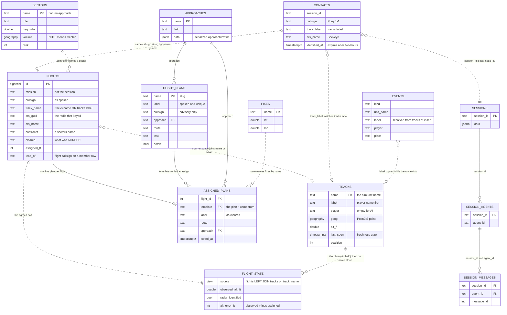

Solid lines are declared foreign keys; dotted lines are joins made by name only, and that is where the conflations live. Three columns hold a NAME for the same aeroplane and none of them are the same string: `flights.callsign` (spoken), `flights.track_name` and `contacts.track_label` (the sim's label, player-name-first), and `flights.srs_guid` (the radio). `flight_state` and `flight_airspace` both join `tracks` to `flights`, but migration `013_join_a_track_by_either_name.sql` widened only `flight_airspace` to `t.name = f.track_name OR t.label = f.track_name` — `flight_state` in `004_flights.sql` still joins on `name` alone, so a flight bound from the radar picture's label can be radar-identified in one view and not the other. Sources: `director/migrations/004_flights.sql`, `005_sectors.sql`, `009_flight_plans_are_templates.sql`, `013_join_a_track_by_either_name.sql`, `feed/tracks.py`, `src/marshall/atc/identify.py`, `src/marshall/atc/approaches.py`, `src/marshall/feed/events.py`.

```mermaid
flowchart LR
 STREAM_UNITS["tools tracks.py StreamUnits thread"]
 STREAM_EVENTS["tools events.py StreamEvents thread"]
 BRIDGE["atc agent_atc.py the SRS bridge"]
 IDENTIFY["tools identify.py bind"]
 CLEARANCE["tools clearance.py assign and ack"]
 FLIGHTSAPI["tools flights.py bind agree find"]
 RADARQ["tools tracks.py radar_cached"]
 TRACKS["tracks"]
 EVENTS["events"]
 FLIGHTS["flights"]
 FLIGHT_STATE["flight_state view"]
 CONTACTS["contacts"]
 ASSIGNED["assigned_plans"]
 PLANS["flight_plans"]
 APPR["approaches"]
 FIXES["fixes"]
 STREAM_UNITS -->|"upsert on update and delete on gone"| TRACKS
 STREAM_EVENTS -->|"kind unit_name label player place"| EVENTS
 STREAM_EVENTS -->|"reads label before the row goes"| TRACKS
 STREAM_EVENTS -->|"player_leave_unit clears track_name"| FLIGHTS
 STREAM_EVENTS -->|"on_the_ground held in memory not the table"| RADARQ
 BRIDGE -->|"PUT approaches at startup"| APPR
 BRIDGE -->|"PUT flightplans at startup"| PLANS
 BRIDGE -->|"PUT fixes via the sim projection"| FIXES
 BRIDGE -->|"POST bind and agree"| FLIGHTSAPI
 FLIGHTSAPI -->|"insert or merge one row per aeroplane"| FLIGHTS
 FLIGHTS -->|"agreed columns"| FLIGHT_STATE
 TRACKS -->|"observed columns"| FLIGHT_STATE
 FLIGHT_STATE -->|"SELECT star by any name"| FLIGHTSAPI
 IDENTIFY -->|"delete then insert the binding"| CONTACTS
 TRACKS -->|"rows fresher than 15 seconds"| RADARQ
 CONTACTS -->|"track_label to callsign tags"| RADARQ
 RADARQ -->|"the RADAR block prepended to the call"| BRIDGE
 PLANS -->|"filed templates to match against"| CLEARANCE
 FIXES -->|"a route naming an unknown fix is refused"| CLEARANCE
 CLEARANCE -->|"insert the copy and set acked_at"| ASSIGNED
 CLEARANCE -->|"F.agree copies route onto the flight row"| FLIGHTSAPI
 APPR -->|"the active plan approach becomes the plate"| BRIDGE
```

Who writes what: only the two gRPC stream threads in `feed/tracks.py` and `src/marshall/feed/events.py` write the observed tables, the bridge (`src/marshall/atc/agent_atc.py`) writes the published ones at startup, and the agent's tools write the agreed ones. Nothing reads the `events` table in a live sortie — `on_the_ground` answers from the in-memory dict, `recent_events` is not among the tools registered in `director/app.py`, and `departed_since` is served at `/events/departed` but no caller in `src/` polls it, so the separation board is never cleared from the sim's `player_leave_unit`. Dead columns: `contacts.srs_name` is inserted by `identify.bind` and never SELECTed (`bindings_for` reads only `track_label` and `callsign`); `tracks.coalition` is upserted every sweep and never read back. Whole objects with no code path: `taskings` and `tasking_state` from `007_tasking.sql` are never touched by any Python here, and nothing in the repo — code or migration — inserts into `sectors`, `controllers` or `sector_staffing`, yet `flight_airspace` resolves `should_be_with` entirely out of `sectors`, so those rows exist only if they were put in the live database by hand; session tables are written by the strands-pg runtime, not by any tool here, so they are left off this diagram.

---

## Troubleshooting: symptom to suspect

### Where the evidence is

Four places, and they answer different questions. Reach for them in this order.

| Source | Path / command | Answers |
|---|---|---|
| Bridge stdout | `/tmp/marshall-bridge-live.log` (`tools/bridge.py`, override with `MARSHALL_BRIDGE_LOG`) | What the bridge *decided*: identity, suppressions, which thread transmitted |
| Flight recorder | `build/logs/flight-<session>.jsonl` (`agent_atc.record`, `agent_atc.py`) | Machine-readable, one object per transmission, with the geometry attached |
| Director | `cd /opt/marshall/director && docker compose logs -f` | Model errors, `session ... is still answering the previous call` (`director/app.py`), tool failures |
| The scope, live | `curl -s localhost:8000/radar \| jq -r .picture` | What the agent was actually looking at |

The bridge log is prose for a human; the recorder is the same events in a form `replay.py` can re-run. When they disagree, the recorder is the one to trust — the console line can be printed before a suppression later drops the transmission.

The console markers, and which component emitted them:

| Marker | Emitted at | Means |
|---|---|---|
| `PILOT [name]: … [RADAR: …]` | `agent_atc.py` | One transcription arrived. `name` is the *resolved* identity, not what he said |
| `(identity: …)` | `agent_atc.py` | The identity ladder did **not** close on radar. Printed only in that case — see below |
| `CONTROLLER: …` | `agent_atc.py` | The deterministic engine produced a next step |
| `SEPARATION: …` | `agent_atc.py` | The holding stack, shown only with ≥2 aircraft unresolved |
| `ATC[pilot/sonnet] (4.3s): …` | `agent_atc.py` | The agent answered a pilot. The tier and the latency are in the line |
| `ATC[hook/sonnet]` | same | Agent woke on its own timer, not on a transmission |
| `ATC[simple] (0.0s)` | `agent_atc.py` | Canned reply, no model call (`simple_response`) |
| `ATC[who] … (out of the blue, no callsign)` | `agent_atc.py` | The challenge. The agent was never asked |
| `ATC[vec]` / `ATC[asr]` / `ATC[down]` | / / | The **asr_monitor** thread, deterministic, no model involved |
| `ENG[tx]` | | Engineering radio, Polly voice "Amy" |
| `HOOK fired (+60s) on 139.000: …` | | Scheduler paid back a promise |
| ` .. <anything>` | throughout | A decision *not* to transmit, or a suppression. These are the most informative lines in the log |
| ` !! <anything>` | throughout | A swallowed failure. The bridge never dies for these on purpose |

### Symptom → suspect → confirm

| Symptom | Most likely | Confirm with |
|---|---|---|
| **ATC said nothing at all** — the pilot transmitted and the frequency stayed dead | (a) The bridge is not running, or a stale one holds the lock; (b) STT returned empty; (c) the director dropped the call as busy; (d) the agent replied without a `RADIO:` marker and was silenced | `uv run python tools/bridge.py status`. Then `grep PILOT /tmp/marshall-bridge-live.log \| tail` — no `PILOT` line means STT or SRS, not the brain. A `PILOT` line with no following `ATC[...]` means the agent: check `docker compose logs` for `still answering the previous call` (`app.py` returns an empty response rather than queueing), or an `ATC[pilot/sonnet] (…): (no call)` line, which is `for_voice(agent=True)` at discarding a reply that had no `RADIO:` marker — the model wrote reasoning instead of a transmission |
| …or the pilot was on **engineering** | Everything he says goes to engineering until he releases the line. Vectors and goodbyes are explicitly held: `.. holding a vector for X: he is on the engineering line` | `grep ENGINEERING /tmp/marshall-bridge-live.log`. Release is by saying a controller's name in the *opening six words* (`_ADDRESSING`) or `_ENG_DONE` |
| …or **two bridges** are up | Both hear the pilot, both answer, and each hears the other. `claim_the_frequency` is an advisory `flock` on `build/bridge.lock` and should make this impossible now — but a bridge started before the lock existed, or on a second host, still can | `!! another bridge already holds the frequency (pid N)` on start; `(ignoring Marshall -- that is one of ours, not a pilot)` at in a running log is the smoking gun |
| **"Station calling, say your callsign"** | `challenge_for`, fired at. It means: identity is unknown (`known` truthy but he named nobody), he is *not* inside the 90 s conversation window (`CONVERSATION_SEC`), and no flight verdict was pending | `grep "ATC\[who\]"` in the log. Then look at the preceding `(identity: …)` line for *why* the ladder failed — `"'Pony 1-1' matches no track and no filed plan"` vs `"nobody named, and the radio is unknown"` are different bugs |
| …challenged even though he *did* say who he is | `said_who` matches only against **closed sets** — existing flight names and the handle this radio resolved to. If the radio never resolved to a track, his handle isn't in the set. Also: `extract` wants the numbered shape, so a bare handle used to be missed | `tools/identity_watch.py` — the `claim` column shows what Whisper gave the extractor |
| **Wrong callsign on the air** | Almost always the *label*, not the identity. `identity.Registry._label` (`identity.py`) takes what he calls himself, voted across the sortie by `transmitter_callsign`. A wrong label is rude; a wrong `track` is dangerous, and they are decided separately on purpose | `tools/whos_who.py` — the RADIO panel prints `heard from` beside `answered to` and marks `<-- MISMATCH`. If the track is right and the name is wrong, it is the vote |
| …"Falcon one **TO** one" | Polly reading a hyphen. Canonical `Falcon 1-1` reached the voice. `for_voice` now rewrites it at, which is the one place every transmission passes | `grep -E "[A-Z][a-z]+ [0-9]-[0-9]" build/logs/flight-*.jsonl` on the `text` field of `atc/*` records |
| …called by his **flight's** name when he is a single | `known = _flights.speaking_as(_who)` at — he is still on the roster as a member. Or `transmitter_callsign` still holds the flight designator; it clears the vote the moment he names himself more specifically | `.. <name>: created/joined/left` lines, and the `flight/*` records in the recorder |
| **Wrong or absent altitude / heading** | Three authorities can speak and only one may. `reconcile` picks from the *geometry*: missed → the missed approach wins; established on final → the talkdown wins and any holding clearance is dropped; otherwise the separation engine wins and the vector is dropped. Anything dropped prints | `grep " \.\. " log` for `holding clearance suppressed: radar shows him established`, `vector suppressed: he has been told to hold`, `holding/vector suppressed: he is flying the missed approach` |
| …the **descent call never came** on final | `hush_a_second_talkdown` is the fix, and the failure it fixes is subtle: the agent's own chatter holds the channel, the metronome's 6/5/4/3-mile calls are deferred by `channel_is_free`, and the aeroplane is into the next mile by the time it clears | `.. hushed the agent on final: the engine is flying the talkdown`, and `.. holding the N mile call for X: <why>`. Repeated "holding" lines with no `ATC[asr]` between them is the bug recurring |
| …an altitude the plate does not contain | The agent invented it. `director/prompts/rules.md` + the generated `plate` prompt pin the assignable levels. Check the plate actually pushed: `pushed plate for <controller> to the director` at startup; `!! could not push plate` means the agent is running on whatever was last seeded | `curl -s localhost:8000/prompts` (or the `/approaches` and `/flightplan/active` endpoints) |
| **Two aircraft got each other's position** | The identity ladder bound a radio to the wrong track — or, more often, to *no* track, and everything downstream used the callsign as the key. `radar_fix_by_track` is preferred over `radar_fix` on every path for exactly this | `tools/whos_who.py`: TRACKS shows every unit and what it is `tied to`; BOARD shows what the engine believes exists; a `!! on the board, not on radar:` line is a ghost made of words |
| …and it started after a slot change | A callsign is a position, not a person (#38). `Registry.forget(guid)` exists for this; nothing calls it automatically. `release_stale` (, 8 minutes) is what eventually clears the old entry — and **two board entries are what makes the deterministic engine engage**, so one stale entry turns a single ship into a sequencing problem against his own former self | `.. <cs> — nothing has accounted for him in 8 minutes, off the board`, and `released` records |
| **A clearance was refused** | Read the `CONTROLLER:` line — the engine, not the agent, wrote the refusal. The stock ones: `not radar identified, say your position and altitude` (`controller.py`, from `may_be_sequenced` — on a vectored approach an unseen aircraft may not take a stack slot); `continue holding, number two, expect approach shortly` (, the letdown block is occupied); `no holding available, remain clear` | If it is `not radar identified` while he is plainly on the scope, the `note_radar_contact` call at resolved by callsign instead of track — that exact bug ran a whole sortie with the board reading UNSEEN |
| …refused with "negative, you are not over the beacon" on a **radar** approach | `separation_context` rejects a claimed station passage the scope contradicts — but only when `beacon_flown`. The classifier files ordinary position reports as `REPORT_BEACON` because it is the nearest thing it knows | `!! rejected: claims the beacon, radar shows 8.2 nm`. If the profile is `vectored`, this guard should not have run at all |
| …vectored when he never asked, or vectored while holding | `may_be_vectored` is the invariant as one question. It refuses if: he is not in `ctl.aircraft` (never asked for an approach), he is on a visual, he has not checked in **on this frequency** (`_heard_on`), or with traffic present he does not own the approach (`owns_the_approach`) | Silence from the asr_monitor with a track plainly on final usually means `_heard_on` has him on a different channel |
| **Radio went silent mid-sortie** | In order of likelihood: the director wedged (a 30 s answer poisons the next calls — it returns `busy` and the bridge prints nothing); the bridge process died; the pilot is parked on the engineering line; the track went **stale** so radar reads `no contacts` and every radar-gated path switches off | `tools/bridge.py status`; `docker compose logs --tail=100`; `curl -s localhost:8000/radar`. `tracks.FRESH_SEC = 15` (`src/marshall/feed/tracks.py`) — a paused server stops the unit stream and a stale row reads as no-contact by design, never as confidently-wrong |
| …silent only on **one** frequency | The bridge answers on the channel the call arrived on (`voice_for(on_hz)`). A hook fires on `hook_frequency(why, _heard_on, …)` — the channel we last heard *that man* on. If he changed radios after the promise, the callback goes to the old one | `HOOK fired (+60s) on 124.000:` — check that number against the frequency in his last `pilot` record |
| **The agent paraphrased instead of reading the numbers** | The two-brain seam. The `CONTROLLER:` / `SEPARATION:` / `ASR:` blocks are appended to the model's context with explicit "voice these exactly" wording (–); if the numbers on the air differ from the ones in those lines, it is the model | Confirm without flying: `uv run --extra voice python tools/atc_dryrun.py --script formation`. It assembles the *same* message the live loop does and prints `CONTROLLER:` beside the reply, so the drift is visible in seconds |
| …especially a **clearance** | `tools/atc_dryrun.py --script clearance` — watch for a shortened route, a rounded level, or a squawk that is not the one the tool returned |

### The diagnostics, and when to reach for each

| Tool | Reach for it when |
|---|---|
| `tools/bridge.py status\|restart` | Always first. It matches on the **process**, not on a string containing itself — `pkill -f marshall.atc.agent_atc` kills the shell running it, which twice left a pilot on a dead frequency. `restart` waits for the lock to release before starting |
| `/diag` on the kneeboard | **First, and in the air.** One card per aeroplane: what he asked for, what he is cleared for, where the engine and the ladder have him, who owns him, and — the line to read when nothing is happening — every `handoff/none`, refusal, unvoiced figure and repair the recorder holds about him, with its age. Two clocks, because the bridge's snapshot and the flight recorder go stale independently and only the first says whether the board is live. It renders what was published and derives nothing; a blank cell means the bridge does not have it (#155) |
| `tools/whos_who.py` | Live, during a sortie. Three panels that disagree in exactly the interesting cases: TRACKS (sim truth), BOARD (what the engine believes), RADIO (who spoke / who was answered). `--once` for a script |
| `tools/identity_watch.py` | Live, when the question is *who does he think is talking*. One line per transmission; anything not `radar` gets a `<<` marker and its `why` printed. Watch the `MANNED` count — a guest is identified by elimination against it, so `0 manned` kills that path silently |
| `tools/replay.py [flight-x.jsonl]` | After the sortie, when the vectoring was wrong. Re-runs every recorded fix through the *current* `asr.guide` and prints the percentage established. "A sortie that never reaches `final` is a vectoring failure, not a pilot one" |
| `tools/atc_dryrun.py` | When the suspect is the model. Same message assembly, typed input, no SRS/Polly/Whisper/mission. Scripts: `formation`, `single`, `visual`, `clearance`, `readback`. Note it calls `load_and_push_plates`, which **writes** every published approach — it no longer takes a profile, so there is no wrong one to pass |
| `tools/check.py` | Before you conclude it is the world's fault. Ruff + pytest + the approach sweeps, seconds, no sim. `--live` adds the sim-backed and voice checks |
| `tools/classify_bench.py` | After touching `intents.py`, the taxonomy wording, or the classifier prompt. The classifier decides check-in from beacon report on the separation-critical path |
| `tools/whats_out_there.py` | "What *was* that?" — asks the sim directly for every unit including ground/statics and anything whose altitude doesn't match the terrain. Run it **while the thing is on screen**; the `tracks` table drops rows and proves nothing by absence |
| `tools/engineer.py` + `/tmp/marshall-say` | Talk to the pilot mid-sortie without the controller hearing it. `echo "…" >> /tmp/marshall-say`. Mostly superseded — the bridge now speaks for engineering in the "Amy" voice — but the name stays in `OUR_STATIONS` so an old one left running is never mistaken for a pilot |
| `tools/letdown_check.py`, `checkin_check.py`, `handoff_check.py`, `channel_check.py`, `visual_check.py` | Each is a card item turned into a script. When a specific behaviour regressed, run the one that owns it rather than the whole suite |

### Reading one line of the recorder

Every transmission writes at least two objects. A real `pilot` line, wrapped:

```json
{"t": 1785291701.647, "kind": "pilot", "callsign": "Sockeye",
 "srs_name": "Sockeye", "claimed": "", "authority": "", "track": "",
 "who": "", "why": "nobody named, and the radio is unknown",
 "freq_mhz": 124.0,
 "transcript": "Batumi Approach, Sake, Request Creation of Apex Flight.",
 "range_nm": null, "radial": null, "alt_ft": null, "heading": null,
 "scope": "362nd_Sockeye-1 (P-51D-30-NA) IN FORMATION with 362nd_Andre-1 — 2 ships, lead 13.5 nm on the 307 radial, 5,952 ft, heading 062, 281 knots | 362nd_Shooter-1 (P-51D-30-NA): 23.3 nm on the 304 radial, 5,999 ft, heading 075, 306 knots"}
```

Read it in this order:

- **`authority`** — `radar` | `plan` | `roster` | `""`. This is the whole point of the record. `radar` means the chain SRS GUID → SRS client name → sim unit → track closed, and no microphone was involved. Anything else means it did not, and `why` says which rung failed. Above, it is empty and `why` explains: Whisper turned "Sockeye" into "Sake", and 124.0 is a formation line the parser once could not read at all.
- **`claimed` vs `callsign`** — what the words said against what was concluded. When they differ *and the identity held*, the design worked; that is the case that used to invent an aeroplane.
- **`track`** — the sim's own name. Empty means every downstream lookup fell back to the callsign, which is how a pilot ends up "NOT radar identified" for an entire approach while the agent vectors him happily.
- **`who`** — the handle (`identity.handle`, `identity.py`), the human out of the squadron name. It is what a formation split falls back to.
- **`range_nm` / `radial` / `alt_ft` / `heading`** — the fix `asr.guide` was given. `null` here with a non-empty `scope` means the fix lookup failed, not that radar was down. This is exactly what `replay.py` re-runs.
- **`scope`** — the *whole* picture, verbatim, as the agent saw it. If the controller said something geographically absurd, this is the proof of what it was looking at.

The `board` record written immediately after it is the separation engine's state at that instant, deliberately adjacent — a ghost is created by a transmission, so the transmission and the board have to be next to each other or the pairing is guesswork later.

The reply side:

```json
{"t": 1785291708.677, "kind": "atc/pilot", "tier": "sonnet", "seconds": 4.3,
 "to": "", "freq_mhz": 124.0,
 "text": "Station calling, say again your callsign and your request."}
```

`kind` names the producer, and that is the fastest way to attribute a behaviour to a brain:

| `kind` | Produced by |
|---|---|
| `atc/pilot` | The agent, answering a transmission |
| `atc/hook` | The agent, on its own timer |
| `atc/vector`, `atc/range`, `atc/landed` | `asr_monitor` — **deterministic, no model** |
| `atc/simple` | `simple_response`, canned, 0.0 s |
| `atc/challenge` | `challenge_for`, canned |
| `controller` | The deterministic engine's directive (what was *handed* to the agent) |
| `asr` | The computed guidance line handed to the agent |
| `board` | The engine's aircraft list |
| `flight/created`, `flight/joined`, `flight/refused`, `flight/left`, `flight/dissolved` | The flight roster, decided in the bridge |
| `engineering`, `engineering/tx`, `debug`, `ship-to-ship`, `released` | Bookkeeping; `ship-to-ship` and `debug` are transmissions ATC deliberately did not answer |

`to` is `addressed_to(reply)` — who the words open by naming. When `to` and the preceding `pilot` record's `callsign` differ, the controller answered the right pilot by the wrong name, which is a different bug from answering the wrong pilot. `whos_who.py` flags that pair as `<-- MISMATCH`.

Quick greps:

```sh
S=build/logs/flight-hooks.jsonl
jq -r 'select(.kind=="pilot") | "\(.authority // "-")\t\(.claimed)\t\(.callsign)\t\(.why)"' $S
jq -r 'select(.kind|startswith("atc/")) | "\(.kind)\t\(.freq_mhz)\t\(.text)"' $S
jq -r 'select(.kind=="pilot" and .track=="") | .transcript' $S # never made it to a track
```

### Known weak points, so you do not chase them

- **The engine is blind and cannot retract.** It believes position reports; the agent sees radar. A flight once called "over the beacon" at eight miles — the agent refused correctly, but the engine had *already* broken the formation up. The bridge reconciles the two at, but only for a claimed station passage and only when a beacon is being flown.
- **`_flights`, `_heard_on`, `_seen_at`, `_transmitters`, `_awaiting_readback` and the missed-approach latch all live in bridge process memory.** A bridge restart forgets every one of them. `may_be_vectored` deliberately keys traffic off the *scope* rather than the stack for this reason — radar does not forget over a restart.
- **Every director call in the bridge is wrapped and swallowed** (`flight_bind`, `flight_agree`, `push_fixes`, `load_and_push_plates`). A dead Postgres degrades the controller silently rather than muting him. The only trace is a ` !! …` line at startup or in the log — worth grepping at the top of every investigation.
- **The `simple_response` shortcut bypasses the agent entirely** and is skipped when the separation engine is `engaged`. A radio check that got a rich reply means two or more contacts were on the scope.
- **`tools/whats_out_there.py` exists because the `tracks` table has been dead for twelve hours without anyone noticing** (a missing SQL placeholder). An empty scope is not proof of an empty sky.
